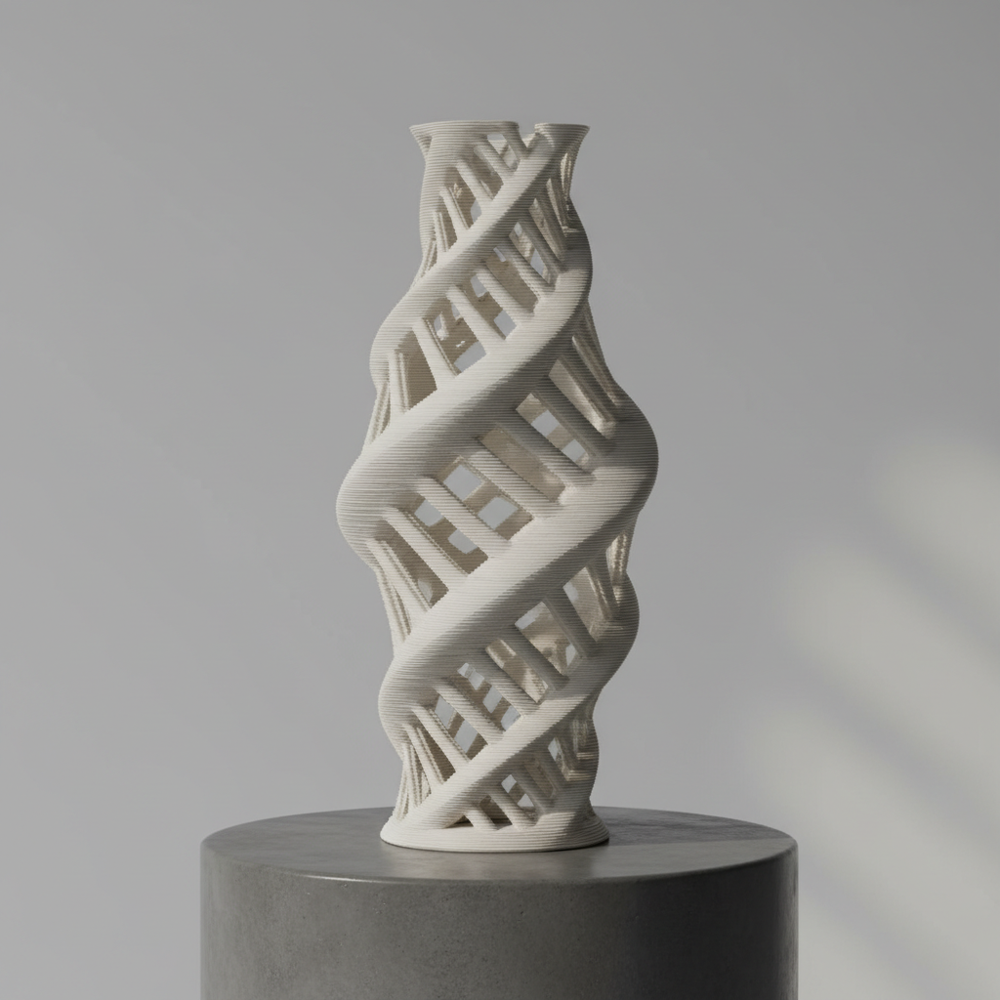

# 3D Printed Ceramics Art 3D打印陶瓷艺术

> "3D printed ceramics is the ancient material meeting the newest machine — a robotic nozzle extruding liquid clay in precise layers, building forms impossible for any human hand, lattices and spirals and mathematically generated surfaces rising wet and fragile from the print bed, each layer a frozen moment of digital instruction made physical, the potter's wheel replaced by algorithms yet the material still demanding fire to become permanent." — Unknown

## 概述

3D打印陶瓷艺术（3D Printed Ceramics Art）是一种利用增材制造技术（3D打印）来创造陶瓷器物的当代艺术形式。通过计算机控制的喷嘴将陶瓷浆料逐层挤出堆积，可以创造出传统手工无法实现的复杂几何形态——从数学曲面到有机结构，从精密格栅到不可能的悬挑。3D打印陶瓷将数字设计与古老的陶瓷材料结合，开辟了陶瓷艺术的全新可能。

3D打印陶瓷艺术的核心要素包括：1）数字设计——使用计算机软件设计器形；2）逐层堆积——通过喷嘴逐层挤出陶瓷浆料；3）复杂几何——实现传统手工无法达到的形态；4）精确控制——计算机精确控制每一层；5）材料挑战——陶瓷浆料的流变学控制；6）后处理——打印后仍需干燥和烧制；7）算法美学——数学和算法生成的美感。

## 核心特征

| 特征 | 描述 |
|------|------|
| 数字设计 | 计算机辅助设计器形 |
| 逐层堆积 | 层层叠加的制造方式 |
| 复杂几何 | 传统手工无法实现的形态 |
| 精确重复 | 可精确复制数字模型 |
| 算法生成 | 数学算法生成的形态 |
| 材料融合 | 数字技术与古老材料的结合 |

## 视觉特征

- **层纹肌理**：逐层打印留下的水平纹理
- **复杂曲面**：数学生成的复杂曲面
- **格栅结构**：精密的网格和格栅
- **有机形态**：模拟自然的有机结构
- **精确对称**：计算机控制的精确对称
- **未来感**：科技感和未来感的造型

## 代表作品

| 作品 | 艺术家/文化 | 年代 | 意义 |
|------|-------------|------|------|
| *Olivier van Herpt作品* | Olivier van Herpt | 2010年代 | 大型3D打印陶瓷先驱 |
| *Jonathan Keep作品* | Jonathan Keep | 2010年代 | 算法生成陶瓷 |
| *Unfold设计工作室* | Unfold | 2010年代 | 3D打印陶瓷设计 |
| *清华大学3D打印陶瓷* | 中国 | 2010年代 | 中国3D打印陶瓷研究 |
| *当代3D打印陶瓷* | 各地艺术家 | 当代 | 技术的持续探索 |

## 历史时间线

| 时期 | 事件 |
|------|------|
| 2000年代 | 早期陶瓷3D打印实验 |
| 2010年 | 桌面级陶瓷3D打印机出现 |
| 2015年 | 3D打印陶瓷进入艺术市场 |
| 2020年代 | 技术成熟，应用扩展 |
| 当代 | 3D打印陶瓷成为独立艺术门类 |

## 中国语境

中国在3D打印陶瓷领域有活跃的研究和实践。清华大学、景德镇陶瓷大学等机构都在进行3D打印陶瓷的技术研发和艺术探索。中国的陶瓷产业——特别是景德镇——正在将3D打印技术融入传统制瓷工艺，用数字技术辅助复杂器形的制作。中国年轻陶艺家对3D打印陶瓷表现出极大的热情——他们将中国传统纹样和器形与数字设计结合，探索"数字青瓷""算法瓷器"等新方向。3D打印陶瓷在中国的发展体现了传统陶瓷大国拥抱新技术的决心。

## AI生成概念图

## 与其他风格的关系

- **Digital Art** → 数字艺术
- **Parametric Design** → 参数化设计
- **Coil Building** → 盘筑（类似逐层原理）
- **Slip Casting** → 注浆成型
- **Industrial Ceramics** → 工业陶瓷
- **Generative Art** → 生成艺术

---

*浮光艺志 | Chronicle of Artistry*
