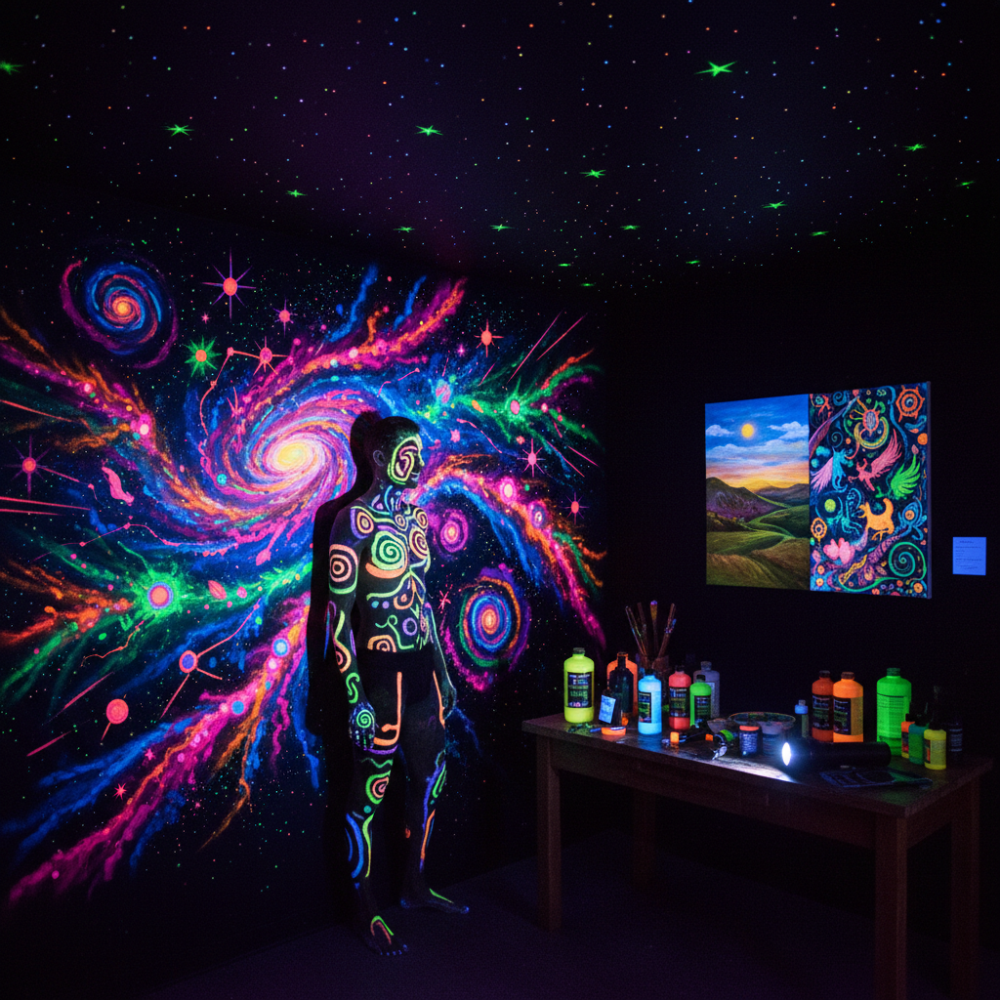

# UV Art 紫外线艺术

> "UV art exists in two worlds simultaneously — invisible in daylight, blazing in ultraviolet. The artist paints with fluorescent and phosphorescent pigments that absorb ultraviolet radiation and re-emit it as visible light, creating images that appear only when the black light switches on. It is secret art, hidden art, art that reveals itself only to those who know how to look." — Unknown

## 概述

紫外线艺术（UV Art）是利用紫外线（黑光灯）照射下会发出荧光的特殊颜料和材料进行创作的艺术形式——作品在普通光线下可能不可见或呈现一种外观，而在紫外线照射下则呈现出完全不同的、鲜艳发光的视觉效果。UV艺术广泛应用于夜店装饰、舞台设计、人体彩绘和沉浸式艺术体验。

UV艺术的实践包括：1）UV壁画——在紫外线下发光的墙面绑画；2）UV人体彩绘——在皮肤上用UV颜料绑画；3）UV装置艺术——利用UV效果的沉浸式装置；4）UV舞台设计——演出和夜店的UV视觉设计；5）双重绑画——在普通光和UV光下呈现不同图像的作品；6）UV雕塑——使用UV反应材料的雕塑；7）UV摄影——拍摄UV艺术效果的摄影。

## 核心特征

| 特征 | 描述 |
|------|------|
| 荧光 | 紫外线下的荧光效果 |
| 双重 | 双重视觉体验 |
| 隐藏 | 日光下不可见的图像 |
| 沉浸 | 沉浸式的视觉体验 |
| 夜间 | 适合暗环境展示 |
| 科技 | 利用光学科技 |

## 视觉特征

- **发光**：在黑暗中发光的效果
- **荧光色**：极其鲜艳的荧光色彩
- **对比**：黑暗背景与发光图案的对比
- **超现实**：超现实的视觉效果
- **渐变**：荧光色彩的渐变
- **隐现**：图案的隐藏与显现

## 代表作品

| 作品 | 艺术家 | 年代 | 意义 |
|------|--------|------|------|
| *UV murals* | Various | 当代 | UV壁画 |
| *Blacklight posters* | Various | 1960s-70s | 迷幻黑光海报 |
| *UV body painting* | Various | 当代 | UV人体彩绘 |
| *Immersive UV installations* | Various | 当代 | 沉浸式UV装置 |
| *Dual-image paintings* | Various | 当代 | 双重图像绑画 |

## 历史时间线

| 时期 | 事件 |
|------|------|
| 1930年代 | 黑光灯的商业化 |
| 1960年代 | 迷幻文化中的黑光海报和艺术 |
| 1980年代 | 夜店文化中的UV装饰 |
| 2000年代 | UV人体彩绘的流行 |
| 当代 | 沉浸式UV艺术体验和数字结合 |

## 中国语境

UV艺术在中国近年来随着夜经济和沉浸式体验的发展而快速增长。中国的许多夜店、酒吧和KTV使用UV装饰——荧光壁画和UV灯光效果是夜生活场所的标配。中国的一些沉浸式艺术展览使用UV技术——创造令人惊叹的视觉体验空间。中国的人体彩绘艺术家在UV彩绘领域非常活跃——在各种活动和表演中展示UV人体彩绘。中国的一些主题公园和密室逃脱使用UV艺术——创造神秘和奇幻的氛围。中国的短视频平台上，UV艺术视频非常受欢迎——"开灯前vs开灯后"的对比效果吸引了大量观众。中国的一些当代艺术家也在探索UV作为严肃艺术媒介的可能性——创造在不同光线条件下呈现不同含义的作品。

## AI生成概念图

## 与其他风格的关系

- **Fluorescent Art** → 荧光艺术
- **Light Art** → 光艺术
- **Immersive Art** → 沉浸式艺术
- **Body Painting** → 人体彩绘
- **Psychedelic Art** → 迷幻艺术
- **Stage Design** → 舞台设计

---

*浮光艺志 | Chronicle of Artistry*
