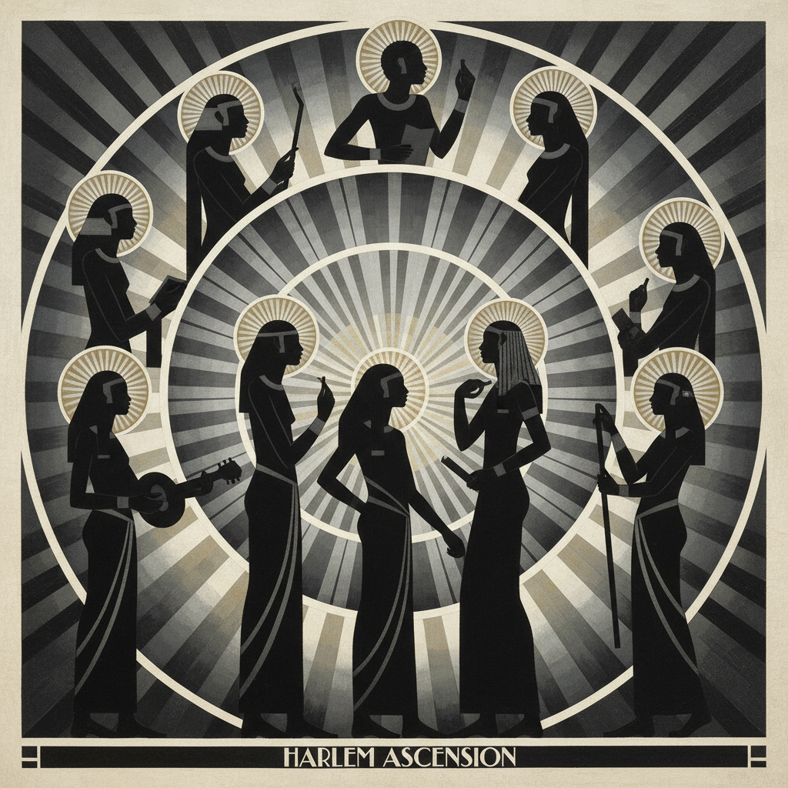

# Aaron Douglas 亚伦·道格拉斯

> **时期：** 1899–1979  
> **关键词：** 哈莱姆文艺复兴视觉语言、剪影与光圈、非洲装饰主义、壁画

## 概述

Aaron Douglas 被称为"哈莱姆文艺复兴的官方艺术家"，他创造了该运动最具辨识度的视觉语言：以几何化的非裔人物剪影、同心圆光圈和Art Deco线条构建的叙事性壁画和插图。他的风格融合了埃及壁画的侧面轮廓、非洲雕塑的简化形态和现代主义的几何抽象。

## 风格特征

- **剪影人物**：人物以深色侧面剪影呈现，具有埃及壁画的仪式感
- **同心圆光圈**：放射性的圆形光晕创造出精神性的空间深度
- **色调分层**：画面以单色调的明暗层次构建空间，如同舞台灯光
- **Art Deco几何**：锐利的角度和装饰性线条赋予画面现代感
- **叙事性构图**：每幅作品讲述非裔美国人从非洲到美国的历史旅程

## 代表作品

- *Aspects of Negro Life*系列壁画（1934）
- *Song of the Towers*（1934）
- *The Creation*（1935）
- *Into Bondage*（1936）

## 历史意义

Douglas 为哈莱姆文艺复兴创造了视觉身份——一种既现代又根植于非洲传统的图像语言。他的壁画将非裔美国历史从奴役到都市化的叙事视觉化，成为黑人文化自豪感的永久象征。

## 概念图

