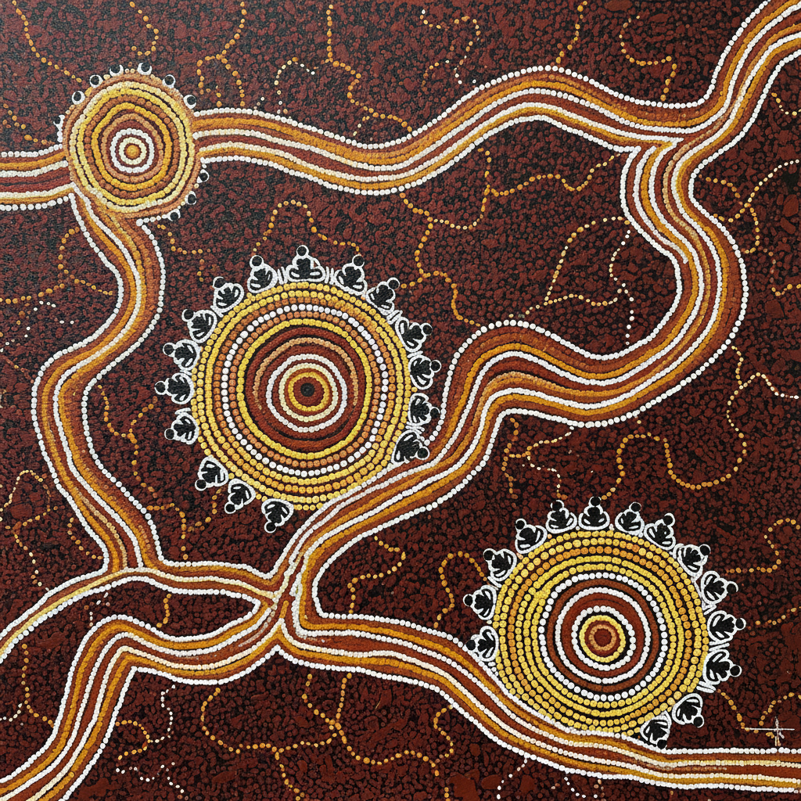

# Aboriginal Australian Art 澳大利亚原住民艺术

> **"我们不拥有土地，土地拥有我们。画画就是唱出土地的歌。"** —— 原住民长老

## 概述

澳大利亚原住民艺术（Aboriginal Australian Art）是世界上最古老的持续艺术传统，可追溯至65,000年前。从岩画到树皮画，从身体彩绘到当代丙烯点画，原住民艺术不仅是视觉表达，更是"梦幻时代"（Dreamtime/Tjukurpa）——创世神话与土地法则的活态载体。1970年代帕普尼亚（Papunya）运动将这一传统带入当代艺术世界，如今原住民艺术是澳大利亚最具国际影响力的文化输出。

## 主要形式

### 点画 (Dot Painting)
- 1971年起源于帕普尼亚社区
- 用丙烯颜料的密集圆点覆盖画面
- 点的密度和色彩变化创造出催眠般的视觉效果
- 实际上是对神圣地面绘画的"编码"——用点遮盖秘密符号

### 岩画 (Rock Art)
- 世界最古老的艺术形式之一（65,000年+）
- X光风格：同时描绘动物外形和内部骨骼/器官
- 手印模板：用嘴喷赭石颜料在手周围形成轮廓
- 卡卡杜国家公园保存有数万年的岩画

### 树皮画 (Bark Painting)
- 阿纳姆地（Arnhem Land）传统
- 在桉树皮上用天然赭石颜料绘制
- 交叉影线（Rarrk）技法——精细的平行线填充
- 描绘祖先精灵、动物图腾和创世故事

## 核心概念

- **梦幻时代 Dreamtime**：创世时期，祖先精灵塑造了大地
- **歌线 Songlines**：祖先穿越大陆时"唱出"的路径
- **图腾 Totem**：个人/氏族与特定动植物的精神联系
- **国度 Country**：不仅是地理，更是精神、法律和身份的总和
- **知识层级**：某些图案只有特定仪式等级的人才能观看

## 视觉特征

- 鸟瞰/地图式视角（从上方俯瞰大地）
- 同心圆代表水源、营地或聚会场所
- U形代表坐着的人
- 平行线代表旅途或歌线
- 大地色系：赭石红、黄、白、黑
- 当代点画的鲜艳丙烯色彩

## 代表艺术家

| 艺术家 | 特征 |
|--------|------|
| Emily Kame Kngwarreye | 晚年爆发的抽象点画大师 |
| Clifford Possum Tjapaltjarri | 帕普尼亚运动先驱 |
| Rover Thomas | 西澳大利亚大地色彩 |
| John Mawurndjul | 阿纳姆地树皮画大师 |
| Minnie Pwerle | 身体彩绘图案的画布转化 |

## 与其他风格的关系

| 风格 | 关系 |
|------|------|
| 抽象表现主义 | 视觉相似但哲学完全不同 |
| 大地艺术 | 共享与土地的深层联系 |
| Op Art | 点画的视觉振动效果 |
| 非洲部落艺术 | 共享图腾和仪式功能 |
| 当代原住民艺术 | 传统与当代画廊系统的对话 |

## 概念图

---

*浮光艺志 | Chronicle of Artistry*
