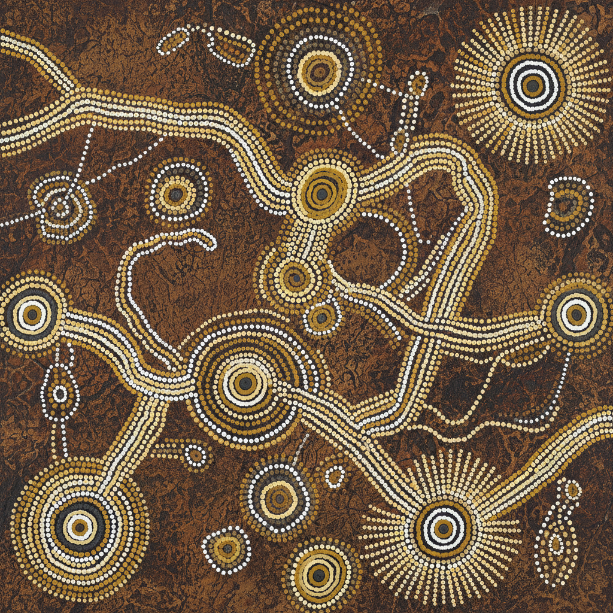

# Aboriginal Dot Painting 澳大利亚原住民点画 | Dot Painting

> **"每一个点都是一首歌——澳大利亚原住民用点阵编织四万年的梦境地图。"**

## 概述

澳大利亚原住民点画（Aboriginal Dot Painting）是澳大利亚原住民（Aboriginal Australians）的当代视觉艺术形式，起源于1971年帕普尼亚（Papunya）社区。原住民艺术家将传统的"梦境时代"（Dreamtime / Tjukurpa）故事和仪式图案转化为丙烯画布上的点阵图案。点画的前身是沙画和身体彩绘——这些仪式性图案有数万年历史。为了保护神圣知识不被外人看到，艺术家用密集的点覆盖了原本的神圣符号，却意外创造出一种震撼的视觉语言。

## 核心特征

- **点阵技法**：用木棍蘸颜料逐点点出图案
- **梦境故事**：描绘祖先创世的"梦境时代"
- **地图功能**：从空中俯瞰的地形图
- **保密机制**：点覆盖神圣符号保护知识
- **大地色系**：赭石、黄、白、黑为传统色
- **圆形构图**：同心圆代表水源、营地、聚会

## 常见符号

| 符号 | 含义 |
|------|------|
| 同心圆 | 水源、营地、聚会地 |
| 曲线 | 旅行路线、河流 |
| U形 | 坐着的人 |
| 直线 | 矛、棍棒 |
| 足迹 | 动物或人的行踪 |
| 星形 | 星星、花 |

## 视觉特征

- 密集的点阵覆盖整个画面
- 大地色系（赭石、黄、白、黑）
- 同心圆和曲线的组合
- 从空中俯瞰的视角
- 催眠般的重复节奏
- 点的大小和密度创造深度

## 与其他风格的关系

| 风格 | 关系 |
|------|------|
| 点彩派 Pointillism | 共享点阵技法（独立发展） |
| Rangoli印度地画 | 共享地面图案传统 |
| 纳瓦霍沙画 | 共享仪式性沙画传统 |
| Op Art | 共享密集图案的视觉效果 |
| 当代抽象艺术 | 原住民点画影响全球当代艺术 |

## 概念图

---

*浮光艺志 | Chronicle of Artistry*
