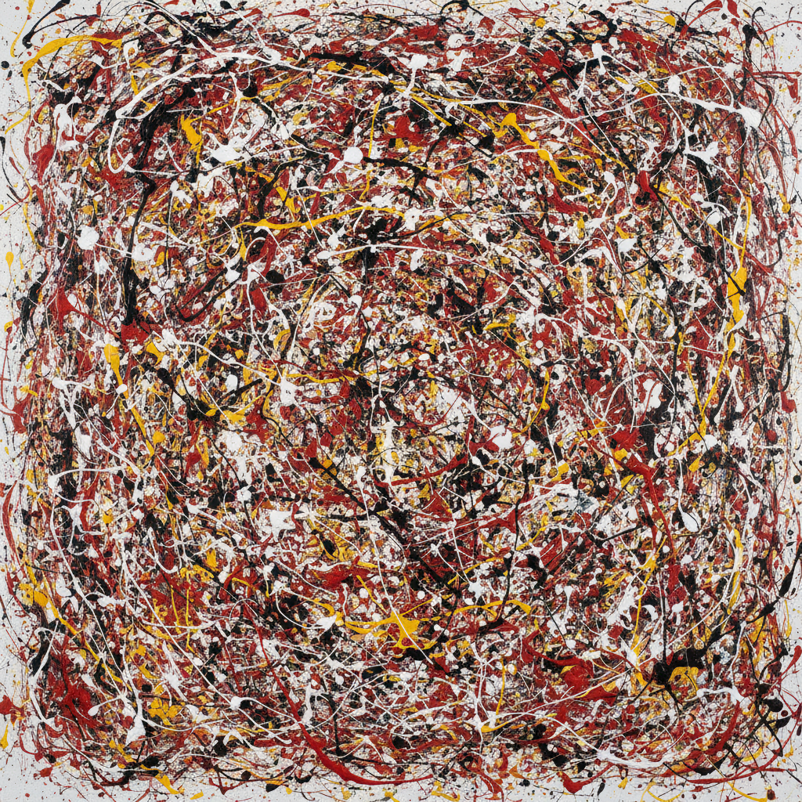

# Abstract Expressionism 抽象表现主义



> **"画布是竞技场——行动本身就是艺术——不需要画'什么'。"**

## 概述

| 维度 | 描述 |
|------|------|
| 时期 | 1940s–1960s/影响至今 |
| 别名 | Abstract Expressionism, Action Painting, Color Field, AbEx |
| 核心色彩 | 无固定——情绪和行动决定色彩 |
| 关键元素 | 大尺幅、行动绘画/色域绘画、情绪表达、非具象 |
| 代表人物 | Jackson Pollock, Mark Rothko, Willem de Kooning, Franz Kline |
| 关联风格 | Expressionism, Minimalism, Color Field, Tachisme |

---

## 历史脉络

| 年份 | 事件 |
|------|------|
| 1943 | Pollock 首次个展——抽象表现主义萌芽 |
| 1947 | Pollock 开始"滴画"——Action Painting诞生 |
| 1950 | 《Life》杂志: "他是美国最伟大的画家吗？" |
| 1958 | Rothko 的色域绘画达到巅峰 |
| 1960s | 抽象表现主义被 Pop Art 和 Minimalism 取代 |
| 2020s | 抽象表现主义作品拍卖价持续创新高 |

### 核心哲学

抽象表现主义的精神是**"不画任何东西——画一切"**：
- 行动 = 艺术（"画的过程比画的结果更重要"）
- 大 = 沉浸（"画布必须大到你可以走进去"）
- 无意识 = 真实（"不思考——让身体和潜意识画"）
- 纯粹 = 力量（"不需要主题——色彩和形式本身就够了"）
- Pollock: "我就是自然" / Rothko: "我画的是人类的基本情感"

---

## 视觉语法

### 色彩系统

```
Action Painting (Pollock, de Kooning)：
  任何颜色 — 泼洒、滴落
  工业漆 — 家用油漆
  黑色 — 线条、能量
  多层 — 覆盖、交织

Color Field (Rothko, Newman)：
  深红 (#8B0000) — 悲剧、崇高
  深蓝 (#000080) — 无限、冥想
  橙黄 (#FF8C00) — 温暖、光
  黑色 (#000000) — 虚无、深渊

规则：
  - 无规则（Action Painting）
  - 大面积色块（Color Field）
  - 情绪决定色彩
  - 色彩之间的关系

质感：
  滴洒 — Pollock
  薄涂 — Rothko（多层透明）
  厚涂 — de Kooning
  硬边 — Newman（直线分割）
```

### 标志性元素

| 类别 | 元素 |
|------|------|
| 尺幅 | 巨大（人体尺度以上） |
| 行动 | 滴洒、泼、刮、涂、甩 |
| 色域 | 大面积色块、模糊边缘、层叠 |
| 空间 | 全面构图(all-over)、无焦点 |
| 材料 | 工业漆、大画布、地板作画 |
| 态度 | 自由、本能、崇高、存在主义 |

---

## 与千禧怀旧的关系

### "最贵的艺术"
- Pollock, Rothko, de Kooning = 拍卖市场最高价
- 抽象表现主义 = "美国世纪"的文化象征
- "一幅看起来'什么都没画'的画值2亿美元——这本身就是一个故事"

### 对当代设计的影响
- Rothko 的色域 → 渐变设计、氛围设计
- Pollock 的滴画 → 纹理、图案、动态
- "抽象表现主义教会了设计师：情绪可以没有形象"
- 冥想App的视觉设计 = Rothko的数字后代

---

## 中国语境

- 中国抽象艺术的发展
- 中国当代艺术家对抽象表现主义的回应
- 与中国书法"写意"精神的对话
- 中国美术馆中的抽象表现主义收藏

---

## 设计应用

| 场景 | 应用方式 |
|------|----------|
| 品牌 | 高端+艺术+情绪+氛围+独特 |
| 空间 | 大型装饰+酒店+画廊+冥想空间 |
| 数字 | 渐变背景+纹理+动态+氛围 |
| 时尚 | 印花+面料+艺术联名+限量 |

---

## 相关风格

← [Expressionism 表现主义](expressionism.md) | [Minimalism 极简主义](minimalism.md) →

↑ [返回千禧怀旧目录](README.md) | [返回总目录](../README.md)
