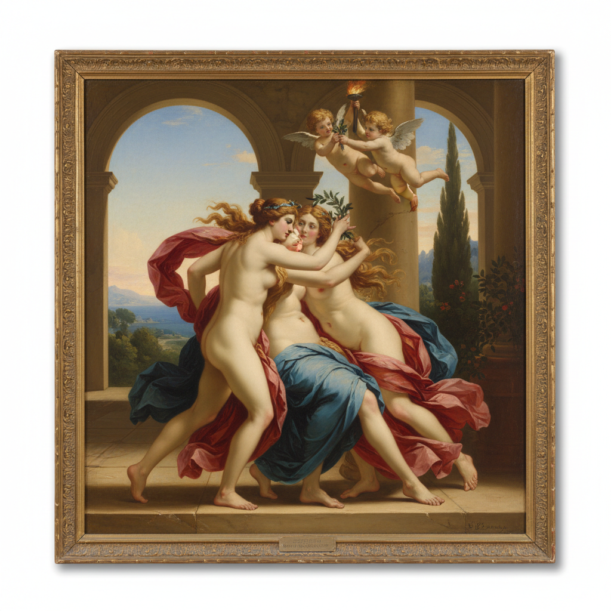

# Academic Art 学院派艺术



> **"规则、技巧、传统——在学院的殿堂里，美有唯一正确的答案。"**

## 概述

| 维度 | 描述 |
|------|------|
| 时期 | 1600s–1900s（鼎盛期1850s–1880s） |
| 别名 | Academic Art, Academicism, 学院派, 官方艺术 |
| 核心色彩 | 古典色调——暖褐、肉色、深红、金色光线 |
| 关键元素 | 古典题材、完美技法、理想化人体、历史画最高 |
| 代表人物 | William-Adolphe Bouguereau, Jean-Léon Gérôme, Alexandre Cabanel |
| 关联风格 | Neoclassicism, Romanticism, Realism, Pre-Raphaelite |

---

## 历史脉络

| 年份 | 事件 |
|------|------|
| 1648 | 法国皇家绘画与雕塑学院成立 |
| 1667 | 第一届沙龙展——学院派的展示平台 |
| 1816 | 罗马大奖制度化——学院派的最高荣誉 |
| 1850s | 学院派鼎盛——Bouguereau、Cabanel统治沙龙 |
| 1863 | "落选者沙龙"——印象派的反叛开始 |
| 1880s | 学院派开始衰落——现代主义兴起 |
| 20世纪 | 学院派被贬为"kitsch"——近年重新评价 |

### 核心哲学

学院派的精神是**"艺术有标准——美有规则——技巧可以通过训练达到完美"**：
- "历史画 > 肖像画 > 风俗画 > 风景画 > 静物画"（题材等级）
- "素描是艺术的基础——色彩是装饰"
- "古希腊罗马是永恒的标准——我们只需要模仿"
- "完美的技法 = 看不见笔触"
- "艺术家必须经过严格训练——天才不够，还需要规则"

---

## 视觉语法

### 色彩系统

```
主色：
  暖褐 (#8B7355) — 古典、温暖
  肉色 (#FFDAB9) — 理想化肌肤
  深红 (#800020) — 天鹅绒、权力
  金色 (#DAA520) — 光线、神圣

辅色：
  天空蓝 (#87CEEB) — 背景、理想
  橄榄绿 (#556B2F) — 风景、自然
  象牙白 (#FFFFF0) — 大理石、纯洁

规则：
  - 笔触不可见——表面光滑如瓷
  - 光线戏剧化但"自然"
  - 肤色理想化——无瑕疵
  - 色彩服务于形式
  - 明暗法(chiaroscuro)是基础
```

### 标志性元素

| 类别 | 元素 |
|------|------|
| 题材 | 神话、历史、宗教、裸体、肖像 |
| 人体 | 理想化、古典比例、完美肌肤 |
| 构图 | 金字塔形、对称、古典平衡 |
| 技法 | 无笔触、多层薄涂、光滑表面 |
| 空间 | 透视精确、大气透视、深度 |
| 态度 | 严肃、崇高、技巧崇拜、保守 |

---

## 与千禧怀旧/当代的关系

### 学院派的重新评价
- 21世纪——学院派技法重新受到尊重
- "当代写实绘画" = 学院派精神的延续
- ArtStation/Concept Art = 数字时代的学院派？
- "AI生成的'完美'图像——是终极的学院派？"

### 对概念艺术/游戏的影响
- 游戏概念艺术的写实风格 = 学院派技法
- 数字绘画教程 = 当代的学院训练
- "Bouguereau如果活在今天——他会画游戏概念图"

---

## 设计应用

| 场景 | 应用方式 |
|------|----------|
| 游戏 | 概念艺术+角色设计+场景 |
| 影视 | 历史题材+美术设计 |
| 品牌 | 古典+高端+传统 |
| 教育 | 绘画基础+技法训练 |

---

## 相关风格

← [Neoclassicism 新古典主义](neoclassicism.md) | [Realism 现实主义](realism.md) →

↑ [返回千禧怀旧目录](README.md) | [返回总目录](../README.md)
