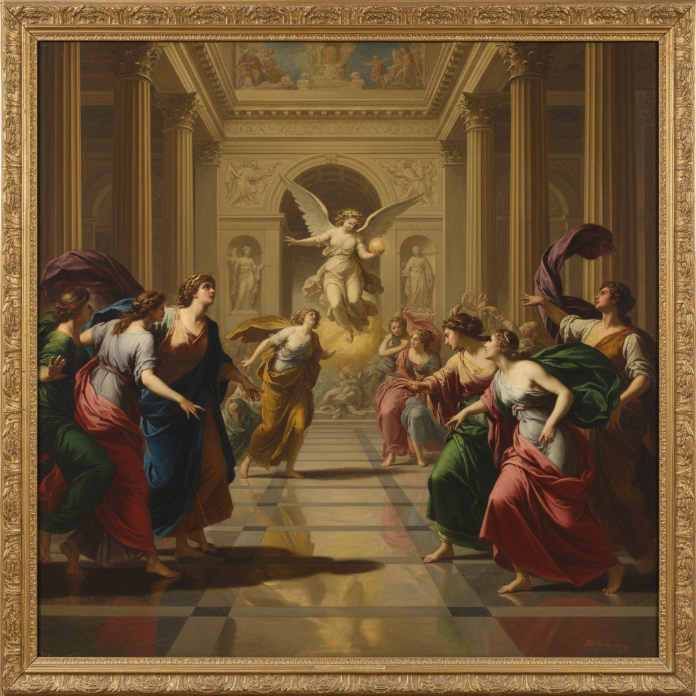

# Academic Realism 学院现实主义

> **时期：** 17世纪–20世纪初  
> **关键词：** 学院体系、古典训练、历史画、沙龙展览、技法至上

## 概述

Academic Realism（学院现实主义）是欧洲皇家美术学院体系培养出的绘画传统——严格的素描训练、解剖学知识、古典构图法则和历史题材的等级制度。从法国美术学院到英国皇家艺术学院，学院派画家用完美的技法服务于崇高的主题：历史、神话、宗教和寓言。布格罗的完美人体、杰罗姆的东方场景——这是印象派革命之前的"正统"艺术。

## 风格特征

- **完美技法**：看不见笔触的光滑表面
- **古典构图**：金字塔形、对角线、平衡
- **历史题材**：神话、圣经、历史事件
- **理想化人体**：解剖精确但经过美化
- **戏剧光线**：舞台式的明暗对比

## 代表人物与作品

- 威廉·布格罗《维纳斯的诞生》
- 让-莱昂·杰罗姆《角斗士》
- 亚历山大·卡巴内尔《堕落天使》
- 保罗·德拉罗什 历史画

## 概念图

