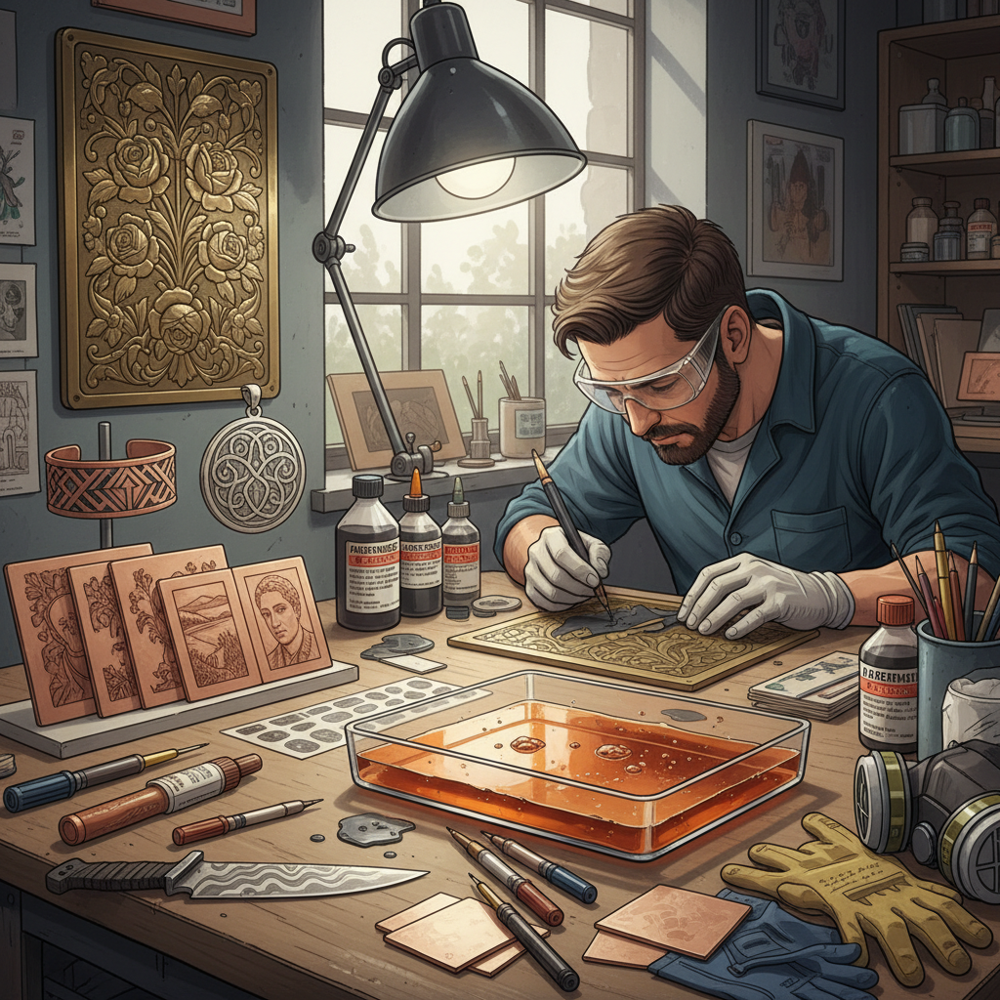

# Acid Etching 酸蚀

> "Acid etching is drawing with chemistry — the artist protects what should remain, then surrenders the rest to the corrosive appetite of acid, which bites into metal with a precision no chisel could match at such scale." — Unknown

## 概述

酸蚀（Acid Etching）是一种利用酸性溶液腐蚀金属表面来创造图案和纹理的技法。艺术家首先在金属表面涂覆一层耐酸的保护层（resist），然后在保护层上刻画或去除需要腐蚀的区域，最后将金属浸入酸液中——未被保护的区域被酸腐蚀形成凹陷，而被保护的区域保持原有高度，从而形成浮雕般的图案。

酸蚀的历史可追溯到中世纪的盔甲装饰，后来发展为版画中的重要技法（蚀刻版画/etching）。在金属工艺中，酸蚀被广泛用于首饰、刀具、金属艺术品和工业零件的装饰。酸蚀的优势在于：能在金属表面创造极其精细的图案、可以处理大面积、不需要高超的雕刻技术。常用的酸液包括氯化铁（ferric chloride）、硝酸和盐酸。

## 核心特征

| 特征 | 描述 |
|------|------|
| 化学 | 化学腐蚀 |
| 保护层 | 耐酸保护层 |
| 精细 | 极其精细的图案 |
| 可控 | 可控的深度 |
| 大面积 | 可处理大面积 |
| 多用途 | 艺术和工业应用 |

## 视觉特征

- **精细**：精细的线条和图案
- **浮雕**：浮雕般的效果
- **对比**：高低面的对比
- **均匀**：均匀的腐蚀深度
- **复杂**：可实现复杂图案
- **锐利**：锐利的边缘

## 代表作品

| 作品 | 艺术家 | 年代 | 意义 |
|------|--------|------|------|
| *Medieval etched armor* | 欧洲工匠 | 15-16世纪 | 盔甲酸蚀装饰 |
| *Rembrandt etchings* | Rembrandt | 17世纪 | 蚀刻版画大师 |
| *Etched jewelry* | Various | 当代 | 酸蚀首饰 |
| *Etched knife blades* | Various | 当代 | 酸蚀刀具 |
| *Circuit board etching* | Industrial | 当代 | 工业酸蚀应用 |

## 历史时间线

| 时期 | 事件 |
|------|------|
| 15世纪 | 酸蚀在盔甲装饰中的应用 |
| 16世纪 | 蚀刻版画技法的发展 |
| 17世纪 | Rembrandt等大师的蚀刻版画 |
| 19世纪 | 工业酸蚀的发展 |
| 20世纪 | 电子工业中的酸蚀（PCB） |
| 当代 | 艺术和工艺中的持续应用 |

## 中国语境

酸蚀在中国的金属工艺和工业中有广泛应用。中国的传统金属工艺中虽然更多使用錾刻（chasing）和雕刻，但酸蚀技法在近现代被引入并广泛使用。中国的当代首饰设计师使用酸蚀创作精细的金属首饰。中国的刀具制作中，酸蚀被用于在刀身上创造图案和标记。中国的电子工业中，酸蚀是PCB制造的核心工艺。中国的金属工艺教育中，酸蚀是基础技法之一。

## AI生成概念图

## 与其他风格的关系

- **Metal Etching** → 金属蚀刻
- **Glass Etching** → 玻璃蚀刻
- **Printmaking** → 版画
- **Engraving** → 雕刻
- **Jewelry Making** → 首饰制作
- **Industrial Design** → 工业设计

---

*浮光艺志 | Chronicle of Artistry*
