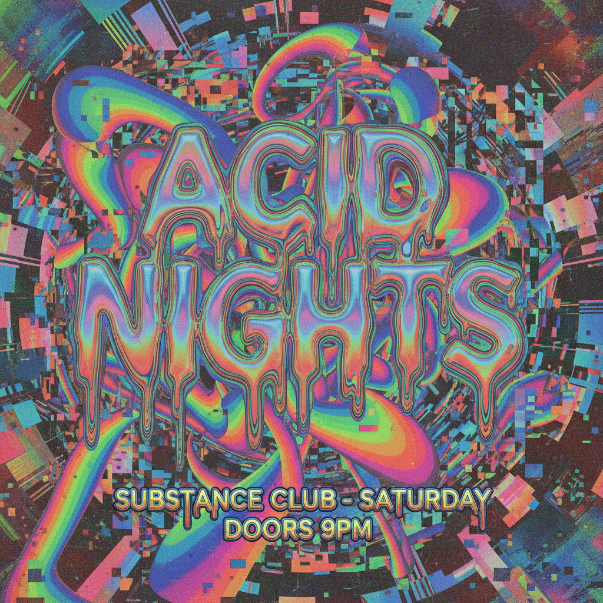
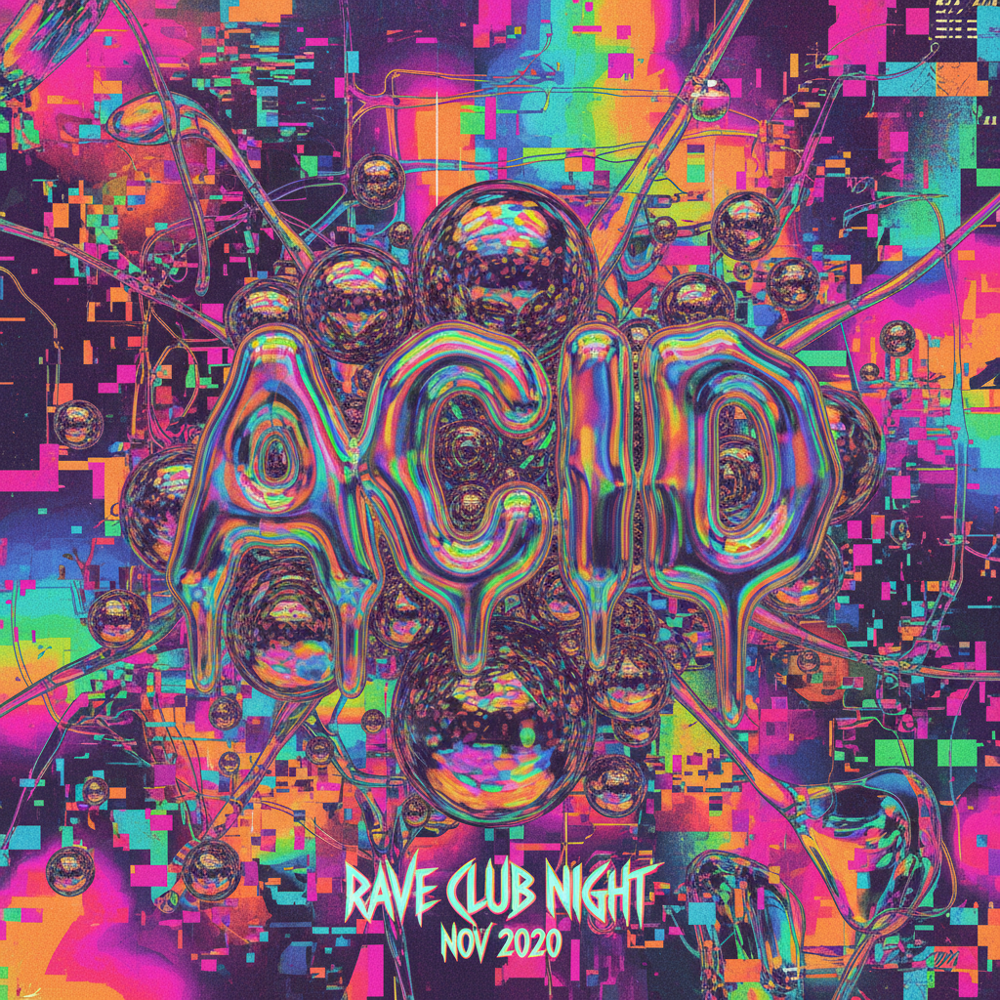

# 酸性设计 | Acid Graphics

## 概述

- **时间跨度**：2018 – 至今
- **发源地**：互联网设计社区（Instagram、Behance、Are.na）
- **核心理念**：极端的视觉张力，将Y2K和蒸汽波的元素推向更激进的形式实验

## 历史背景

酸性设计（Acid Graphics）是2018年前后从Y2K回潮和蒸汽波美学中分化出的一种更为激进的平面设计风格。它继承了Y2K的金属质感和蒸汽波的迷幻色彩，但在排版、构图和材质表现上走向了更极端的实验性。

"Acid"一词既指视觉上的"腐蚀感"（如液态金属的溶解效果），也暗示了迷幻药文化（Acid Trip）带来的视觉扭曲体验。这一风格在独立音乐海报、潮牌视觉、NFT艺术中广泛应用。

## 视觉特征

### 色彩
- 高对比度荧光色（酸绿、电紫、热粉）
- 黑色/深灰背景为主
- 金属渐变（铬银、液态金）
- 彩虹全息渐变

### 核心视觉元素
- **液态铬/金属球体**：3D渲染的反射金属物体
- **扭曲变形文字**：拉伸、膨胀、融化的字体
- **极端排版**：超大/超小字号混排、密集文字块
- **星形/尖刺图形**：锐利的几何装饰
- **噪点与颗粒纹理**
- **扫描线/摩尔纹**
- **眼球、嘴唇等身体局部**
- **条形码、技术参数文字**

### 排版特征
- 极窄或极宽的字体
- 文字沿曲线/圆形排列
- 大量使用Helvetica Neue、Monument Extended等字体
- 文字作为图形元素而非信息载体

## 与Y2K/蒸汽波的区别

| 维度 | Y2K | 蒸汽波 | 酸性设计 |
|------|-----|--------|----------|
| 情绪 | 乐观、甜美 | 迷幻、讽刺 | 激进、冷酷 |
| 色调 | 糖果色 | 粉紫渐变 | 荧光+黑色 |
| 质感 | 半透明塑料 | VHS低保真 | 液态金属 |
| 排版 | 泡泡字体 | 日文/像素 | 极端实验排版 |
| 受众 | 大众流行 | 亚文化 | 设计师/潮牌 |

## 应用领域

| 领域 | 说明 |
|------|------|
| 音乐海报 | 电子音乐、Techno、实验音乐活动视觉 |
| 潮牌设计 | 街头品牌的视觉识别 |
| NFT/加密艺术 | 数字收藏品的视觉语言 |
| 社交媒体 | Instagram设计师账号的标志性风格 |
| 杂志排版 | 先锋时尚杂志的实验版面 |

## 代表设计师/工作室

| 名称 | 特征 |
|------|------|
| David Rudnick | 极端排版、金属质感 |
| Acid Midis | 酸性设计的命名灵感之一 |
| Hassan Rahim | 暗黑金属美学 |
| Slava Kirilenko | 液态铬3D |

## 图片画廊

<!-- 存放于 assets/artworks/acid-graphics/ -->

| | |
|:---:|:---:|
|  |  |
| *酸性设计概念* | *铬色液态排版* |

## 延伸阅读

- [Acid Graphics 趋势分析 (Behance)](https://www.behance.net/search/projects?search=acid+graphics)
- [Are.na: Acid Graphics](https://www.are.na/search/acid%20graphics)

---

[← 梦核与怪核 Dreamcore](dreamcore-weirdcore.md) | [→ McBling](mcbling.md) | [↑ 返回目录](README.md)
