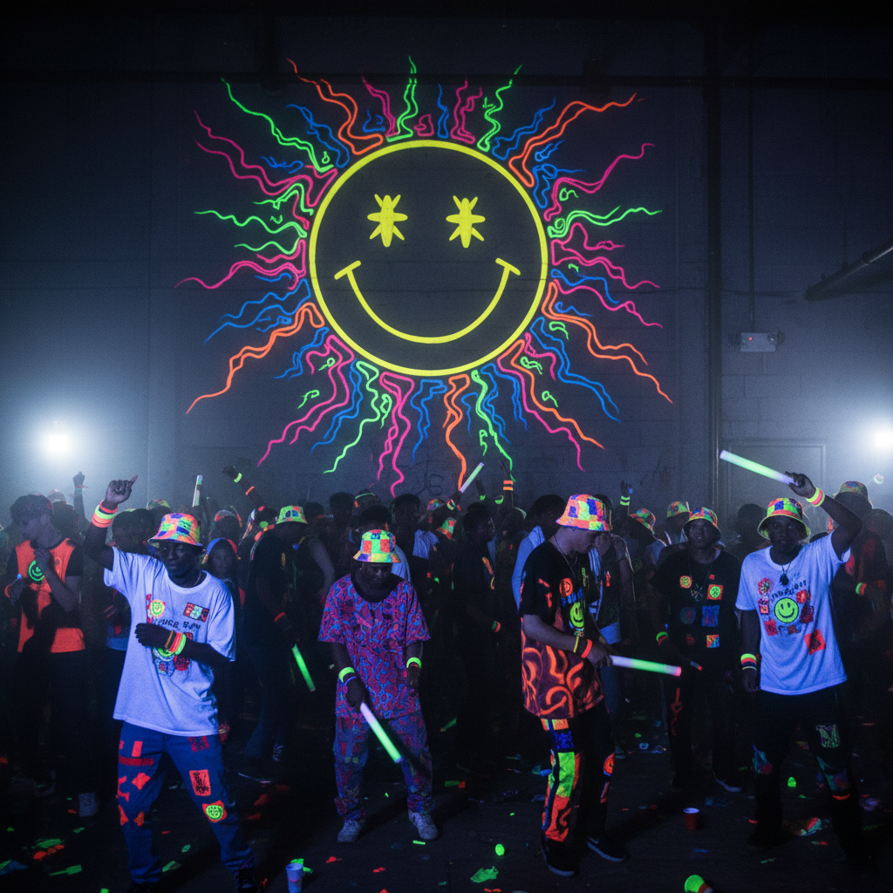

# Acid House 酸浩室



> **"笑脸、荧光、仓库派对——1988年的第二个夏天改变了一切。"**

## 概述

| 维度 | 描述 |
|------|------|
| 时期 | 1987–1992/影响至今 |
| 别名 | Acid House, Second Summer of Love, Rave |
| 核心色彩 | 荧光黄、荧光绿、荧光粉、黑色 |
| 关键元素 | 笑脸符号、荧光色、仓库/田野派对、Roland TB-303 |
| 代表人物 | DJ Pierre, 808 State, The Prodigy, Orbital |
| 关联风格 | Rave, Techno, Trance, Cyber Goth, Nu-Rave |

---

## 历史脉络

| 年份 | 事件 |
|------|------|
| 1987 | DJ Pierre "Acid Tracks"——Acid House 诞生于芝加哥 |
| 1987 | Ibiza——英国DJ发现Acid House |
| 1988 | "Second Summer of Love"——英国仓库派对爆发 |
| 1989 | 政府打压——Criminal Justice Act |
| 1990 | 从地下到主流——The Prodigy, Orbital |
| 1992 | Rave 文化商业化——超级俱乐部时代 |

### 核心哲学

Acid House 的精神是**"PLUR——Peace, Love, Unity, Respect——在舞池里人人平等"**：
- 跳舞 = 自由（"不需要VIP——舞池面前人人平等"）
- 笑脸 = 快乐（"最简单的符号，最纯粹的快乐"）
- 仓库 = 反体制（"我们不需要许可证"）
- 重复 = 催眠（"4/4拍是通往另一个维度的门"）
- "如果你在1988年的仓库里——你知道那是什么感觉"

---

## 视觉语法

### 色彩系统

```
主色：
  荧光黄 (#FFFF00) — 笑脸、经典
  荧光绿 (#39FF14) — UV反应
  荧光粉 (#FF69B4) — 派对
  黑色 (#000000) — 基底、夜晚

辅色：
  荧光橙 (#FF6600) — 活力
  白色 (#FFFFFF) — 对比
  紫色 (#9400D3) — UV灯

规则：
  - 荧光色 = 必须（UV灯下发光）
  - 黑色基底 + 荧光 = 基本公式
  - 笑脸 = 最核心的符号
  - 重复图案 = 催眠感

质感：
  荧光 — 在UV灯下发光
  塑料 — 手环、哨子
  尼龙 — 运动服
  汗水 — 真实的质感
```

### 标志性元素

| 类别 | 元素 |
|------|------|
| 符号 | 黄色笑脸 ☺、和平符号、阴阳 |
| 服装 | 荧光运动服、宽松T恤、渔夫帽 |
| 配饰 | 荧光手环、哨子、白手套 |
| 场所 | 仓库、田野、超级俱乐部 |
| 音乐 | TB-303 酸音、TR-808/909 鼓机、4/4拍 |
| 态度 | PLUR、快乐、自由、平等、跳舞 |

---

## 与千禧怀旧的关系

### Rave 文化的起源
- Acid House (1988) = 所有 Rave 文化的起点
- → Techno → Trance → Drum & Bass → Dubstep
- 笑脸符号 = 流行文化中最持久的亚文化符号之一
- "没有1988年的仓库，就没有今天的电子音乐节"

### Nu-Rave 复兴 (2006-2010)
- Klaxons, New Young Pony Club
- 荧光色回归时尚
- "2000s 的孩子重新发现了笑脸和荧光"

---

## 中国语境

- 电子音乐在中国的爆发（2015后）
- 中国音乐节文化的兴起
- 笑脸符号在中国潮流文化中的存在
- 与中国"锐舞"/"电音派对"的关系

---

## 设计应用

| 场景 | 应用方式 |
|------|----------|
| 音乐 | 电子音乐+海报+笑脸+荧光+派对 |
| 活动 | 音乐节+UV派对+仓库+荧光装饰 |
| 品牌 | 快乐+荧光+笑脸+年轻+自由 |
| 时尚 | 荧光+运动+宽松+渔夫帽+手环 |

---

## 相关风格

← [Nu-Rave 新锐舞](nu-rave.md) | [Cyber Goth 赛博哥特](cyber-goth.md) →

↑ [返回千禧怀旧目录](README.md) | [返回总目录](../README.md)
