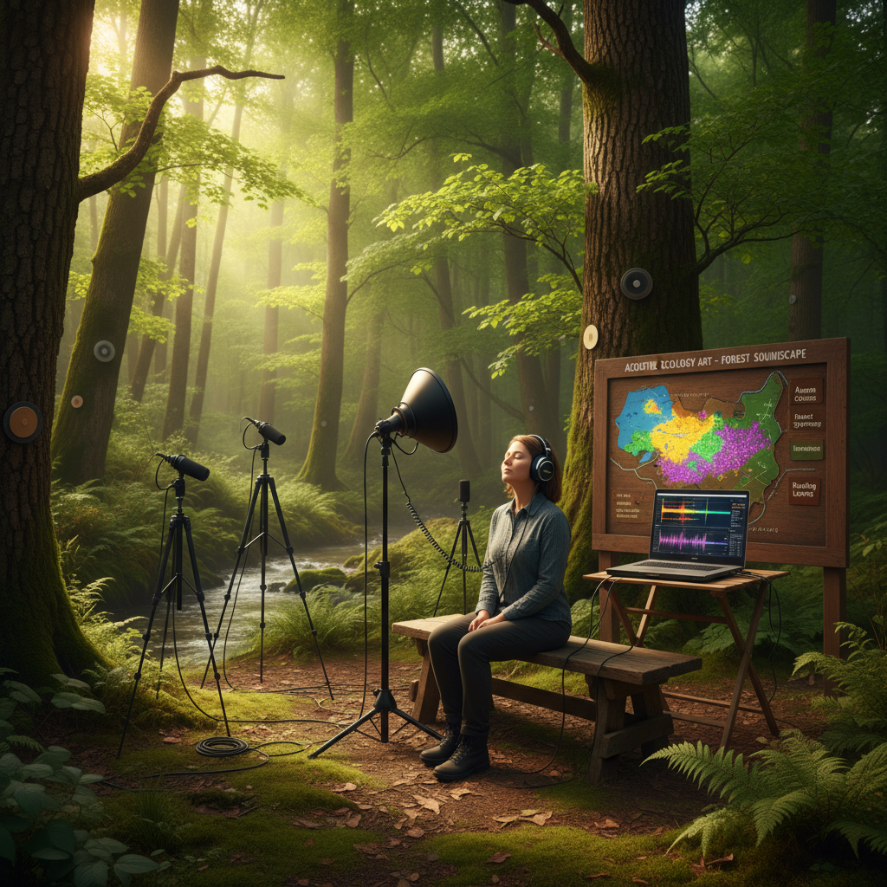

# Acoustic Ecology Art 声学生态艺术

> "Acoustic ecology art listens to the world as a whole — it hears the soundscape not as background noise but as a living composition, a symphony of biophony, geophony, and anthrophony that tells the story of a place more truthfully than any photograph, that reveals the health of an ecosystem through its sonic richness, and that mourns the growing silence as species disappear and human noise drowns out the voices of the living world." — R. Murray Schafer

## 概述

声学生态艺术（Acoustic Ecology Art）是基于声学生态学——研究声音与环境关系的学科——的艺术实践。声学生态学由加拿大作曲家R. Murray Schafer在1960年代创立，它将环境中的所有声音视为一个"声景"（soundscape），并研究这个声景的组成、变化和意义。

声学生态艺术的实践包括：1）声景录制——在特定地点录制完整的声学环境，作为"声音摄影"；2）声景作曲——用环境录音创作音乐和声音作品；3）声景地图——创建地点的声学地图，记录不同位置的声音特征；4）消失的声音——记录和保存正在消失的自然和文化声音；5）声音行走——引导人们在环境中专注聆听，重新发现声音世界。

## 核心特征

| 特征 | 描述 |
|------|------|
| 聆听 | 深度聆听 |
| 环境 | 环境声音 |
| 生态 | 声学生态 |
| 记录 | 声景记录 |
| 变化 | 声景变化 |
| 保护 | 声音保护 |

## 视觉特征

- **波形**：声波的可视化
- **频谱**：声景的频谱图
- **地图**：声音地图
- **设备**：录音设备和麦克风
- **自然**：自然环境场景
- **图表**：声学数据图表

## 代表作品

| 作品 | 艺术家 | 年代 | 意义 |
|------|--------|------|------|
| *World Soundscape Project* | R. Murray Schafer | 1969 | 声景研究先驱 |
| *Endangered sounds* | Various | 2000年代 | 濒危声音 |
| *Soundscape compositions* | Hildegard Westerkamp | 1980年代至今 | 声景作曲 |
| *Dawn chorus recordings* | Various | 2010年代 | 黎明合唱录制 |
| *Urban soundscapes* | Various | 当代 | 城市声景 |

## 历史时间线

| 时期 | 事件 |
|------|------|
| 1969 | R. Murray Schafer创立世界声景项目 |
| 1977 | Schafer《The Tuning of the World》 |
| 1990年代 | 声学生态学的全球化 |
| 2010年代 | 数字技术使声景录制民主化 |
| 当代 | 与气候变化研究的结合 |

## 中国语境

声学生态艺术在中国有独特的文化基础。中国传统文化中有丰富的"听觉美学"——从"高山流水"的音乐意境，到"蝉噪林逾静，鸟鸣山更幽"的声景诗学，到中国传统园林中对水声、风声、鸟声的精心设计。中国传统的"听雨"文化——在不同季节、不同建筑中聆听雨声的不同质感——是一种古老的声学生态实践。中国当代面临严重的噪声污染问题，这使得声学生态艺术具有特殊的现实意义。中国的一些艺术家在探索声学生态：录制中国正在消失的自然声景、创建中国城市的声音地图、以及将中国传统的听觉美学与当代声学生态学结合。

## AI生成概念图

## 与其他风格的关系

- **Sound Art** → 声音艺术
- **Eco-Art** → 生态艺术
- **Field Recording** → 田野录音
- **Sonification Art** → 声化艺术
- **Land Art** → 大地艺术
- **Environmental Art** → 环境艺术

---

*浮光艺志 | Chronicle of Artistry*
