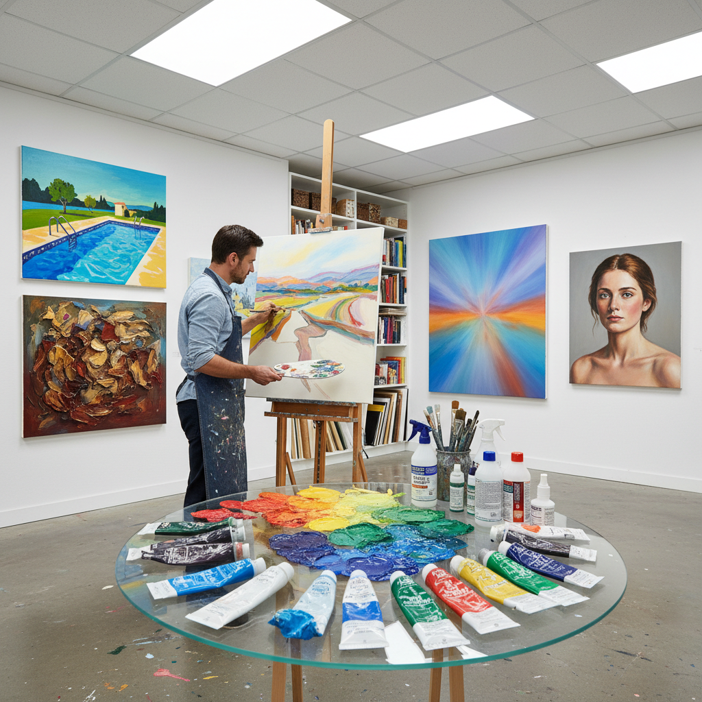

# Acrylic Painting 丙烯画

> "Acrylic is the chameleon of paints — it can mimic the transparency of watercolor, the body of oil, the flatness of gouache, and yet it dries in minutes, demanding decisiveness from the artist." — Unknown

## 概述

丙烯画（Acrylic Painting）是使用丙烯酸树脂乳液颜料进行创作的绘画形式。丙烯颜料于1950年代商业化，迅速成为20世纪下半叶最重要的绘画媒介之一。丙烯的核心优势在于：快速干燥（几分钟到几小时）、水溶性（使用时可用水稀释，干后防水）、极强的适应性（可以模拟油画的厚涂、水彩的透明、甚至喷漆的平滑）、以及优异的耐久性（不会像油画那样随时间变黄或开裂）。

丙烯画的兴起与波普艺术、色域绘画和当代艺术的发展密切相关——Andy Warhol、David Hockney、Mark Rothko等艺术家都大量使用丙烯颜料。丙烯的快干特性使得艺术家可以快速叠加层次，适合大尺幅和快节奏的创作。

## 核心特征

| 特征 | 描述 |
|------|------|
| 快干 | 几分钟即可干燥 |
| 水溶 | 使用时水溶，干后防水 |
| 多变 | 可模拟多种效果 |
| 耐久 | 不变黄不开裂 |
| 灵活 | 适用于多种基底 |
| 现代 | 20世纪的发明 |

## 视觉特征

- **鲜艳**：色彩鲜艳饱和
- **平滑**：可实现极平滑的表面
- **厚涂**：也可厚涂堆积
- **层次**：快干允许快速叠层
- **哑光**：自然哑光质感
- **多样**：视觉效果极多样

## 代表作品

| 作品 | 艺术家 | 年代 | 意义 |
|------|--------|------|------|
| *A Bigger Splash* | David Hockney | 1967 | 丙烯画的经典 |
| *Campbell's Soup Cans* | Andy Warhol | 1962 | 波普艺术丙烯 |
| *No. 61 (Rust and Blue)* | Mark Rothko | 1953 | 色域绘画 |
| *Mountains and Sea* | Helen Frankenthaler | 1952 | 色域绘画先驱 |
| *Contemporary acrylic* | Various | 当代 | 当代丙烯艺术 |

## 历史时间线

| 时期 | 事件 |
|------|------|
| 1934 | 丙烯酸树脂的发明 |
| 1950s | 商业丙烯颜料的推出 |
| 1960s | 波普艺术家的广泛采用 |
| 1970s | 丙烯成为主流媒介 |
| 1980s+ | 丙烯介质和添加剂的丰富 |
| 当代 | 丙烯画的全球普及 |

## 中国语境

丙烯画在中国的当代艺术中占有重要地位。中国当代艺术家如张晓刚、岳敏君、曾梵志等大量使用丙烯颜料。丙烯的快干特性和鲜艳色彩特别适合中国当代艺术中的大尺幅创作。在中国的美术教育中，丙烯画是重要的课程内容。中国的壁画和公共艺术领域也广泛使用丙烯颜料（因其耐候性）。当代中国的插画和设计领域中，丙烯也是常用媒介。

## AI生成概念图

## 与其他风格的关系

- **Oil Painting** → 油画
- **Watercolor** → 水彩
- **Gouache** → 水粉
- **Pop Art** → 波普艺术
- **Color Field** → 色域绘画
- **Mixed Media** → 混合媒介

---

*浮光艺志 | Chronicle of Artistry*
