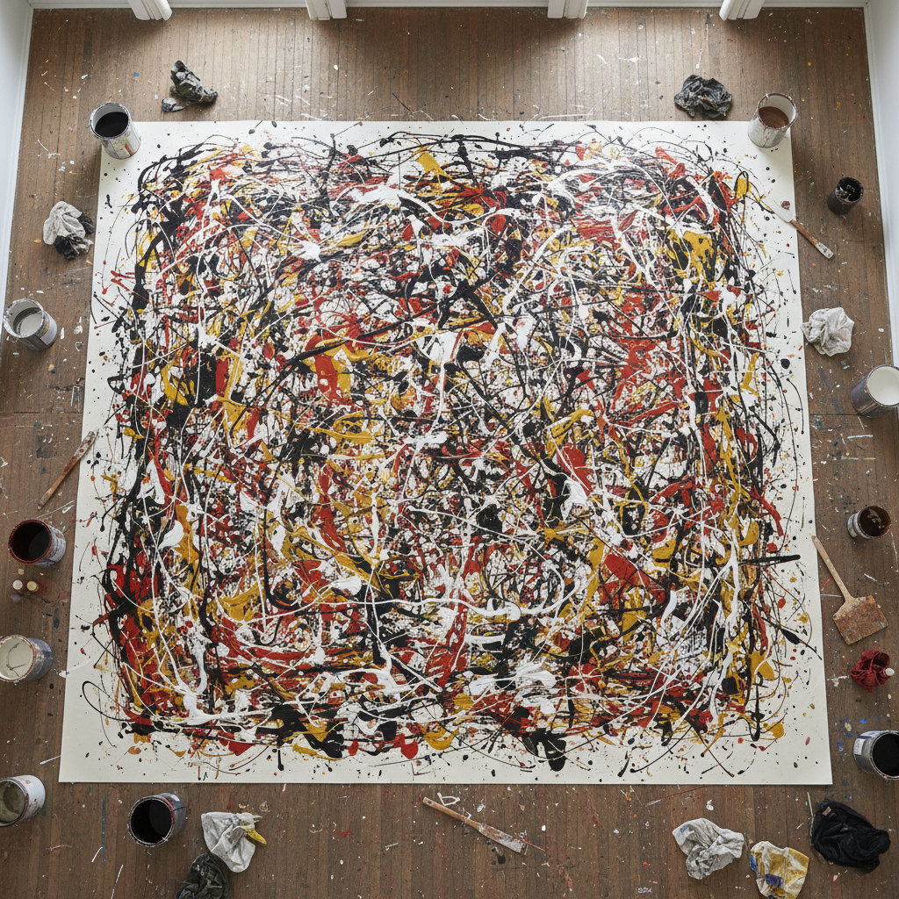

# Action Painting 行动绘画

> "The painting has a life of its own. I try to let it come through." — Jackson Pollock

## 概述

行动绘画（Action Painting）是抽象表现主义的核心实践——强调绑画行为本身的物理性和即时性，而非最终的图像结果。杰克逊·波洛克将画布铺在地上，用棍子和刷子将颜料滴洒、泼溅、甩动在画面上；德库宁用狂暴的笔触撕裂画面；弗朗茨·克莱恩用巨大的黑色笔触横扫画布。行动绘画将绘画从"制作图像"解放为"身体行动的记录"。

行动绘画的哲学在于：绘画不是表现——它是行动。画布不是窗户——它是竞技场。

## 核心特征

| 特征 | 描述 |
|------|------|
| 身体性 | 强调身体的物理行动 |
| 即时性 | 即兴的、即时的创作 |
| 过程 | 过程比结果重要 |
| 大尺度 | 通常是大尺度画布 |
| 能量 | 充满能量和动势 |
| 无意识 | 潜意识的自动表达 |

## 视觉特征

- **滴洒**：颜料的滴洒和泼溅
- **笔触**：狂暴的、有力的笔触
- **能量**：充满动态能量的画面
- **层次**：颜料层的叠加和交织
- **大尺度**：巨大的画面尺度
- **全面**：all-over的构图方式

## 代表作品

| 作品 | 艺术家 | 年代 | 意义 |
|------|--------|------|------|
| *Number 1A, 1948* | Jackson Pollock | 1948 | 滴画的巅峰 |
| *Autumn Rhythm* | Jackson Pollock | 1950 | 行动绘画的代表 |
| *Woman I* | Willem de Kooning | 1950-52 | 狂暴的笔触 |
| *Painting* | Franz Kline | 1952 | 黑白的力量 |
| *Mountains and Sea* | Helen Frankenthaler | 1952 | 浸染法的开创 |
| *Untitled* | Joan Mitchell | 1960s-90s | 抒情行动绘画 |

## 历史时间线

| 时期 | 事件 |
|------|------|
| 1940s | 抽象表现主义的兴起 |
| 1947 | Pollock开始滴画 |
| 1952 | Harold Rosenberg命名"行动绘画" |
| 1950s | 行动绘画的黄金时代 |
| 1956 | Pollock去世 |
| 1960s | 行动绘画的影响扩散 |
| 当代 | 行动绘画的遗产和继承 |

## 中国语境

行动绘画在中国当代艺术中有重要影响——从1980年代的"85新潮"开始，中国艺术家就在探索行动绘画的可能性。中国传统书法中的"狂草"——如张旭、怀素的草书——在精神上与行动绘画有深刻的相通：都是身体能量的直接释放。当代中国的抽象绘画和实验书法中，行动绘画的影响无处不在。

## AI生成概念图

## 与其他风格的关系

- **Abstract Expressionism** → 抽象表现主义包含行动绘画
- **Automatism** → 自动主义是行动绘画的精神来源
- **Performance Art** → 行为艺术继承了行动绘画的身体性
- **Calligraphy** → 书法与行动绘画有身体相通
- **Tachisme** → 塔希主义是欧洲的行动绘画
- **Gutai** → 具体派是日本的行动绘画

---

*浮光艺志 | Chronicle of Artistry*
