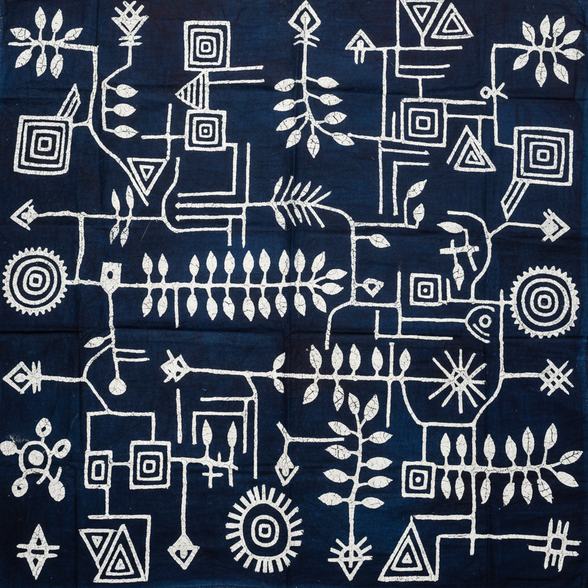

# Adire 阿迪雷 | Adire / アディレ

> **"靛蓝的秘密——约鲁巴族女性用淀粉糊在白布上画出只有她们知道的图案密码。"**

## 概述

Adire（阿迪雷）是尼日利亚约鲁巴族（Yoruba）的传统靛蓝染布艺术，"Adire"在约鲁巴语中意为"扎染"或"抗染"。最经典的形式是Adire Eleko——用木薯淀粉糊（laali）在白色棉布上手绘图案作为防染剂，然后浸入靛蓝染缸，洗去淀粉后露出白色图案。另一种形式Adire Oniko使用扎染技法。Adire在19世纪末至20世纪初的阿贝奥库塔（Abeokuta）达到鼎盛，是约鲁巴族女性的重要经济和艺术活动。

## 主要类型

| 类型 | 技法 |
|------|------|
| Adire Eleko | 淀粉糊防染（手绘） |
| Adire Oniko | 扎染（绑扎） |
| Adire Alabere | 缝扎染 |

## 核心特征

- **靛蓝染色**：深蓝色的经典色调
- **淀粉防染**：木薯淀粉糊作为防染剂
- **手绘图案**：用鸡毛笔或棕榈肋骨绘制
- **女性艺术**：约鲁巴族女性的传统
- **象征图案**：每种图案有特定名称和含义
- **大幅布料**：通常为整块包裹布

## 经典图案

| 图案名 | 含义 |
|--------|------|
| Ibadandun | "伊巴丹是甜的" |
| Olokun | 海神 |
| Sunbebe | 太阳 |
| Ewe | 叶子 |
| Alaari | 红色布料 |

## 视觉特征

- 靛蓝和白色的经典对比
- 手绘线条的自由流动
- 重复的几何和有机图案
- 大面积的布料构图
- 淀粉防染的独特边缘
- 深浅蓝色的层次变化

## 与其他风格的关系

| 风格 | 关系 |
|------|------|
| Batik蜡染 | 共享防染技法 |
| Shibori绞り染め | 共享扎染传统 |
| Indigo靛蓝文化 | 共享靛蓝染色 |
| Boro襤褸 | 共享靛蓝美学 |
| 当代非洲时尚 | Adire的现代复兴 |

## 概念图

---

*浮光艺志 | Chronicle of Artistry*
