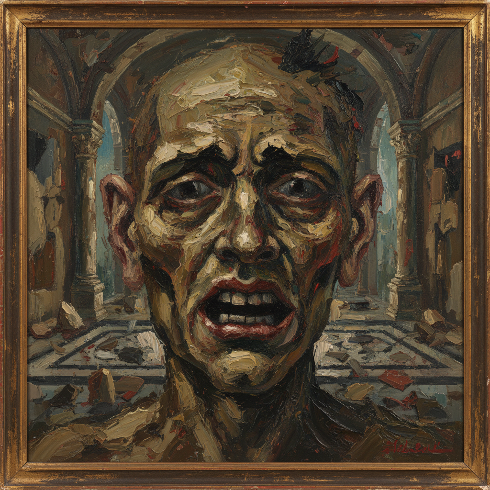

# Adrian Ghenie 阿德里安·格尼

> **流派**: 当代绘画 · 新表现主义  
> **时期**: 1977–至今 罗马尼亚  
> **关键词**: 历史创伤、面孔变形、厚涂刮擦、弗朗西斯·培根遗产

## 概述

阿德里安·格尼是当代最炙手可热的欧洲画家之一。他的作品处理20世纪的历史创伤——纳粹、共产主义、独裁——但用一种极度物质化的绘画语言：厚重的颜料被刮刀切割、堆叠和撕裂，人物的面孔在颜料的暴力操作中变形为肉块般的抽象。他被视为弗朗西斯·培根的当代继承者。

## 视觉特征

- **面孔变形**: 人物面部被颜料覆盖、刮擦、扭曲
- **厚涂刮擦**: 用刮刀大面积移动颜料
- **历史人物**: 希特勒、齐奥塞斯库等独裁者形象
- **暗色调**: 深棕、暗红、黑色为主
- **空间透视**: 保留古典的室内空间感

## 代表作品

- 《镍矿》(The Nickel Mine, 2008)
- 《馅饼战斗》(Pie Fight) 系列
- 威尼斯双年展罗马尼亚馆 (2015)
- 《达尔文的房间》(Darwin's Room, 2014)

## 历史影响

格尼证明了绘画仍然是处理历史暴力最有力的媒介之一。他的"面孔毁灭"技法为表达20世纪极权主义的恐怖找到了一种既具体又抽象的视觉形式。

## 相关风格

- [Francis Bacon 弗朗西斯·培根](francis-bacon.md)
- [Neo-Expressionism 新表现主义](neo-expressionism.md)
- [Luc Tuymans 吕克·图伊曼斯](luc-tuymans.md)
