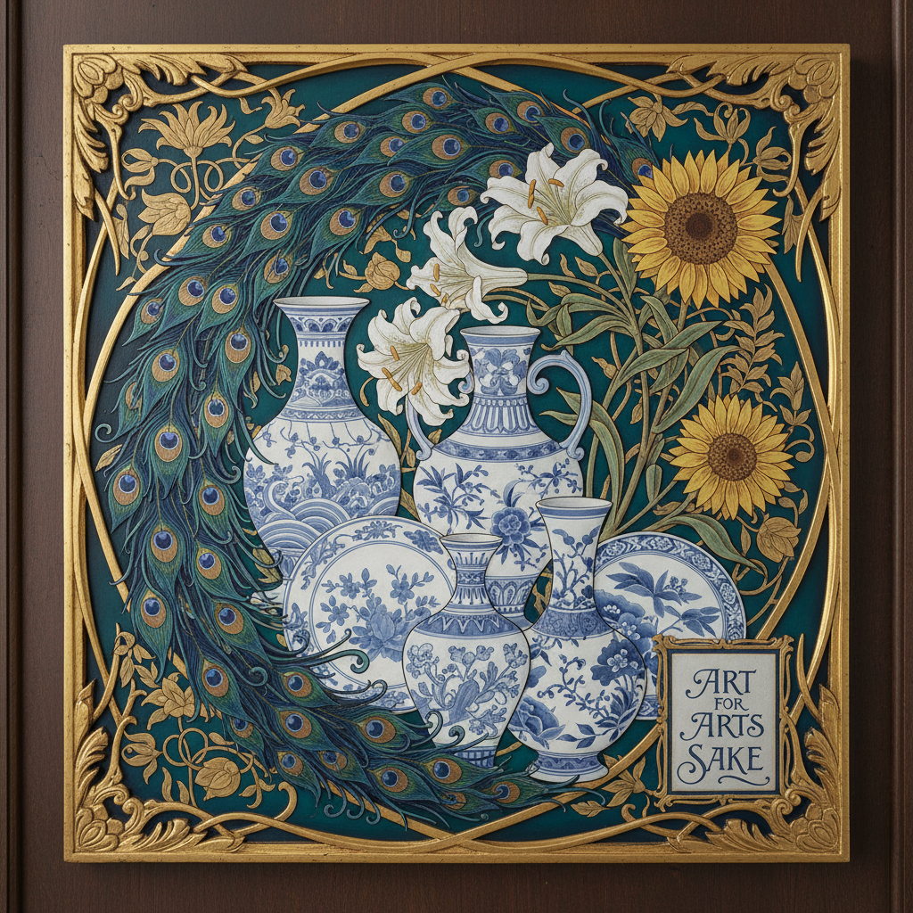

# Aesthetic Movement 唯美主义运动



> **"为艺术而艺术——美不需要理由，不需要道德，不需要目的。"**

## 概述

| 维度 | 描述 |
|------|------|
| 时期 | 1868–1901 |
| 别名 | Aesthetic Movement, Aestheticism, 唯美主义, 审美运动 |
| 核心色彩 | 孔雀蓝绿、向日葵金、百合白、深红 |
| 关键元素 | 孔雀、百合、向日葵、日本风、"为艺术而艺术" |
| 代表人物 | James McNeill Whistler, Oscar Wilde, Aubrey Beardsley, William Morris |
| 关联风格 | Art Nouveau, Arts and Crafts, Pre-Raphaelite, Japonisme |

---

## 历史脉络

| 年份 | 事件 |
|------|------|
| 1860s | "为艺术而艺术"理念在英国传播 |
| 1870s | Whistler的"夜曲"系列——唯美主义绘画巅峰 |
| 1876 | Whistler设计"孔雀房间"——唯美主义室内设计典范 |
| 1882 | Oscar Wilde美国巡回演讲——唯美主义的明星化 |
| 1890s | Aubrey Beardsley的插画——唯美主义的黑白极致 |
| 1895 | Oscar Wilde审判——唯美主义的终结标志 |
| 1901 | 维多利亚时代结束——唯美主义正式落幕 |

### 核心哲学

唯美主义的精神是**"美是生活的最高目的——艺术不为道德服务"**：
- Oscar Wilde："所有艺术都是无用的——这正是它的价值"
- "Art for Art's Sake" = 艺术不需要教化功能
- "生活应该模仿艺术——而不是艺术模仿生活"
- "美是唯一的真理——丑是唯一的罪"
- "感官愉悦 > 道德教化 > 实用功能"

---

## 视觉语法

### 色彩系统

```
主色：
  孔雀蓝 (#006D6F) — 标志色、异域
  孔雀绿 (#00A693) — 自然、东方
  向日葵金 (#FFD700) — 太阳、生命
  百合白 (#FFFAFA) — 纯洁、唯美

辅色：
  深红 (#8B0000) — 激情、颓废
  靛蓝 (#191970) — 夜曲、神秘
  象牙 (#FFFFF0) — 精致、古典

标志物：
  孔雀 — 唯美主义的图腾
  百合 — 纯洁与美
  向日葵 — Oscar Wilde的标志
  蓝白瓷 — 日本风/中国风

规则：
  - 装饰性 > 叙事性
  - 东方元素（日本风）是核心
  - 线条优雅、构图精致
  - 色彩和谐——不为表达情感
  - 美本身就是目的
```

### 标志性元素

| 类别 | 元素 |
|------|------|
| 图案 | 孔雀羽毛、百合、向日葵、蓝白瓷 |
| 风格 | 日本风(Japonisme)、东方装饰 |
| 线条 | 优雅曲线、装饰性、Beardsley式黑白 |
| 室内 | 孔雀房间、蓝白瓷收藏、东方屏风 |
| 态度 | 颓废、精致、反维多利亚道德 |

---

## 与千禧怀旧/当代的关系

### Dark Academia的祖先
- Dark Academia的"为知识而知识" = 唯美主义的"为艺术而艺术"
- Oscar Wilde = Dark Academia的精神偶像
- 维多利亚时代的精致 = 两者共享的美学基础

### 对当代设计的影响
- 孔雀元素在时尚中的持续流行
- "Art for Art's Sake"精神 → 当代独立设计
- Aubrey Beardsley的黑白插画 → 当代插画的灵感源

---

## 设计应用

| 场景 | 应用方式 |
|------|----------|
| 室内 | 孔雀元素+东方装饰+精致 |
| 时尚 | 颓废美+精致+反实用 |
| 插画 | Beardsley式黑白+装饰线条 |
| 品牌 | 高端+艺术+唯美+精致 |

---

## 相关风格

← [Pre-Raphaelite 前拉斐尔派](pre-raphaelite.md) | [Art Nouveau 新艺术运动](art-nouveau.md) →

↑ [返回千禧怀旧目录](README.md) | [返回总目录](../README.md)
