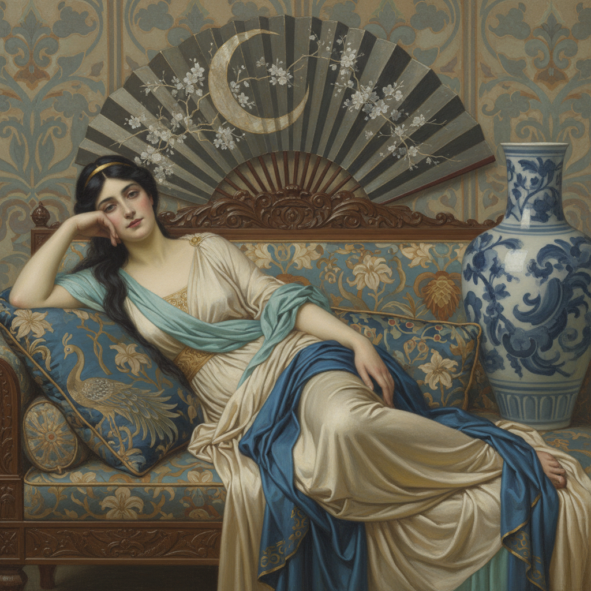

# Aestheticism Painting 唯美主义绘画

> **时期：** 1860年代–1900年代  
> **关键词：** 为艺术而艺术、感官愉悦、装饰性、惠斯勒、美即真理

## 概述

Aestheticism Painting（唯美主义绘画）是19世纪后半叶"为艺术而艺术"运动在绘画中的体现——画家们拒绝艺术必须承载道德教化或叙事功能，转而追求纯粹的视觉美感。惠斯勒将画作命名为"夜曲"和"交响曲"，阿尔伯特·摩尔的古典女性只为展示色彩与形式的和谐——美本身就是目的，不需要理由。

## 风格特征

- **色彩和谐**：如音乐般的色调编排
- **装饰性**：图案、织物和花卉的精致描绘
- **古典女性**：理想化的优雅姿态
- **东方元素**：日本和中国艺术的影响
- **模糊叙事**：去除故事，保留氛围

## 代表人物与作品

- 詹姆斯·惠斯勒 夜曲系列
- 阿尔伯特·摩尔 古典女性
- 弗雷德里克·莱顿 唯美人物
- 爱德华·伯恩-琼斯 装饰画

## 概念图

