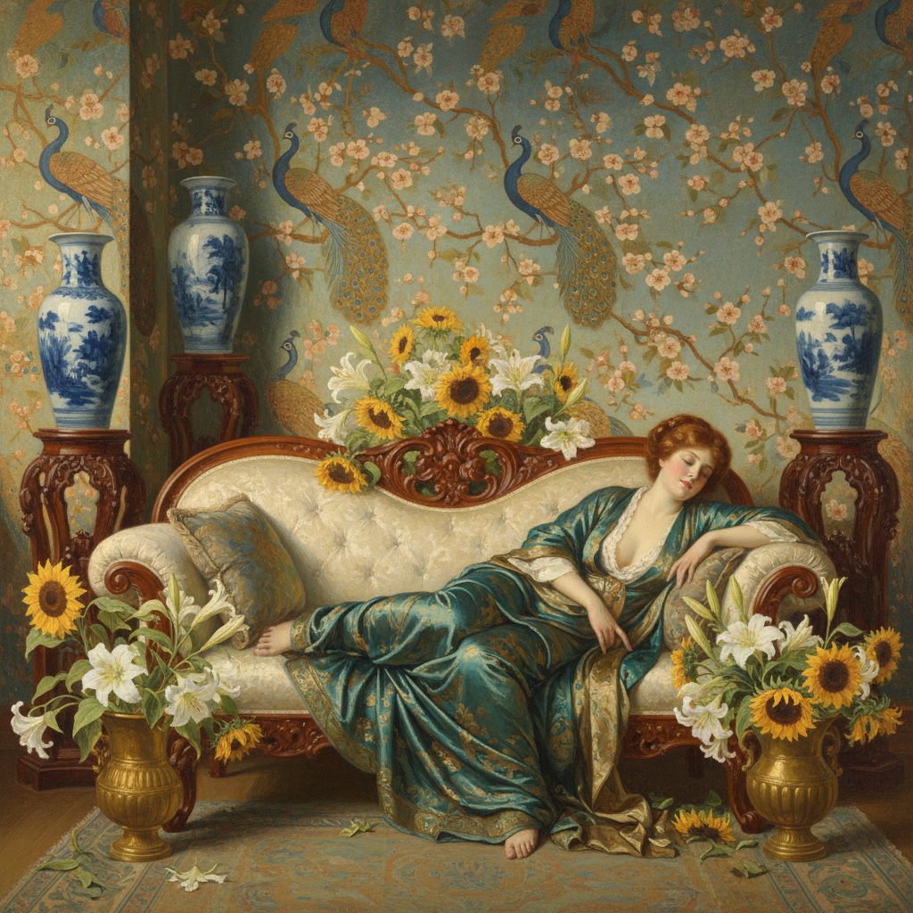

# Aestheticism 唯美主义

> "All art is quite useless." — Oscar Wilde

## 概述

唯美主义（Aestheticism）是19世纪后半叶兴起于英国的艺术运动，核心信条是"为艺术而艺术"（Art for Art's Sake）。它拒绝艺术必须服务于道德教化或社会功能的维多利亚正统观念，主张美本身就是艺术的最高目的。

唯美主义横跨绘画、文学、室内设计、时装和生活方式，是一场全面的感官革命——它要求将日常生活本身变成一件艺术品。

## 核心特征

| 特征 | 描述 |
|------|------|
| 为艺术而艺术 | 美是自足的，不需要道德或社会功能 |
| 感官至上 | 追求视觉、听觉、触觉的极致愉悦 |
| 装饰性 | 精致的图案、曲线、对称 |
| 日本主义 | 深受浮世绘和日本工艺影响 |
| 综合艺术 | 绘画、诗歌、音乐、设计的统一 |
| 反叙事 | 画面不讲故事，只呈现美 |

## 视觉特征

- **色彩**：柔和的孔雀蓝、金色、象牙白、淡紫
- **线条**：流畅的曲线，受日本版画影响
- **构图**：装饰性平面化，弱化透视
- **题材**：美人、花卉、孔雀、东方器物
- **质感**：丝绸、瓷器、漆器的精致表面
- **氛围**：慵懒、梦幻、超脱世俗

## 代表作品

| 作品 | 艺术家 | 年代 | 意义 |
|------|--------|------|------|
| *Nocturne in Black and Gold* | James McNeill Whistler | 1875 | 引发著名的Ruskin诉讼案 |
| *The Golden Stairs* | Edward Burne-Jones | 1880 | 无叙事的纯粹美 |
| *Peacock Room* | Whistler | 1876-77 | 唯美主义室内设计的极致 |
| *Symphony in White No. 1* | Whistler | 1862 | 以音乐术语命名绘画 |
| *Salomé* illustrations | Aubrey Beardsley | 1894 | 黑白线条的颓废之美 |
| *Flaming June* | Frederic Leighton | 1895 | 古典美的唯美主义诠释 |

## 历史时间线

| 时期 | 事件 |
|------|------|
| 1860s | Whistler开始以音乐术语命名画作 |
| 1868 | Walter Pater发表影响深远的美学论文 |
| 1870s | 唯美主义运动在伦敦形成 |
| 1876 | Peacock Room完成——唯美主义室内设计典范 |
| 1878 | Whistler vs Ruskin诉讼案——艺术自主权之争 |
| 1882 | Oscar Wilde美国巡回演讲推广唯美主义 |
| 1890s | 运动高峰，《The Yellow Book》杂志 |
| 1895 | Wilde入狱，唯美主义遭受社会反弹 |

## 子类型

| 子类型 | 特征 |
|--------|------|
| 绘画唯美主义 | Whistler、Leighton——纯粹视觉美 |
| 文学唯美主义 | Wilde、Pater——感官散文和唯美诗歌 |
| 装饰唯美主义 | William Morris边缘——精致室内设计 |
| 日本主义分支 | Godwin、Whistler——东方美学的西方转化 |
| 颓废派 | Beardsley、Huysmans——唯美主义的极端化 |

## 中国语境

唯美主义与中国传统文人画的"逸品"理想有深层共鸣——两者都主张艺术超越功利。20世纪初，唯美主义通过日本和留欧学者传入中国，影响了创造社（郭沫若、郁达夫）等文学团体。当代中国设计中的"新中式"美学也部分继承了唯美主义对精致感官体验的追求。

## 争议与遗产

- **争议**：被维多利亚社会视为"不道德"和"颓废"
- **Wilde审判**：1895年Wilde入狱使运动蒙上阴影
- **遗产**：为Art Nouveau、现代设计和当代生活美学奠基
- **当代回响**：极简主义设计、生活方式品牌、"审美至上"的社交媒体文化

## 真实作品（公共领域）

| 作品 | 来源 |
|------|------|
| *Nocturne in Black and Gold* (Whistler) | [Detroit Institute of Arts](https://www.dia.org/art/collection/object/nocturne-black-and-gold-falling-rocket-45539) |
| *Flaming June* (Leighton) | [Museo de Arte de Ponce](https://www.museoarteponce.org/) |

> ⚠️ 本条目优先使用真实作品。

## AI生成概念图

## 与其他风格的关系

- **Pre-Raphaelite** → 拉斐尔前派是唯美主义的直接前驱
- **Art Nouveau** → 新艺术运动继承了唯美主义的装饰性曲线
- **Japonisme** → 日本主义是唯美主义的重要灵感来源
- **Symbolism** → 象征主义与唯美主义共享反自然主义立场
- **Decadence** → 颓废派是唯美主义的极端化
- **Minimalism** → "少即是多"的现代极简与唯美主义的精致追求遥相呼应

---

*浮光艺志 | Chronicle of Artistry*
