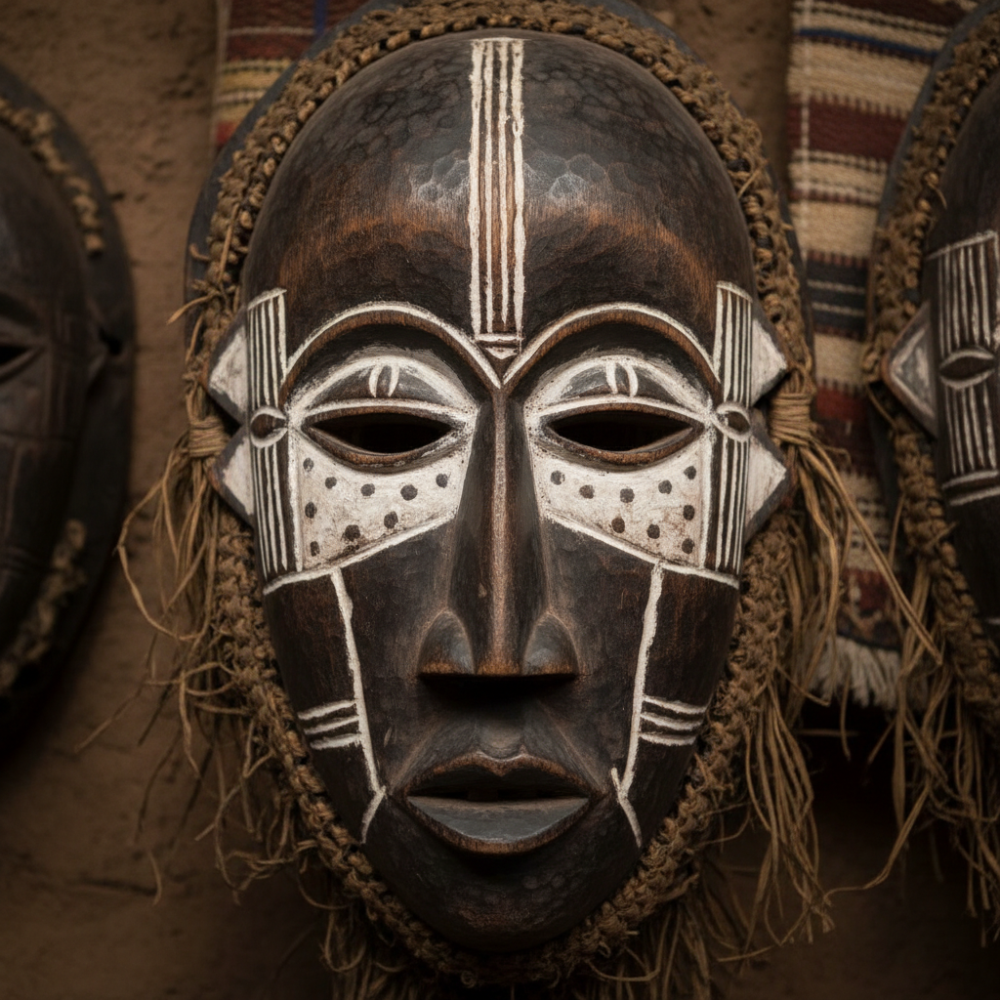

# 非洲艺术 · African Art

> "面具不是面孔的模仿，而是精灵的居所。" —— 非洲谚语

## 概述

非洲艺术（African Art）是撒哈拉以南非洲大陆数千年来发展出的多元视觉艺术传统的总称。从西非约鲁巴人的青铜头像到中非刚果的面具雕刻，从东非埃塞俄比亚的基督教绘画到南非的岩画，非洲艺术以其强烈的抽象造型、精神性功能和与仪式生活的深度融合而著称。20世纪初，非洲雕塑对毕加索、马蒂斯等现代主义大师产生了革命性影响，彻底改变了西方艺术的发展方向。

## 核心特征

| 特征 | 描述 |
|------|------|
| 时期 | 史前至今 |
| 地域 | 撒哈拉以南非洲全境 |
| 媒介 | 木雕、青铜铸造、陶器、纺织、珠饰、岩画 |
| 核心理念 | 以视觉形式连接可见世界与精神世界 |
| 色彩 | 天然木色、黑色、白色（高岭土）、赭石红 |

## 视觉特征

- **概括性造型**：人体比例自由变形，强调精神本质而非外貌
- **几何化抽象**：面部和身体特征被简化为几何形
- **正面性**：雕塑多为正面对称构图
- **表面装饰**：刻痕、烙印、珠饰等丰富的表面处理
- **功能性美学**：艺术品同时是仪式工具、权力象征或日用器物

## 代表作品

| 作品 | 文化/地区 | 年代 | 类型 |
|------|-----------|------|------|
| 伊费青铜头像 | 尼日利亚约鲁巴 | 12-14世纪 | 青铜铸造 |
| 贝宁青铜浮雕 | 尼日利亚贝宁王国 | 16-17世纪 | 青铜浮雕 |
| 巴姆巴拉奇瓦拉羚羊头饰 | 马里 | 传统 | 木雕 |
| 丹族面具 | 科特迪瓦/利比里亚 | 传统 | 木雕面具 |
| 诺克陶塑 | 尼日利亚 | 前500-200 | 陶塑 |

## 发展时间线

| 时期 | 事件 |
|------|------|
| 前25000 | 南非布隆博斯洞穴最早的抽象刻画 |
| 前500 | 诺克文化陶塑，西非最早的大型雕塑 |
| 12-15世纪 | 伊费和贝宁青铜艺术黄金时代 |
| 15-19世纪 | 欧洲殖民前各王国艺术繁荣 |
| 1897 | 英国掠夺贝宁青铜器，非洲艺术进入西方视野 |
| 1907 | 毕加索受非洲面具启发创作《亚维农少女》 |
| 1960s | 非洲独立运动，当代非洲艺术兴起 |
| 当代 | 非洲当代艺术在全球市场崛起 |

## 中国语境

非洲艺术与中国的交流在当代日益密切。中非论坛框架下的文化交流项目推动了两大洲艺术的对话。在视觉语言层面，非洲木雕的抽象造型与中国商周青铜器的饕餮纹在"以变形表达精神力量"的策略上有深层共鸣。当代中国艺术家如曾梵志的面具系列，也可追溯到非洲面具艺术对现代主义的影响链条。

## AI 概念图

*AI 生成概念图：非洲艺术风格*

## 关联词条

- [[aboriginal-art]] - 澳大利亚原住民艺术
- [[maori-art]] - 毛利艺术
- [[aztec-art]] - 阿兹特克艺术

---

*浮光艺志 · Chronicle of Artistry*
