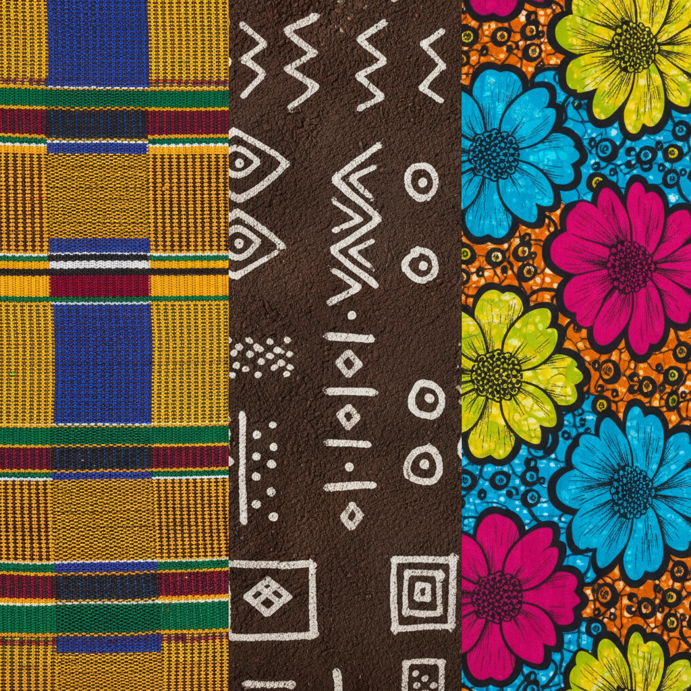

# African Textile Art 非洲纺织艺术

> **"布料会说话——每一根线、每一个图案都承载着族群的记忆与智慧。"**

## 概述

非洲纺织艺术是世界上最丰富多彩的纺织传统之一，涵盖数十种独特的织造、染色和印花技艺。从加纳的Kente皇家织布到马里的Bogolan泥染布，从尼日利亚的Adire蓝染到遍布西非的Ankara蜡印花布，每一种纺织品都是文化身份、社会地位和精神信仰的视觉载体。非洲纺织艺术的历史可追溯至数千年前，至今仍是非洲大陆最具活力的文化表达形式。

## 主要纺织传统

### Kente 肯特布 (加纳)
- **起源**：阿散蒂王国（Ashanti），17世纪
- **技法**：窄条织布机编织，再拼接成大幅布料
- **特征**：鲜艳的几何条纹图案，金色、绿色、蓝色为主
- **文化意义**：原为皇室专用，每种图案有特定名称和含义
- **象征**：财富、权力、精神纯洁

### Bogolan / Mud Cloth 泥染布 (马里)
- **起源**：班巴拉族（Bambara），12世纪+
- **技法**：棉布先用树叶汁浸泡，再用发酵河泥绘制图案
- **特征**：黑白/棕白对比的几何图案
- **文化意义**：猎人的护身符、女性成年礼服饰
- **象征**：保护、力量、身份转变

### Adire 阿迪尔蓝染布 (尼日利亚)
- **起源**：约鲁巴族（Yoruba），千年历史
- **技法**：靛蓝染色 + 防染技术（扎染、蜡防、木薯糊防染）
- **特征**：深蓝底色上的白色图案
- **文化意义**：约鲁巴妇女的传统手工艺
- **独特之处**：用羽毛蘸木薯糊在布面绘制精美花纹

### Ankara / Wax Print 蜡印花布
- **起源**：荷兰殖民时期引入，19世纪末
- **技法**：蜡防染印花（工业化生产）
- **特征**：大胆鲜艳的重复图案，双面印花
- **文化意义**：已成为泛非洲身份的象征
- **当代**：非洲时装设计的核心面料

### Adinkra 阿丁克拉布 (加纳)
- **起源**：阿散蒂王国
- **技法**：用树皮染料在布面压印符号
- **特征**：每个符号都有特定哲学含义
- **文化意义**：原为葬礼和皇室仪式专用

## 视觉特征

- 大胆饱和的色彩组合
- 几何图案的无限重复与变化
- 强烈的正负空间对比
- 符号化的叙事系统
- 手工痕迹与不完美的美感
- 条纹、棋盘格、同心圆等基本元素的创意组合

## 与其他风格的关系

| 风格 | 关系 |
|------|------|
| Bauhaus 纺织 | 共享几何抽象，但非洲更早 |
| Op Art | Kente的视觉振动效果 |
| Memphis Design | 共享大胆色彩和图案 |
| 当代非洲时装 | 直接继承和创新 |
| 日本绞染 Shibori | 共享防染技术原理 |
| 印度蜡染 Batik | 技术同源，荷兰殖民时期传入非洲 |

## 当代影响

- Vlisco、Ankara等品牌的全球化
- 非洲时装周和设计师的国际崛起
- Dior、Louis Vuitton 等奢侈品牌的非洲元素
- 非洲裔美国人的文化认同符号
- 当代艺术中的纺织媒介复兴

## 概念图

---

*浮光艺志 | Chronicle of Artistry*
