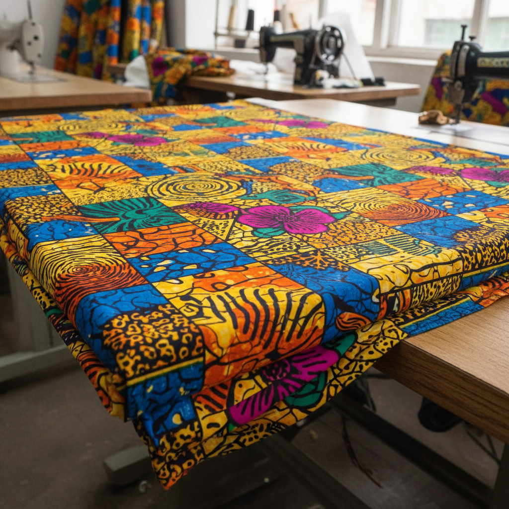

# African Wax Print 非洲蜡染印花布 | Ankara / Kitenge

> **"荷兰人仿制印尼蜡染，却在西非找到了灵魂——每块布都有名字和故事。"**

## 概述

非洲蜡染印花布（African Wax Print / Ankara / Kitenge）是一种工业化生产的彩色棉布，使用蜡染印花技术在布料两面印制鲜艳的几何和具象图案。这种布料的历史充满戏剧性：19世纪荷兰商人试图用机器仿制印尼蜡染（Batik）出口东南亚，但因"瑕疵"（蜡裂纹效果）在印尼市场失败，却意外在西非大受欢迎。如今，Vlisco（荷兰）、ABC Wax（英国）和众多非洲本土品牌生产的蜡染印花布已成为非洲视觉文化的核心符号。

## 核心特征

- **双面印花**：蜡染技术使两面图案同样鲜明
- **蜡裂纹**：特有的细裂纹效果（最初是"瑕疵"）
- **鲜艳色彩**：大胆的色彩组合
- **命名传统**：每种图案有特定名称和含义
- **社会语言**：通过穿着的布料传递信息
- **6码制**：传统以6码为一个完整单位

## 经典图案

| 图案名 | 含义 |
|--------|------|
| "我丈夫的眼睛" | 婚姻忠诚 |
| "如果你跑我追" | 爱情追逐 |
| "金钱有翅膀" | 财富无常 |
| "ABC" | 教育的重要性 |
| 风扇图案 | 社会地位 |
| 贝壳图案 | 财富和繁荣 |

## 视觉特征

- 大胆鲜艳的色彩组合
- 几何和有机图案的混合
- 重复的图案单元
- 蜡裂纹的独特质感
- 高对比度的配色
- 图案的叙事性

## 与其他风格的关系

| 风格 | 关系 |
|------|------|
| 印尼蜡染 Batik | 直接技术源流 |
| Kente肯特布 | 共享西非纺织文化 |
| Adire蓝染布 | 共享尼日利亚纺织传统 |
| 当代非洲时装 | Ankara是非洲时装的基础面料 |
| 全球街头时尚 | 非洲印花的全球化 |

## 概念图

---

*浮光艺志 | Chronicle of Artistry*
