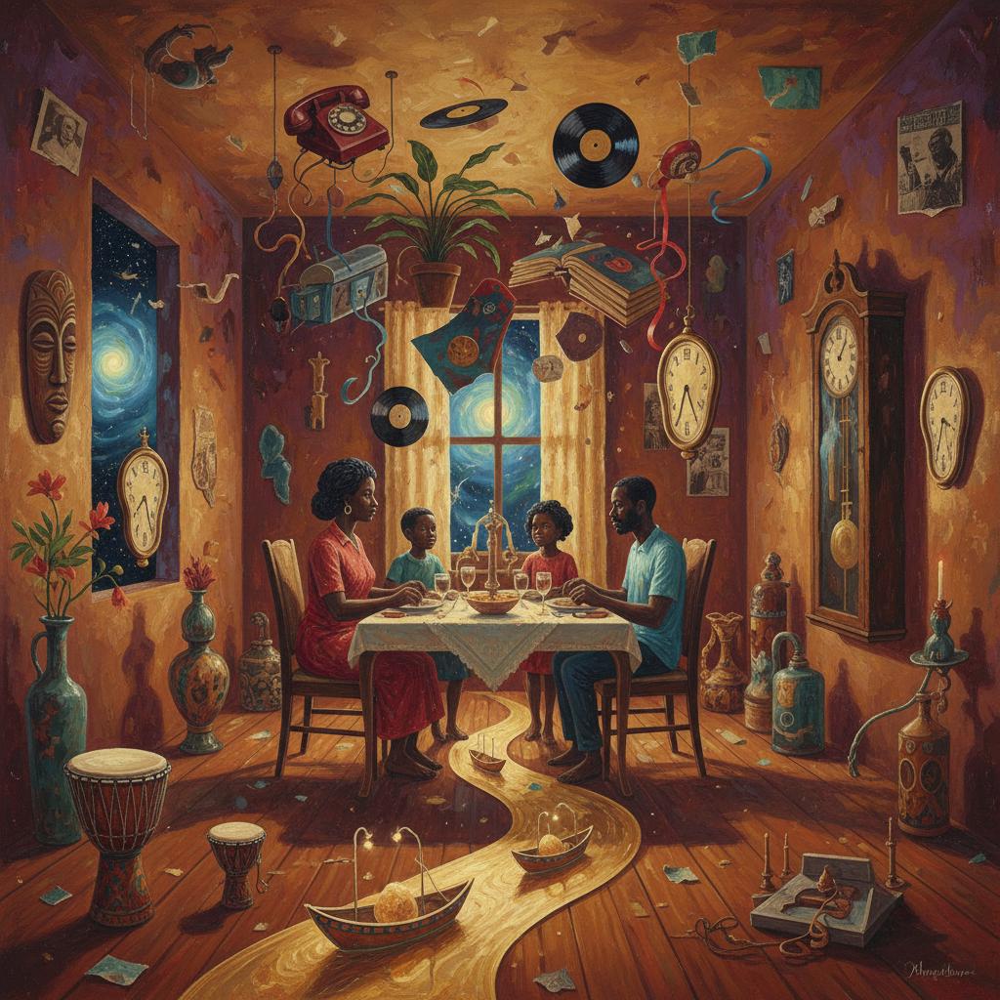

# Afro-Surrealism 非洲超现实主义

> **时期：** 2009–至今  
> **关键词：** 黑人超现实、日常魔幻、时间扭曲、非洲散居、梦与现实

## 概述

Afro-Surrealism 由作家 D. Scot Miller 在2009年的宣言中正式命名，区别于Afrofuturism的未来导向——它关注的是"此时此地"的超现实体验。对于非洲散居者来说，日常生活本身就充满超现实：系统性的荒诞、历史创伤的幽灵、身份的多重性。Afro-Surrealism不需要去未来寻找奇异，因为当下已经足够奇异。

## 风格特征

- **日常魔幻**：在平凡场景中发现超现实元素
- **时间非线性**：过去的创伤与当下的体验交织
- **身体政治**：黑人身体作为超现实的场域
- **幽默与荒诞**：用笑声面对系统性的荒谬
- **梦境逻辑**：不遵循因果的叙事结构

## 代表人物与作品

- D. Scot Miller《Afro-Surreal Manifesto》
- Wangechi Mutu 拼贴与雕塑
- Kara Walker 剪影叙事
- Terence Nance《Random Acts of Flyness》

## 概念图

