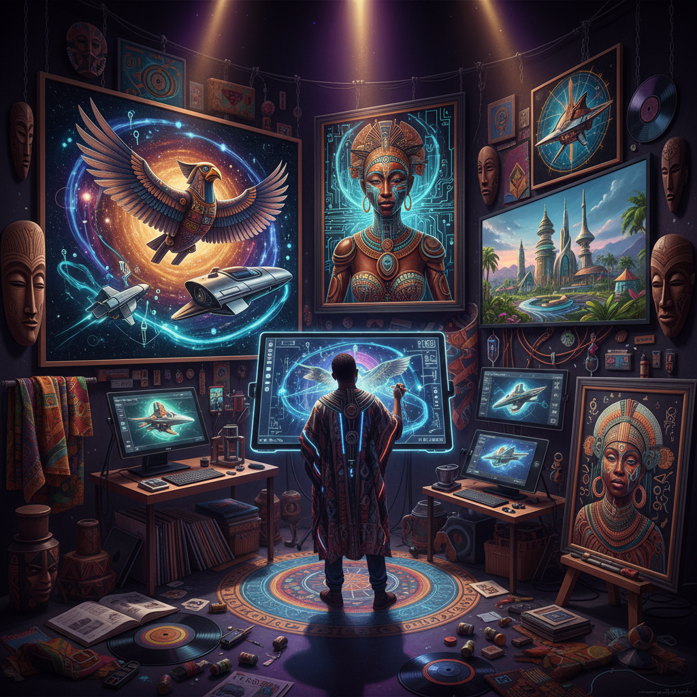

# Afrofuturism Art 非洲未来主义

> "Afrofuturism reimagines the future through African eyes — blending science fiction, African mythology, technology, and the Black diaspora experience into visions of tomorrow that center Blackness not as absence or oppression but as cosmic possibility, reclaiming the right to imagine futures where African aesthetics, spirituality, and innovation shape civilizations among the stars, a movement that insists the future is not a white space but a canvas as vast and varied as Africa itself." — Unknown

## 概述

非洲未来主义（Afrofuturism）是一种融合非洲散居族裔文化、科幻小说、历史虚构、奇幻、非洲宇宙观和技术想象的跨学科文化美学和哲学运动。非洲未来主义想象一个以非洲和非裔文化为中心的未来——在这个未来中，非洲的美学、精神传统和技术创新塑造着文明的方向。

"Afrofuturism"一词由文化批评家马克·德里（Mark Dery）在1993年的文章《黑色到未来》（Black to the Future）中首次使用。但非洲未来主义的实践远早于这个命名——从孙·拉（Sun Ra）的宇宙爵士乐、乔治·克林顿（George Clinton）的P-Funk神话、奥克塔维亚·巴特勒（Octavia Butler）的科幻小说，到让-米歇尔·巴斯奎特的绘画，都是非洲未来主义的先驱。当代的非洲未来主义在视觉艺术、音乐、文学、电影（如《黑豹》）和时尚中都有丰富的表现。

## 核心特征

| 特征 | 描述 |
|------|------|
| 未来 | 以非洲为中心的未来想象 |
| 科技 | 技术与非洲传统的融合 |
| 神话 | 非洲神话和宇宙观 |
| 散居 | 非洲散居族裔的经验 |
| 解放 | 解放性的想象 |
| 跨界 | 跨学科的实践 |

## 视觉特征

- **宇宙**：宇宙和星际的意象
- **部落**：非洲部落美学的未来化
- **科技**：高科技与传统的融合
- **金属**：金属和发光材料
- **图案**：非洲传统图案的变形
- **身体**：身体的装饰和改造

## 代表作品

| 作品 | 艺术家 | 年代 | 意义 |
|------|--------|------|------|
| *Space is the Place* | Sun Ra | 1974 | 孙·拉的宇宙爵士 |
| *Mothership Connection* | George Clinton | 1975 | 克林顿的母舰 |
| *Afrofuturist paintings* | Wangechi Mutu | 2000年代 | 穆图的非洲未来女性 |
| *Black Panther* | Ryan Coogler | 2018 | 瓦坎达的视觉设计 |
| *Drexciya* | Drexciya | 1990年代 | 水下非洲文明的音乐 |

## 历史时间线

| 时期 | 事件 |
|------|------|
| 1950-70年代 | Sun Ra的宇宙哲学 |
| 1993 | Mark Dery命名"Afrofuturism" |
| 2000年代 | 非洲未来主义的学术化 |
| 2018 | 《黑豹》的全球影响 |
| 当代 | 非洲大陆的未来主义艺术 |

## 中国语境

非洲未来主义在中国的直接影响有限，但其方法论——将本土文化传统与未来想象结合——对中国当代艺术有启发意义。中国也面临类似的文化想象问题：如何想象一个以中国文化为中心的未来？中国的科幻文学（如刘慈欣的《三体》）和科幻视觉艺术中也在探索"中国未来主义"的可能性。中非文化交流日益增多，一些中国艺术家和非洲艺术家开始合作探索跨文化的未来想象。非洲未来主义对"谁有权想象未来"的追问，也与中国当代文化中的身份政治讨论有对话空间。

## AI生成概念图

## 与其他风格的关系

- **Science Fiction Art** → 科幻艺术
- **Cyberpunk** → 赛博朋克
- **African Art** → 非洲艺术
- **Postcolonial Art** → 后殖民艺术
- **Digital Art** → 数字艺术
- **Speculative Design** → 推测设计

---

*浮光艺志 | Chronicle of Artistry*
