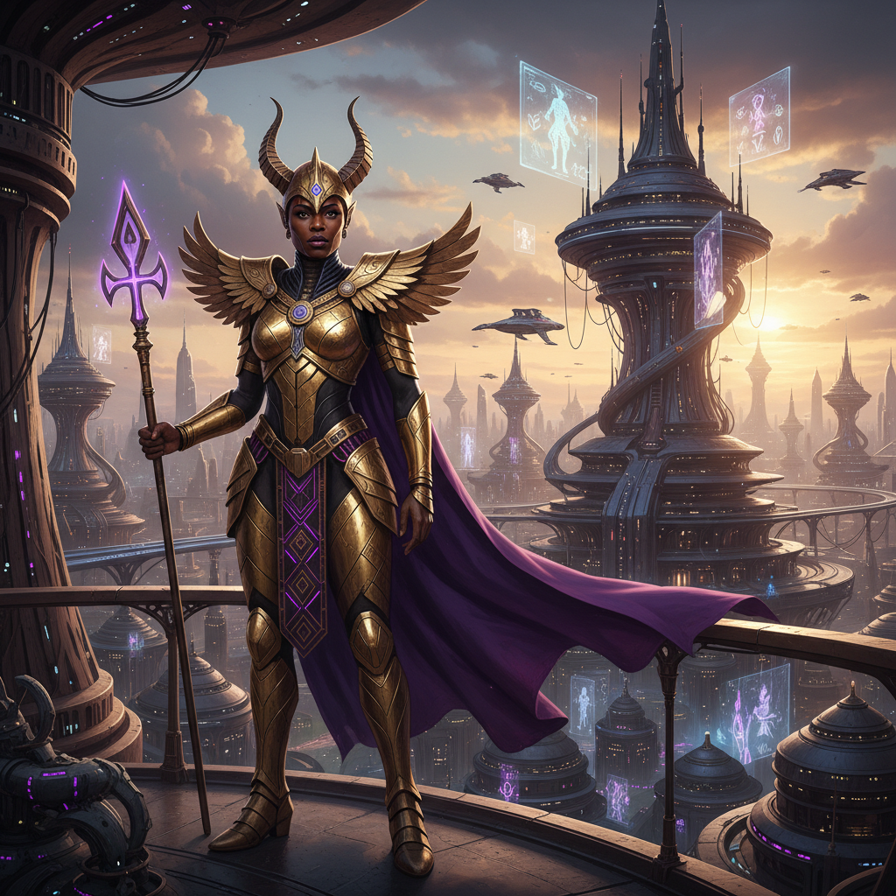
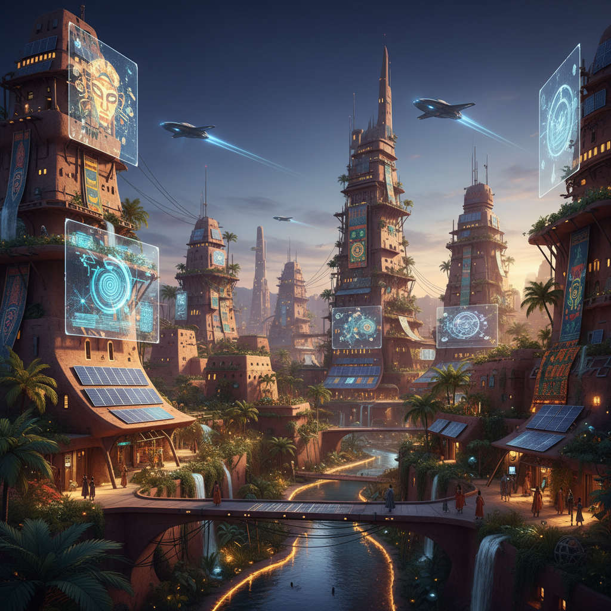

# Afrofuturism 非洲未来主义





> **"瓦坎达不只是虚构——当非洲传统遇见太空科技，历史被重新书写。"**

## 概述

| 维度 | 描述 |
|------|------|
| 时期 | 1950s 起源 / 2010s–至今 主流化 |
| 别名 | Afrofuturism, Black Futurism, African Futurism |
| 核心色彩 | 金色、紫色、靛蓝、黑色、大地色 |
| 关键元素 | 非洲图腾、太空意象、部落几何、科技装甲 |
| 代表人物 | Sun Ra、Janelle Monáe、Black Panther、Beyoncé |
| 关联风格 | Cyberpunk, Solarpunk, Tribal, Space Age |

---

## 历史脉络

### 1950s–1970s：音乐先驱

| 人物 | 贡献 |
|------|------|
| Sun Ra | 爵士+太空+埃及神话的融合 |
| Parliament-Funkadelic | 放克音乐的太空视觉 |
| Octavia Butler | 非裔科幻文学先驱 |

### 1990s–2000s：概念成型

- 1993年：Mark Dery 正式提出 "Afrofuturism" 一词
- 非裔散居社群通过科幻想象重新定义身份
- 核心问题："如果非洲的历史没有被殖民中断，技术会走向何方？"

### 2010s–至今：全球爆发

- **Black Panther** (2018)：瓦坎达将 Afrofuturism 带入主流
- **Beyoncé** "Black Is King" (2020)：音乐视觉的非洲未来主义
- **Janelle Monáe**：android 身份与黑人身份的交叉
- 非洲本土科技产业的崛起（拉各斯、内罗毕）

### 核心哲学

Afrofuturism 的力量在于它**同时面向过去和未来**：
- 重新想象被殖民抹去的非洲技术史
- 将非洲传统知识体系视为"另一种科技"
- 拒绝"非洲=落后"的叙事
- 创造一个非洲人主导技术发展的平行/未来世界

---

## 视觉语法

### 色彩系统

```
主色：
  金色 (#FFD700) — 权力、太阳、财富
  紫色 (#800080) — 皇室、精神性
  靛蓝 (#4B0082) — 非洲传统染料
  黑色 (#000000) — 太空、力量
  大地色 (#8B4513) — 非洲大地

辅色：
  铜色 (#B87333) — 金属工艺
  翠绿 (#228B22) — 热带植被
  红色 (#FF0000) — 生命力、战斗

质感：
  金属（金/铜/钢） — 科技装甲
  编织 — 非洲纺织传统
  几何图案 — 部落纹样
  全息/发光 — 未来科技
  自然材质 — 木、骨、石
```

### 标志性元素

| 类别 | 元素 |
|------|------|
| 图案 | 非洲部落几何、Kente 布纹、Adinkra 符号 |
| 科技 | 振金式材料、全息投影、生物科技 |
| 建筑 | 非洲传统建筑+未来科技融合 |
| 服装 | 部落服饰+科技装甲+太空服 |
| 发型 | 辫子、Afro、雕塑式发型 |
| 太空 | 飞船、星球、宇宙 |

---

## 与千禧怀旧的关系

### 2000s 的文化铺垫
- The Matrix (1999) 中的非裔角色与赛博空间
- Missy Elliott 的未来主义音乐视频
- Outkast 的太空放克美学
- 这些为 2010s 的 Afrofuturism 爆发奠定了基础

### 与 Y2K 美学的交叉
- Y2K 的金属质感 + 非洲图腾 = Afrofuturist Y2K
- 2000s R&B/Hip-hop 视频中的太空+奢华元素

---

## 中国语境

- 中非合作中的"非洲科技叙事"
- 非洲题材电影/纪录片在中国的传播
- 与中国科幻（《三体》《流浪地球》）的对话
- 全球南方视角的未来想象

---

## 设计应用

| 场景 | 应用方式 |
|------|----------|
| 品牌 | 金色+几何图案+未来字体+非洲纹样 |
| 时尚 | 传统纺织+金属配件+建筑式剪裁 |
| 建筑 | 非洲传统形态+可持续技术+自然材料 |
| 数字 | 全息效果+部落几何+太空背景 |

---

## 延伸阅读

- 《Black Panther》美术设计分析
- Sun Ra 的视觉宇宙
- Octavia Butler 科幻小说中的视觉想象

---

## 相关风格

← [Cyberpunk 赛博朋克](cyberpunk.md) | [Solarpunk 太阳朋克](solarpunk.md) →

↑ [返回千禧怀旧目录](README.md) | [返回总目录](../README.md)
