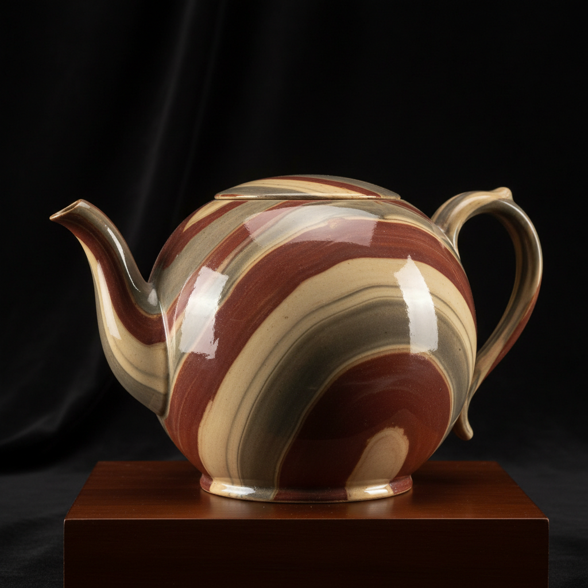

# Agateware Art 玛瑙纹陶艺术

> "Agateware is geology compressed into a teacup — different colored clays are wedged together just enough to create swirling, marbled patterns that mimic the banded beauty of natural agate stone. Too much mixing and the colors blur into mud; too little and the layers remain distinct blocks. The potter must find the precise moment when chaos becomes beauty and stop." — Unknown

## 概述

玛瑙纹陶艺术（Agateware Art）是一种将不同颜色的粘土部分混合后在轮上拉坯或模压成型的陶瓷技法——使器物表面呈现类似天然玛瑙石的层状纹理。与练込（nerikomi）的精确图案控制不同，玛瑙纹陶更强调自然随机的混合效果——通过控制混合程度来获得理想的纹理。这种技法在18世纪英国斯塔福德郡达到巅峰。

玛瑙纹陶艺术的实践包括：1）色泥准备——调配不同颜色的粘土；2）部分混合——将色泥部分揉合保留纹理；3）拉坯成型——在轮上拉坯使纹理流动；4）模压成型——用模具压制成型；5）表面处理——修整和抛光表面；6）透明釉——施透明釉保护纹理；7）当代玛瑙纹陶——将传统技法与现代设计结合的创作。

## 核心特征

| 特征 | 描述 |
|------|------|
| 混合 | 部分混合的色泥 |
| 自然 | 自然随机的纹理 |
| 玛瑙 | 类似玛瑙的效果 |
| 流动 | 拉坯中的流动 |
| 英国 | 英国的重要传统 |
| 偶然 | 可控的偶然性 |

## 视觉特征

- **纹理**：流动的大理石纹理
- **层次**：多色粘土的层次
- **自然**：自然有机的图案
- **流动**：拉坯产生的流动感
- **温暖**：温暖的土色调
- **独特**：每件作品的独特纹理

## 代表作品

| 作品 | 艺术家/文化 | 年代 | 意义 |
|------|-------------|------|------|
| *Staffordshire agateware* | 英国 | 18世纪 | 斯塔福德郡玛瑙纹陶 |
| *Wedgwood agateware* | 英国 | 18世纪 | 韦奇伍德玛瑙纹陶 |
| *Tang dynasty marbled ware* | 中国 | 唐代 | 唐代绞胎陶 |
| *Contemporary agateware* | 国际 | 当代 | 当代玛瑙纹陶 |
| *Studio pottery agateware* | 当代 | 当代 | 工作室玛瑙纹陶 |

## 历史时间线

| 时期 | 事件 |
|------|------|
| 唐代 | 中国绞胎陶的发展 |
| 17世纪 | 英国玛瑙纹陶的起源 |
| 18世纪 | 斯塔福德郡的黄金时代 |
| 19世纪 | 工业化后的衰落 |
| 当代 | 玛瑙纹陶的艺术化复兴 |

## 中国语境

玛瑙纹陶与中国陶瓷传统有直接的历史联系。中国唐代的绞胎陶是世界上最早的玛瑙纹陶——将不同颜色的粘土绞合创造纹理。中国的绞胎陶传统比英国的agateware早了近千年——是这一技法的源头。中国当阳峪窑和巩义窑是唐代绞胎陶的重要产地——出土了大量精美的绞胎器物。中国当代的陶艺家重新发掘绞胎传统——将其与现代审美结合。中国的陶瓷研究中，绞胎陶是重要的研究课题——探讨其技法、审美和文化意义。中国的一些陶瓷产区开始复兴绞胎陶生产——作为文化旅游和工艺传承的一部分。

## AI生成概念图

## 与其他风格的关系

- **Nerikomi** → 练込陶艺
- **Marbling** → 大理石纹
- **Ceramics** → 陶瓷艺术
- **Mokume-gane** → 木目金
- **Stoneware** → 石器
- **Folk Pottery** → 民间陶器

---

*浮光艺志 | Chronicle of Artistry*
