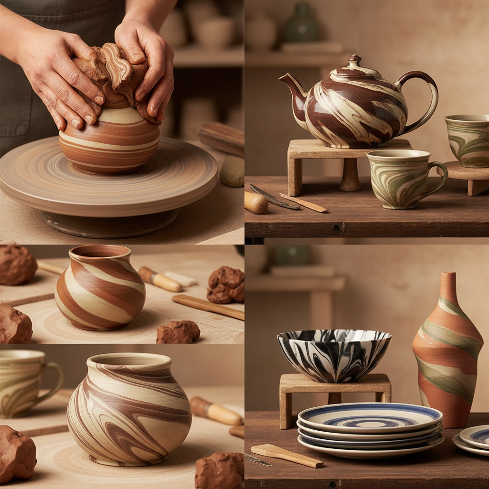

# Agateware 玛瑙纹陶

> "Agateware is geology in miniature — clays of different colors wedged together like strata of stone, then thrown or shaped to reveal swirling patterns that echo the banded beauty of natural agate, each piece a unique cross-section of an artificial earth." — Unknown

## 概述

玛瑙纹陶（Agateware）是一种将不同颜色的粘土混合在一起，通过拉坯或成型使其产生类似天然玛瑙石纹理的陶瓷技法。不同颜色的粘土被部分混合（而非完全混合），保留各自的色彩身份，在成型过程中产生流动的、旋转的、层叠的纹理——类似大理石、玛瑙或木纹的自然图案。

玛瑙纹陶与练込（nerikomi）的区别在于：玛瑙纹陶通常是将不同颜色的粘土随机或半随机地混合后拉坯，产生流动的有机纹理；而练込是精确地层叠和切片，产生几何的重复图案。玛瑙纹陶在18世纪英国斯塔福德郡（Staffordshire）的陶器生产中达到高峰——Thomas Whieldon和Josiah Wedgwood等陶工生产了精美的玛瑙纹陶器。

## 核心特征

| 特征 | 描述 |
|------|------|
| 多色 | 多色粘土混合 |
| 流动 | 流动的纹理 |
| 自然 | 类似天然石纹 |
| 贯穿 | 纹理贯穿器壁 |
| 随机 | 部分随机的效果 |
| 拉坯 | 通常通过拉坯成型 |

## 视觉特征

- **流动**：流动的纹理
- **旋转**：旋转的图案
- **自然**：类似天然石纹
- **多色**：多色的层次
- **有机**：有机的形态
- **独特**：每件都独一无二

## 代表作品

| 作品 | 艺术家 | 年代 | 意义 |
|------|--------|------|------|
| *Staffordshire agateware* | Thomas Whieldon | 18世纪 | 英国玛瑙纹陶传统 |
| *Wedgwood agateware* | Josiah Wedgwood | 18世纪 | 韦奇伍德的玛瑙纹陶 |
| *Chinese jiaotai ware* | 中国工匠 | 唐代 | 中国绞胎瓷 |
| *Contemporary agateware* | Various | 当代 | 当代玛瑙纹陶 |
| *Marbled pottery* | Various | 当代 | 大理石纹陶器 |

## 历史时间线

| 时期 | 事件 |
|------|------|
| 古代 | 早期多色粘土混合技法 |
| 唐代 | 中国绞胎瓷的发展 |
| 17-18世纪 | 英国玛瑙纹陶的兴起 |
| 18世纪 | Whieldon和Wedgwood的玛瑙纹陶 |
| 20世纪 | 工作室陶艺中的玛瑙纹复兴 |
| 当代 | 当代陶艺家的玛瑙纹创新 |

## 中国语境

玛瑙纹陶在中国有重要的历史地位——中国唐代的绞胎瓷是世界上最早的玛瑙纹陶之一。中国的绞胎瓷以其独特的木纹、羽毛纹和流水纹图案闻名于世。中国的当阳峪窑是绞胎瓷的重要产地。中国的当代陶艺教育中，玛瑙纹/绞胎技法作为一种独特的成型和装饰技法被教授。中国的一些当代陶艺家在传承绞胎传统的基础上进行创新，将其与现代设计理念结合。

## AI生成概念图

## 与其他风格的关系

- **Nerikomi** → 练込技法
- **Marbling** → 大理石纹
- **Chinese Jiaotai** → 中国绞胎
- **Mokume Gane** → 木目金
- **Wheel Throwing** → 拉坯
- **Staffordshire Pottery** → 斯塔福德郡陶器

---

*浮光艺志 | Chronicle of Artistry*
