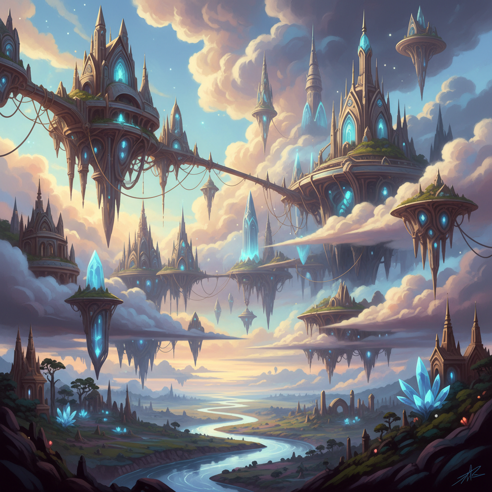

# AI Art 人工智能艺术



> **"输入文字，输出图像——当创造力不再需要手——艺术的定义被重写。"**

## 概述

| 维度 | 描述 |
|------|------|
| 时期 | 2015–至今（深度学习时代） |
| 别名 | AI Art, AI-Generated Art, Generative AI, Prompt Art |
| 核心色彩 | 无固定——由prompt和模型决定 |
| 关键元素 | 文本到图像、风格迁移、扩散模型、prompt工程 |
| 代表人物 | Refik Anadol, Holly Herndon, 社区(Midjourney/SD) |
| 关联风格 | Generative Art, Digital Art, Surrealism, 所有风格(可模仿) |

---

## 历史脉络

| 年份 | 事件 |
|------|------|
| 2015 | DeepDream——神经网络"做梦" |
| 2018 | GAN生成的肖像在佳士得拍卖 |
| 2021 | DALL-E——文本到图像的突破 |
| 2022 | Midjourney, Stable Diffusion——AI艺术民主化 |
| 2022 | AI作品获科罗拉多州博览会一等奖——争议爆发 |
| 2023 | GPT-4V, Gemini——多模态AI |
| 2024+ | 视频生成(Sora)、实时生成、AI+人类协作 |

### 核心哲学

AI艺术的精神是**"创造力的定义正在被重写——问题不再是'怎么画'而是'画什么'"**：
- 民主化 = 革命（"不会画画的人也能创造视觉"）
- Prompt = 新技能（"描述能力成为创造力"）
- 协作 = 未来（"AI不是取代艺术家——是新的画笔"）
- 争议 = 必然（"每一次技术革命都引发'这还是艺术吗？'的争论"）
- "摄影发明时人们说'这不是艺术'——现在AI面临同样的问题"

---

## 视觉语法

### 色彩系统

```
无固定规则——AI可以模仿任何风格

AI特有视觉特征：
  超现实融合 — 不可能的组合
  过度精细 — 超越人手的细节
  "AI味" — 特定的光滑感
  风格混合 — 多种风格同时存在

常见AI美学：
  梦幻 — 超现实、流动
  精细 — 超高细节
  融合 — 风格混搭
  概念 — 不可能的场景

质感：
  光滑 — AI特有的"完美"
  细节 — 无限放大
  融合 — 边界模糊
  噪点 — 扩散模型特征
```

### 标志性元素

| 类别 | 元素 |
|------|------|
| 工具 | Midjourney, DALL-E, Stable Diffusion, Gemini |
| 技法 | Prompt工程、img2img、ControlNet、LoRA |
| 特征 | 超现实融合、不可能场景、风格混搭 |
| 争议 | 版权、原创性、艺术家生计、"这是艺术吗？" |
| 社区 | Discord、Reddit、社交媒体 |
| 态度 | 实验、民主、争议、快速、无限可能 |

---

## 与千禧怀旧的关系

### 艺术史的最新章节
- AI Art = 2020s最重要的视觉文化现象
- "每个人都成为了'艺术家'——或者说'导演'"
- AI可以模仿所有历史风格——"所有风格都变成了prompt"
- 本项目的所有配图就是AI生成的——这本身就是证明

### 对创意产业的冲击
- 插画师、概念艺术家——工作方式的根本改变
- "AI不会取代创意——但会取代不用创意的执行"
- 从"手工制作"到"策划+指导"的转变

---

## 中国语境

- 中国AI绘画工具的发展
- 中国AI艺术社区和创作者
- 中国对AI生成内容的监管讨论
- 中国设计产业对AI工具的采用

---

## 设计应用

| 场景 | 应用方式 |
|------|----------|
| 概念 | 快速概念探索+方案生成+灵感 |
| 品牌 | AI辅助设计+独特视觉+快速迭代 |
| 内容 | 社交媒体+博客配图+营销素材 |
| 艺术 | AI+人类协作+新媒体+NFT |

---

## 相关风格

← [Generative Art 生成艺术](generative-art.md) | [所有风格(AI可模仿一切)](../README.md) →

↑ [返回千禧怀旧目录](README.md) | [返回总目录](../README.md)
