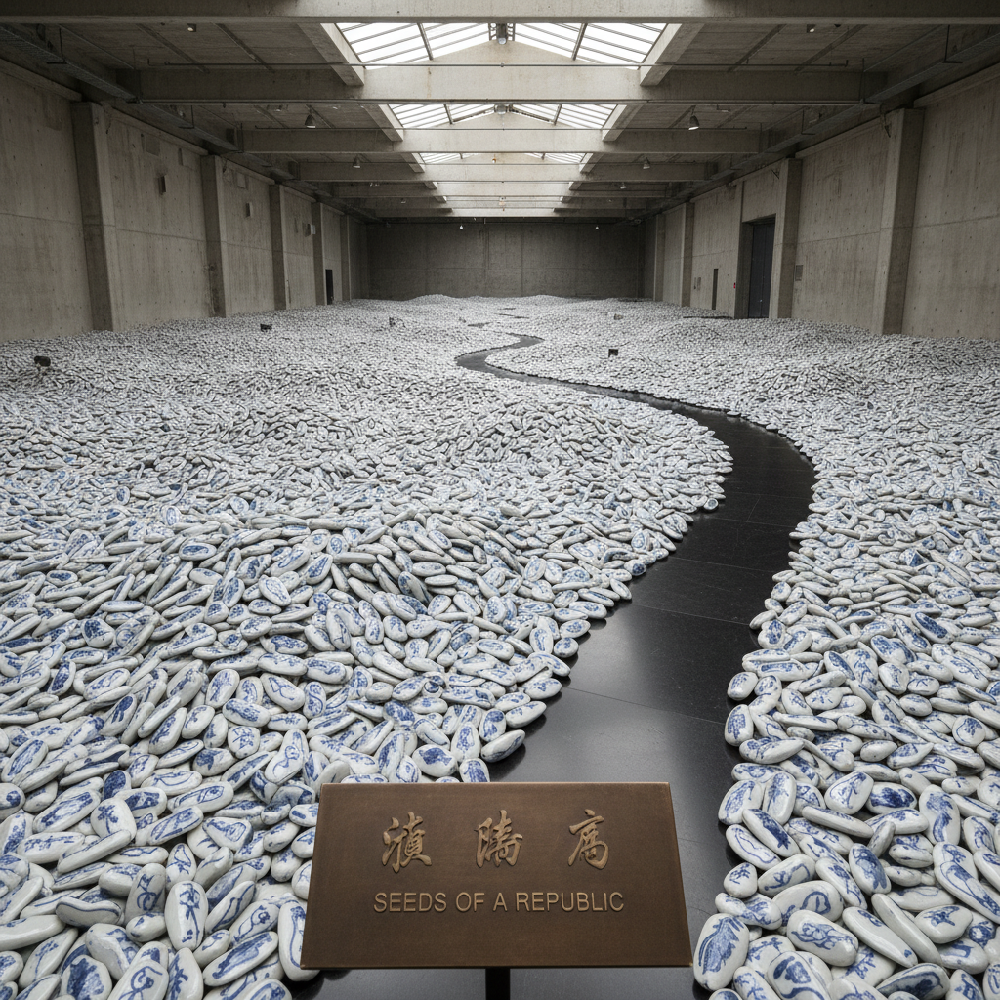

# Ai Weiwei 艾未未

> "Everything is art. Everything is politics." — Ai Weiwei

## 概述

艾未未（Ai Weiwei，1957–）是中国当代艺术家、建筑师和社会活动家，以将政治批判与概念艺术融合闻名。他的作品——从用一亿颗手工瓷瓜子铺满泰特美术馆，到用救生衣包裹柏林音乐厅柱子——用规模、材料和行动挑战权力，将艺术变成社会抗议的工具。

## 核心特征

| 特征 | 描述 |
|------|------|
| 政治批判 | 艺术作为社会抗议 |
| 规模震撼 | 数以百万计的手工物件 |
| 中国材料 | 瓷器、木材、玉石的传统工艺 |
| 破坏与重建 | 摔碎汉代陶罐的挑衅 |
| 社交媒体 | 博客和推特作为艺术媒介 |
| 难民危机 | 全球人权议题的视觉化 |

## 代表作品

| 作品 | 年代 | 意义 |
|------|------|------|
| *Sunflower Seeds* | 2010 | 一亿颗手工瓷瓜子 |
| *Dropping a Han Dynasty Urn* | 1995 | 对传统的挑衅性破坏 |
| *Remembering* | 2009 | 四川地震遇难学生的纪念 |
| *Law of the Journey* | 2017 | 难民危机的巨型充气船 |

## AI生成概念图

## 与其他风格的关系

- **Conceptual Art** → 观念艺术的政治化
- **Readymade** → 杜尚传统的社会延伸
- **Activism Art** → 艺术行动主义的代表
- **Chinese Contemporary** → 中国当代艺术的国际面孔
