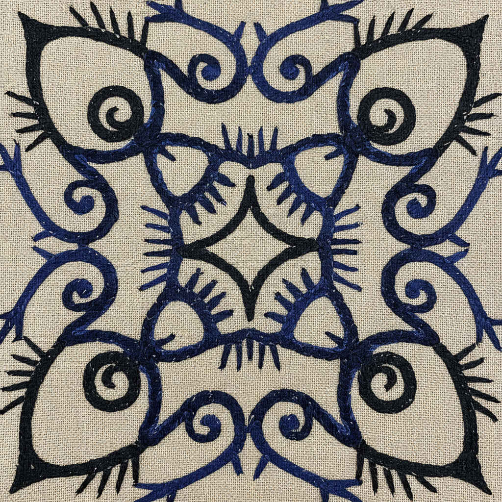

# Ainu Art 阿伊努艺术 | アイヌ文様

> **"万物皆有神灵——北海道的风与熊在木纹和刺绣中永生。"**

## 概述

阿伊努艺术（Ainu Art / アイヌ文様）是日本北海道原住民阿伊努族（アイヌ）的传统视觉艺术，以其独特的曲线纹样（モレウ/morew）和刺绣（チカルカルペ）著称。阿伊努人信仰万物有灵（カムイ/kamuy），认为自然界的一切——熊、猫头鹰、鲑鱼、风、火——都是神灵的化身。他们的艺术不仅是装饰，更是与神灵沟通的媒介，保护穿戴者免受恶灵侵害。

## 核心纹样

| 纹样 | 阿伊努名 | 特征 |
|------|----------|------|
| 漩涡纹 | モレウ (Morew) | 螺旋曲线，最基本的元素 |
| 棘刺纹 | アイウシ (Aiushi) | 带刺的线条，驱邪 |
| 眼纹 | シク (Shik) | 菱形眼睛，监视恶灵 |
| 括弧纹 | ラムラム (Ramram) | 对称括弧形 |

## 主要艺术形式

| 形式 | 特征 |
|------|------|
| 刺绣衣物 Attush | 树皮布上的链锁绣和贴布绣 |
| 木雕 | 熊雕、仪式用具、刀鞘 |
| 编织 | 树皮纤维和草的编织 |
| 金属工艺 | 刀具（マキリ）的装饰 |
| 当代版画 | 传统纹样的现代诠释 |

## 核心特征

- **对称性**：左右对称的纹样设计
- **曲线为主**：流畅的螺旋和漩涡
- **驱邪功能**：纹样保护穿戴者
- **开口处加强**：衣物的领口、袖口、下摆重点装饰
- **黑白蓝为主**：树皮布的自然色+靛蓝染色
- **无文字记录**：纹样本身是一种视觉语言

## 视觉特征

- 流畅优雅的螺旋曲线
- 严格的左右对称
- 黑色线条在浅色底上
- 衣物边缘的带状装饰
- 几何与有机的精妙平衡
- 简洁有力的线条语言

## 与其他风格的关系

| 风格 | 关系 |
|------|------|
| 凯尔特艺术 | 共享螺旋纹和交织纹（独立发展） |
| 毛利纹身 | 共享螺旋纹和原住民身份 |
| Art Nouveau | 共享有机曲线（独立发展） |
| 日本绳文土器 | 可能的远古关联 |
| 当代日本设计 | 阿伊努纹样的现代应用 |

## 概念图

---

*浮光艺志 | Chronicle of Artistry*
