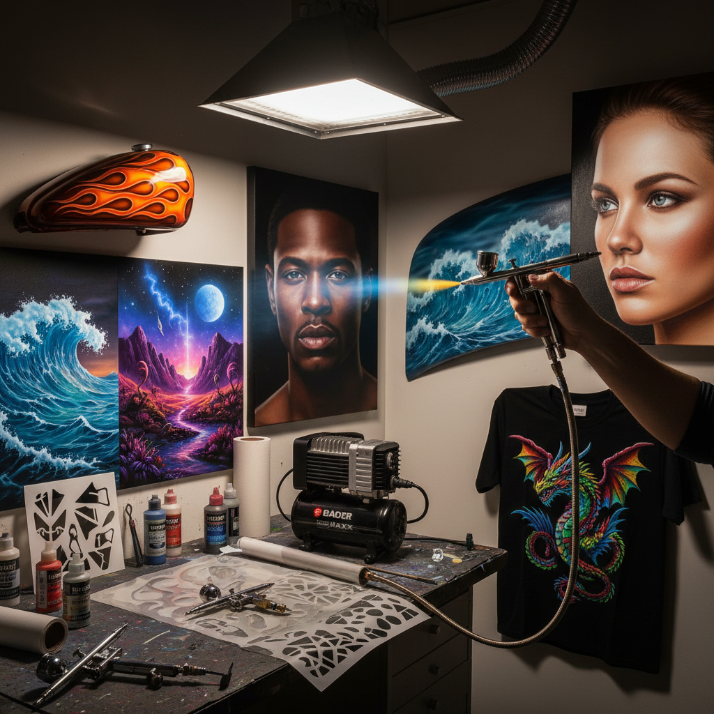

# Airbrush Art 喷笔艺术

> "The airbrush is a whisper of paint — atomized pigment floats onto the surface in gradients so smooth they seem impossible, creating photorealistic illusions and luminous effects that no brush could achieve with such effortless perfection." — Unknown

## 概述

喷笔艺术（Airbrush Art）是一种使用气动喷笔（airbrush）——通过压缩空气将颜料雾化喷射到表面的精密工具——进行绘画创作的技法。喷笔能产生极其平滑的渐变、精确的细节和照片般的写实效果。喷笔艺术在商业插画、汽车彩绘、T恤绘画、模型制作和纯艺术中都有广泛应用。

喷笔由英国人Charles Burdick在1893年获得专利，最初用于照片修饰。20世纪中期，喷笔成为商业插画的主要工具——杂志封面、电影海报、产品广告中大量使用喷笔。1970-80年代，喷笔艺术在汽车文化和科幻艺术中达到高峰。虽然数字绘画在很大程度上取代了商业喷笔，但喷笔艺术在汽车彩绘、模型制作和纯艺术领域仍然活跃。

## 核心特征

| 特征 | 描述 |
|------|------|
| 气动 | 压缩空气驱动 |
| 雾化 | 颜料雾化喷射 |
| 平滑 | 极其平滑的渐变 |
| 精密 | 精密的控制 |
| 写实 | 可达到照片般写实 |
| 多用途 | 多种应用领域 |

## 视觉特征

- **平滑**：极其平滑的渐变
- **写实**：照片般的写实效果
- **发光**：发光的效果
- **精密**：精密的细节
- **柔和**：柔和的边缘
- **光泽**：光泽的表面

## 代表作品

| 作品 | 艺术家 | 年代 | 意义 |
|------|--------|------|------|
| *Vargas Pin-ups* | Alberto Vargas | 1940s-60s | 喷笔插画经典 |
| *Sci-fi book covers* | Various | 1970s-80s | 科幻喷笔艺术 |
| *Custom car murals* | Various | 1970s起 | 汽车喷笔彩绘 |
| *Hajime Sorayama robots* | Sorayama | 1980s起 | 超写实喷笔艺术 |
| *Contemporary airbrush art* | Various | 当代 | 当代喷笔艺术 |

## 历史时间线

| 时期 | 事件 |
|------|------|
| 1893 | Charles Burdick获得喷笔专利 |
| 1920s-40s | 喷笔在照片修饰中的应用 |
| 1950s-60s | 商业插画中的喷笔黄金时代 |
| 1970s-80s | 汽车文化和科幻艺术中的高峰 |
| 1990s | 数字工具开始取代商业喷笔 |
| 当代 | 喷笔在特定领域的持续活跃 |

## 中国语境

喷笔艺术在中国有多个应用领域。中国的汽车改装文化中，喷笔彩绘是重要的装饰方式。中国的模型制作社区中，喷笔是必备工具。中国的一些美术培训机构开设喷笔课程。中国的商业插画领域虽然已转向数字化，但喷笔技法的美学影响仍然存在。中国的一些当代艺术家使用喷笔进行大型壁画和装置创作。

## AI生成概念图

## 与其他风格的关系

- **Spray Paint** → 喷漆艺术
- **Photorealism** → 照相写实主义
- **Commercial Illustration** → 商业插画
- **Custom Car Culture** → 汽车改装文化
- **Digital Painting** → 数字绘画
- **Model Making** → 模型制作

---

*浮光艺志 | Chronicle of Artistry*
