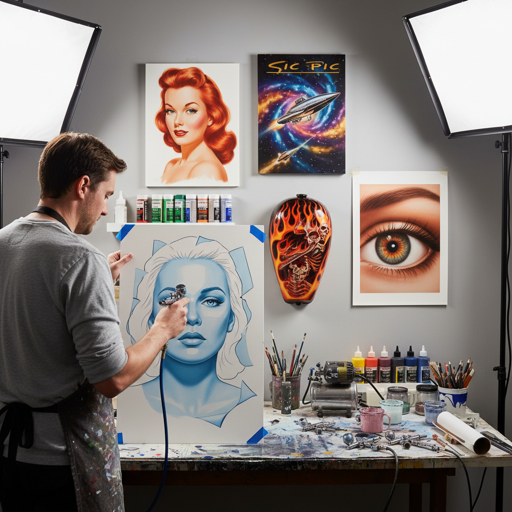

# Airbrush 气笔画

> "The airbrush is a whisper of paint — no brush touches the surface, only a mist of pigment so fine it can render gradients invisible to the eye, making the impossible look photographic." — Unknown

## 概述

气笔画（Airbrush）是使用气笔（airbrush，一种精密的喷枪工具）将颜料以极细的雾状喷射到表面上的绘画技法。气笔通过压缩空气将颜料雾化，可以实现极其平滑的渐变、精细的细节和照片般的写实效果。气笔的独特之处在于：没有笔触——颜料以雾状沉积在表面上，可以创造出完全无笔痕的、如照片般光滑的效果。

气笔画的应用范围极广：商业插画、汽车彩绘（custom car painting）、T恤彩绘、人体彩绘、模型上色、美甲、蛋糕装饰，以及纯艺术创作。气笔的精确控制能力使其特别适合写实主义和超写实主义的表现。

## 核心特征

| 特征 | 描述 |
|------|------|
| 气笔 | 精密喷枪工具 |
| 雾化 | 颜料雾化喷射 |
| 无笔触 | 完全无笔触 |
| 渐变 | 极其平滑的渐变 |
| 精细 | 可实现极精细细节 |
| 写实 | 适合写实表现 |

## 视觉特征

- **光滑**：极其光滑的表面
- **渐变**：无缝的色彩渐变
- **写实**：照片般的写实感
- **精细**：极精细的细节
- **无痕**：无笔触痕迹
- **光泽**：可实现光泽效果

## 代表作品

| 作品 | 艺术家 | 年代 | 意义 |
|------|--------|------|------|
| *Pin-up illustrations* | Alberto Vargas | 1940s | 经典气笔插画 |
| *Sci-fi book covers* | Various | 1970s-80s | 科幻气笔插画 |
| *Custom car art* | Various | 1960s+ | 汽车彩绘 |
| *Photorealistic airbrush* | Dru Blair | 当代 | 超写实气笔 |
| *Contemporary airbrush art* | Various | 当代 | 当代气笔艺术 |

## 历史时间线

| 时期 | 事件 |
|------|------|
| 1876 | 气笔的发明（Francis Stanley） |
| 1890s | 照片修饰中的应用 |
| 1930s-50s | 商业插画的黄金时代 |
| 1960s+ | 汽车彩绘文化 |
| 1970s-80s | 科幻和奇幻插画 |
| 当代 | 数字工具与气笔的并存 |

## 中国语境

气笔画在中国的应用主要集中在商业领域——汽车彩绘、摩托车彩绘、头盔彩绘等在中国有着活跃的市场。中国的模型爱好者群体中，气笔上色是基本技能。一些中国的商业插画师使用气笔进行创作。中国的美甲行业中，气笔美甲也越来越流行。当代中国的一些艺术家将气笔作为纯艺术创作工具——利用其独特的无笔触效果来探索写实主义和超写实主义。中国的一些培训机构提供气笔彩绘课程。

## AI生成概念图

## 与其他风格的关系

- **Spray Paint** → 喷漆艺术
- **Photorealism** → 照相写实主义
- **Commercial Illustration** → 商业插画
- **Custom Painting** → 定制彩绘
- **Digital Art** → 数字艺术
- **Body Painting** → 人体彩绘

---

*浮光艺志 | Chronicle of Artistry*
