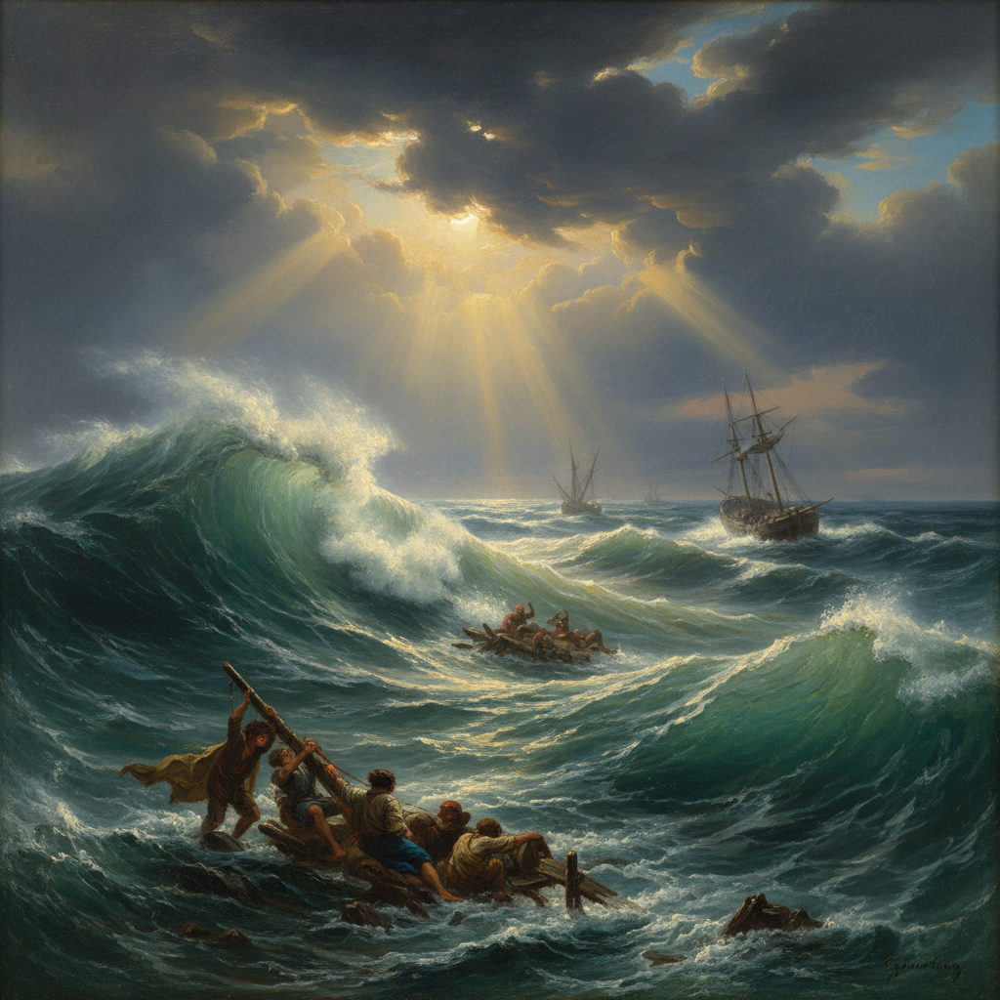

# Aivazovsky Art 艾瓦佐夫斯基艺术

> "The movement of living elements is unattainable for the brush: to paint lightning, a gust of wind, the splash of a wave is unthinkable from nature." — Ivan Aivazovsky

## 概述

艾瓦佐夫斯基艺术（Aivazovsky Art）是19世纪俄罗斯海景画大师伊万·康斯坦丁诺维奇·艾瓦佐夫斯基（Ivan Konstantinovich Aivazovsky, 1817-1900）创立的浪漫主义海景画风格。艾瓦佐夫斯基被誉为"海洋的诗人"——他一生创作了约6000幅作品，其中绝大多数以大海为主题。他能凭记忆在画室中完成巨幅海景画——对海浪、光线和大气效果的把握达到了令人叹为观止的程度。

艾瓦佐夫斯基最著名的作品《九级浪》（1850）描绘了暴风雨后的海面——巨浪翻涌中透出金色的阳光，展现了大自然的壮美与人类的渺小。他的另一杰作《黑海》（1881）以极简的构图表现了大海的无穷力量。艾瓦佐夫斯基的海景画不仅是对自然的记录，更是对大海精神的诗意表达。

艾瓦佐夫斯基艺术的核心要素包括：1）海洋主题——以大海为终身题材；2）光影戏剧——戏剧性的光影效果；3）透明水体——海水的透明质感；4）浪漫壮美——浪漫主义的崇高美学；5）记忆创作——凭记忆在画室完成；6）大气效果——雾气、风暴、日出的表现；7）速度与激情——快速而充满激情的笔触。

## 核心特征

| 特征 | 描述 |
|------|------|
| 海洋主题 | 以大海为终身题材 |
| 光影戏剧 | 戏剧性光影效果 |
| 透明水体 | 海水透明质感 |
| 浪漫壮美 | 浪漫主义崇高美学 |
| 记忆创作 | 凭记忆在画室完成 |
| 大气效果 | 雾气风暴日出表现 |

## 视觉特征

- **翻涌巨浪**：动态的海浪表现
- **透明海水**：阳光穿透海浪的效果
- **戏剧天空**：暴风雨或日出的壮丽天空
- **金色光芒**：穿透云层的金色阳光
- **船只人物**：风暴中的船只和水手
- **蓝绿色调**：标志性的海洋蓝绿色

## 代表作品

| 作品 | 年代 | 意义 |
|------|------|------|
| *九级浪* (The Ninth Wave) | 1850 | 最著名的作品 |
| *黑海* (The Black Sea) | 1881 | 极简主义海景 |
| *彩虹* (Rainbow) | 1873 | 光影的极致 |
| *月夜* (Moonlit Night) | 1849 | 月光海景 |
| *暴风雨* (Storm) | 1886 | 大海的力量 |
| *切斯梅海战* (Battle of Chesma) | 1848 | 历史海战画 |

## 历史时间线

| 时期 | 事件 |
|------|------|
| 1817年 | 出生于费奥多西亚（克里米亚） |
| 1833-1839年 | 就读圣彼得堡美术学院 |
| 1840年代 | 游历欧洲，声名鹊起 |
| 1850年 | 创作《九级浪》 |
| 1860-1880年代 | 创作巅峰期 |
| 1900年 | 在费奥多西亚去世 |

## 中国语境

艾瓦佐夫斯基在中国有着广泛的知名度。《九级浪》是中国美术教育中最常被引用的海景画范例——它展示了如何通过色彩和光影表现大海的力量与美。中国海景画家如颜文樑等都受到艾瓦佐夫斯基的影响。他对海水透明质感的表现技法——通过薄涂和叠色创造光线穿透海浪的效果——被中国油画家广泛学习。艾瓦佐夫斯基证明了单一题材可以创造无穷的变化——这与中国传统山水画家终身画山水的传统有相通之处。他的浪漫主义精神和对自然力量的崇敬也与中国"天人合一"的哲学传统产生共鸣。

## 概念图

## 与其他风格的关系

- **Romanticism** → 浪漫主义
- **Turner** → 透纳（英国海景画）
- **Peredvizhniki** → 巡回展览画派
- **Marine Painting** → 海景画传统
- **Shishkin** → 希施金（陆地风景）
- **Luminism** → 光辉主义

---

*浮光艺志 | Chronicle of Artistry*
