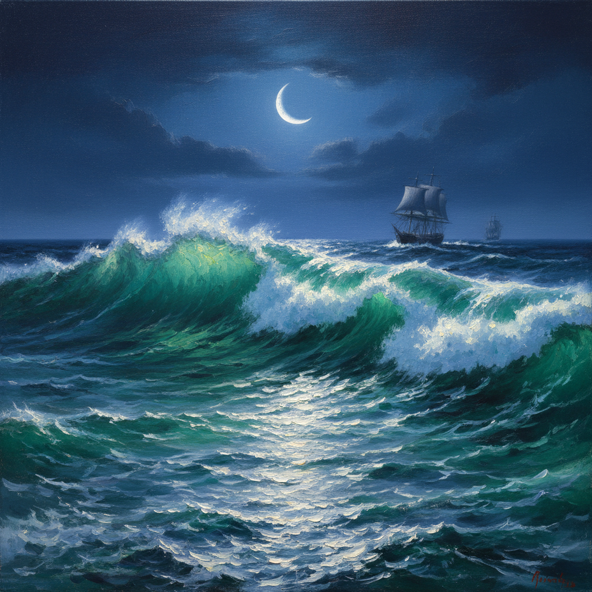

# Ivan Aivazovsky 艾瓦佐夫斯基

> "Движения живых стихий неуловимы для кисти: писать молнию, порыв ветра, всплеск волны — немыслимо с натуры." — Иван Айвазовский
> ("活的元素之运动无法被画笔捕捉：画闪电、风的突袭、浪花的飞溅——从写生中是不可能的。")

## 概述

伊凡·康斯坦丁诺维奇·艾瓦佐夫斯基（Иван Константинович Айвазовский / Ivan Konstantinovich Aivazovsky，1817–1900）是俄罗斯帝国最伟大的海景画家，也是世界艺术史上最多产的画家之一——一生创作了超过6000幅作品。

他以超凡的记忆力和想象力著称，几乎所有海景都在画室中凭记忆完成。他对海水透明度、光线穿透波浪、月光在水面的反射等效果的表现达到了前无古人的高度。

## 核心特征

| 特征 | 描述 |
|------|------|
| 海水透明 | 表现海浪内部的光线穿透效果 |
| 记忆创作 | 在画室中凭记忆和想象完成 |
| 月光效果 | 月光在海面的银色光路 |
| 风暴戏剧 | 巨浪、海难、人与自然的搏斗 |
| 极速创作 | 据说能在2小时内完成一幅海景 |
| 浪漫崇高 | 自然力量的壮美与恐怖 |

## 视觉特征

- **海水**：翡翠绿、深蓝到透明的渐变，内部可见光线
- **浪花**：白色泡沫的精确质感
- **天空**：从暴风雨的墨黑到日出的金红
- **月光**：银色光路在水面的精确反射
- **船舶**：在巨浪中挣扎的帆船
- **光线**：穿透云层和海浪的戏剧性光束

## 代表作品

| 作品 | 年代 | 意义 |
|------|------|------|
| *Девятый вал (The Ninth Wave)* | 1850 | 最著名作品，人类在巨浪中的求生 |
| *Чёрное море (The Black Sea)* | 1881 | 纯粹的海面——没有船，没有人 |
| *Лунная ночь на Босфоре* | 1894 | 月光海景的极致 |
| *Среди волн (Among the Waves)* | 1898 | 82岁时的巨作，纯粹的海浪 |
| *Буря на море ночью* | 1849 | 夜间风暴的戏剧性 |

## 真实作品（公共领域）

艾瓦佐夫斯基的作品已进入公共领域：

| 作品 | 来源 |
|------|------|
| *The Ninth Wave* | [Russian Museum](https://rusmuseum.ru/collections/) / [Wikimedia](https://commons.wikimedia.org/wiki/File:Hovhannes_Aivazovsky_-_The_Ninth_Wave_-_Google_Art_Project.jpg) |
| *The Black Sea* | [Tretyakov Gallery](https://www.tretyakovgallery.ru/) |
| *Among the Waves* | [Aivazovsky Gallery, Feodosia](https://feogallery.org/) |

> ⚠️ 本条目优先使用真实作品。如需本地图片，请从上述来源手动下载后放入 `assets/artworks/aivazovsky/` 并压缩。

## AI生成概念图（备用）

## 历史背景

1. **1817年**：出生于克里米亚费奥多西亚（亚美尼亚裔）
2. **1833年**：进入圣彼得堡皇家美术学院
3. **1840年代**：游历意大利，声名鹊起
4. **1844年**：被任命为俄罗斯海军官方画家
5. **1850年**：创作《第九道浪》，成为俄罗斯最著名画作之一
6. **1880-90年代**：持续高产创作直至晚年
7. **1900年**：在费奥多西亚去世，留下6000余幅作品

## 与其他风格的关系

- **Romanticism** → 浪漫主义崇高海景的俄罗斯代表
- **Maritime Art** → 海洋画派的最高成就之一
- **Turner** → 同为海景大师，但风格不同（Turner更抽象）
- **Luminism** → 对光线穿透水面的极致追求
- **Grimshaw** → 共享月光效果的精湛表现

---

*浮光艺志 | Chronicle of Artistry*
