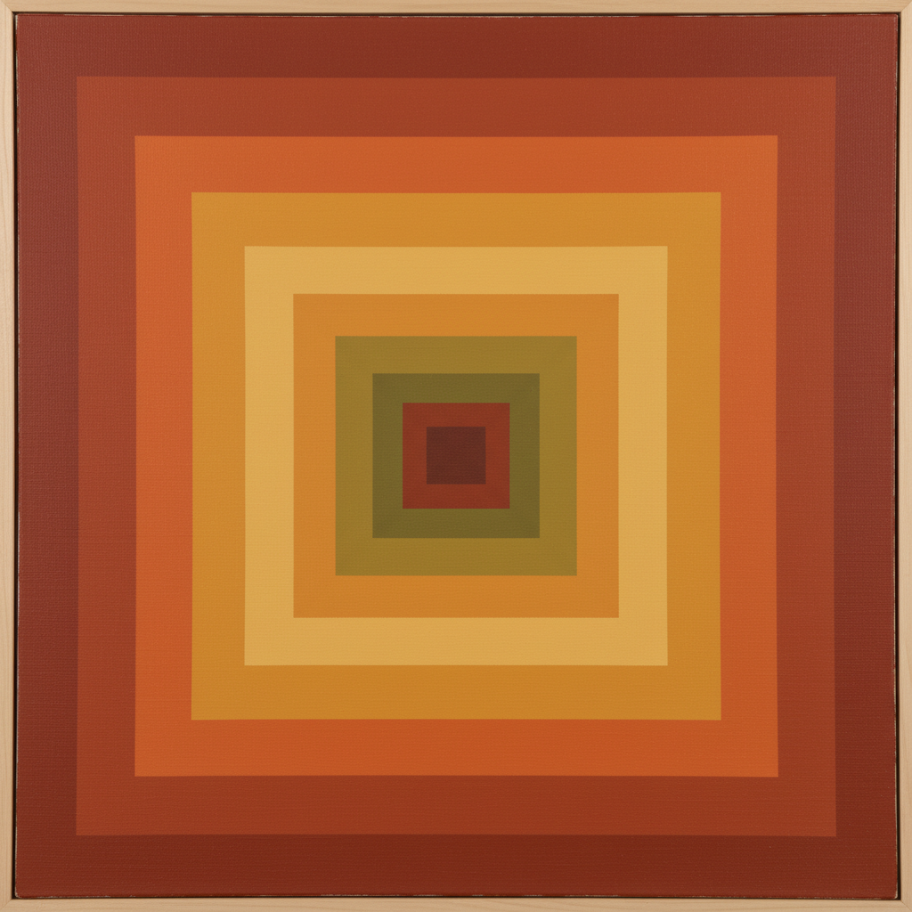

# Josef Albers 约瑟夫·阿尔伯斯

> "In visual perception a color is almost never seen as it really is." — Josef Albers

## 概述

约瑟夫·阿尔伯斯（Josef Albers，1888–1976）是德裔美国艺术家和教育家，包豪斯的学生和教师，后在耶鲁大学执教。他以《向正方形致敬》系列闻名——用嵌套的正方形探索色彩的相互作用，证明颜色永远是相对的。他的《色彩的相互作用》一书是20世纪最重要的色彩理论著作。

## 核心特征

| 特征 | 描述 |
|------|------|
| 嵌套正方形 | 同心正方形的色彩实验 |
| 色彩相对性 | 颜色因邻色而改变 |
| 极简几何 | 最少的形式，最大的感知 |
| 系统性实验 | 科学方法论的艺术实践 |
| 教育革命 | 从包豪斯到耶鲁的设计教育 |
| 光学振动 | 色彩边界的视觉颤动 |

## 代表作品

| 作品 | 年代 | 意义 |
|------|------|------|
| *Homage to the Square* series | 1950–76 | 色彩感知的终极实验 |
| *Interaction of Color* | 1963 | 色彩理论的圣经 |
| *Structural Constellation* | 1950s | 不可能空间的线描 |
| *Variant/Adobe* | 1947–52 | 墨西哥砖墙的抽象 |

## AI生成概念图

## 与其他风格的关系

- **Bauhaus** → 包豪斯学生和教师
- **Color Field** → 影响了色域绘画
- **Op Art** → 光学艺术的理论基础
- **Minimalism** → 极简主义的先驱
