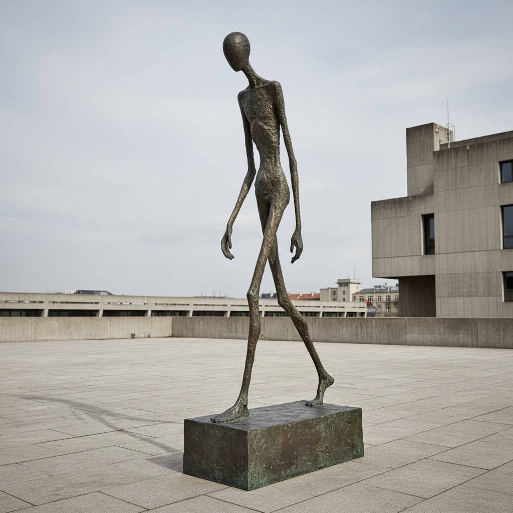

# Alberto Giacometti 阿尔贝托·贾科梅蒂

> **流派**: 超现实主义 · 存在主义雕塑  
> **时期**: 1901–1966 瑞士/法国  
> **关键词**: 细长人像、存在焦虑、行走的人、空间与距离

## 概述

阿尔贝托·贾科梅蒂是20世纪最具哲学深度的雕塑家。他以极度拉长、瘦削的人体雕塑闻名——这些孤独的行走者仿佛被存在的重量压缩到了最本质的形态。他的作品是对人类孤独和脆弱性的视觉冥想。

## 视觉特征

- **极度细长**: 人体被拉伸到几乎消失的程度
- **粗糙表面**: 青铜表面保留了反复塑造的手指痕迹
- **孤独人物**: 单独行走或站立的人像
- **微小头部**: 头部相对身体极小，增强距离感
- **底座强调**: 厚重的底座与纤细的人体形成对比

## 代表作品

- 《行走的人 I》(1960)
- 《指向的人》(1947)
- 《城市广场》(1948)
- 《猫》(1951)

## 历史影响

贾科梅蒂将存在主义哲学转化为视觉形式，证明了雕塑可以表达人类最深层的孤独和焦虑。他对"观看"本身的质疑影响了后来的现象学美学和当代雕塑。

## 相关风格

- [Henry Moore 亨利·摩尔](henry-moore.md)
- [Constantin Brancusi 康斯坦丁·布朗库西](constantin-brancusi.md)
- [Egon Schiele 埃贡·席勒](egon-schiele.md)
