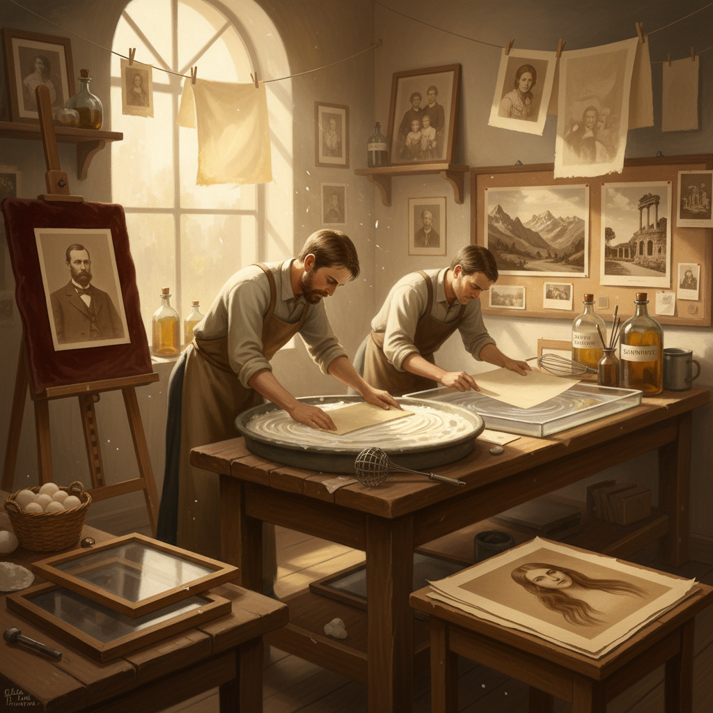

# Albumen Printing 蛋白印刷

> "Albumen printing is photography on egg white — silver salts suspended in a thin film of dried albumen, coating paper with a glossy surface that holds detail with extraordinary clarity, the dominant photographic printing process for half a century, billions of images preserved in the protein of humble eggs." — Unknown

## 概述

蛋白印刷（Albumen Printing）是19世纪下半叶最主要的摄影印刷工艺——从1850年代到1890年代，全球绝大多数照片都是蛋白印刷品。这种工艺由Louis Désiré Blanquart-Evrard在1850年发明，使用鸡蛋清（蛋白/albumen）作为将感光银盐固定在纸张表面的粘合剂。

蛋白印刷的过程：将鸡蛋清打发后静置分离，涂在高质量的薄纸上形成光滑的蛋白层，干燥后浸入硝酸银溶液使其感光。感光后的蛋白纸通过负片接触曝光（日光印相），然后用硫代硫酸钠定影、水洗。蛋白印刷品具有特征性的光泽表面、温暖的棕色调和精细的细节。19世纪的蛋白纸工厂每年消耗数百万枚鸡蛋。

## 核心特征

| 特征 | 描述 |
|------|------|
| 蛋白 | 鸡蛋清作为粘合剂 |
| 银盐 | 银盐感光材料 |
| 光泽 | 光滑光泽的表面 |
| 接触 | 接触印刷方式 |
| 棕色 | 温暖的棕色调 |
| 历史 | 19世纪主流工艺 |

## 视觉特征

- **光泽**：蛋白层的光泽表面
- **棕色**：温暖的棕褐色调
- **精细**：精细的细节表现
- **褪色**：边缘常有褪色
- **温暖**：温暖的整体色调
- **历史感**：强烈的历史感

## 代表作品

| 作品 | 艺术家 | 年代 | 意义 |
|------|--------|------|------|
| *Carte de visite portraits* | Various | 1860s | 名片照片 |
| *Civil War photographs* | Various | 1860s | 美国内战摄影 |
| *Travel photography* | Various | 1860-80s | 旅行摄影 |
| *Contemporary albumen prints* | Various | 当代 | 当代蛋白印刷 |

## 历史时间线

| 时期 | 事件 |
|------|------|
| 1850年 | Blanquart-Evrard发明蛋白印刷 |
| 1855-90年代 | 蛋白印刷的统治时代 |
| 1860年代 | 名片照片的全球流行 |
| 1890年代 | 被明胶银盐相纸取代 |
| 当代 | 替代摄影中的复兴 |

## 中国语境

蛋白印刷在中国有重要的历史意义——19世纪中后期进入中国的早期摄影几乎都是蛋白印刷品。中国最早的摄影作品（如约翰·汤姆森拍摄的中国影像）都是蛋白印刷。中国的博物馆和档案馆收藏有大量19世纪的蛋白印刷照片。中国的摄影史研究中，蛋白印刷是理解早期中国摄影的关键。当代中国的替代摄影艺术家也开始实践蛋白印刷。

## AI生成概念图

## 与其他风格的关系

- **Salt Printing** → 盐纸印刷
- **Platinum Printing** → 铂金印刷
- **Carbon Printing** → 碳素印刷
- **Collodion Process** → 火棉胶工艺
- **Alternative Photography** → 替代摄影
- **Historical Photography** → 历史摄影

---

*浮光艺志 | Chronicle of Artistry*
