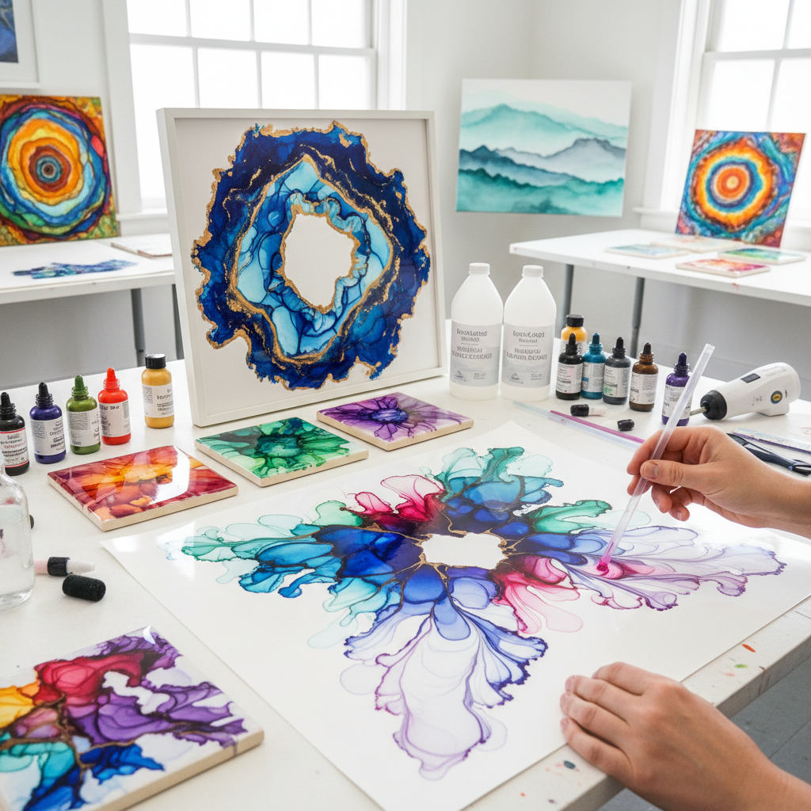

# Alcohol Ink Art 酒精墨水艺术

> "Alcohol ink is liquid light on a non-porous surface — drops of intensely pigmented ink in an alcohol carrier, spreading and blooming with ethereal speed, pushed by breath and gravity into luminous abstractions that glow like stained glass from within." — Unknown

## 概述

酒精墨水艺术（Alcohol Ink Art）是使用酒精基墨水（alcohol-based ink）在非吸收性表面（如Yupo纸、瓷砖、玻璃、金属等）上创作的艺术形式。酒精墨水是高度浓缩的染料溶解在异丙醇中——当墨水滴在光滑表面上时，酒精迅速蒸发，留下鲜艳的色彩。通过添加更多酒精（blending solution），可以使墨水重新流动、混合和产生独特的纹理效果。

酒精墨水艺术的魅力在于其"即时性"和"不可预测性"——墨水在表面上快速流动和变化，产生有机的、流动的图案。艺术家通过吹气、倾斜表面、滴加酒精等方式引导墨水的流动。酒精墨水的色彩极其鲜艳和透明，可以创造出类似彩色玻璃或宝石的光泽效果。

## 核心特征

| 特征 | 描述 |
|------|------|
| 酒精基 | 酒精基墨水 |
| 非吸收 | 非吸收性表面 |
| 鲜艳 | 极其鲜艳的色彩 |
| 透明 | 透明的层次 |
| 快速 | 快速蒸发和变化 |
| 流动 | 自由流动的效果 |

## 视觉特征

- **鲜艳**：极其鲜艳的色彩
- **透明**：透明的光泽感
- **流动**：有机的流动图案
- **层次**：多层次的深度
- **光泽**：宝石般的光泽
- **梦幻**：梦幻的视觉效果

## 代表作品

| 作品 | 艺术家 | 年代 | 意义 |
|------|--------|------|------|
| *Alcohol ink abstracts* | Various | 当代 | 酒精墨水抽象画 |
| *Alcohol ink landscapes* | Various | 当代 | 酒精墨水风景 |
| *Alcohol ink on tile* | Various | 当代 | 瓷砖上的酒精墨水 |
| *Alcohol ink jewelry* | Various | 当代 | 酒精墨水首饰 |
| *Large scale alcohol ink* | Various | 当代 | 大型酒精墨水作品 |

## 历史时间线

| 时期 | 事件 |
|------|------|
| 1950年代 | 酒精基标记墨水的发展 |
| 1990年代 | Ranger/Tim Holtz推出艺术用酒精墨水 |
| 2000年代 | 酒精墨水在手工创作中的应用 |
| 2015年后 | 社交媒体推动的全球流行 |
| 当代 | 酒精墨水艺术的持续发展 |

## 中国语境

酒精墨水艺术在中国有快速的发展——通过社交媒体（小红书、抖音）传入中国后受到广泛关注。中国的手工创作者和艺术爱好者使用酒精墨水创作抽象画、首饰、手机壳装饰等。中国的电商平台上有丰富的酒精墨水材料（Copic、Ranger等品牌以及国产替代品）。中国的一些艺术家将酒精墨水的流动效果与中国传统水墨的意境结合，探索东方美学在新媒介中的表达。

## AI生成概念图

## 与其他风格的关系

- **Fluid Art** → 流体艺术
- **Resin Art** → 树脂艺术
- **Watercolor** → 水彩
- **Ink Wash** → 水墨
- **Abstract Art** → 抽象艺术
- **Pour Painting** → 倾倒绘画

---

*浮光艺志 | Chronicle of Artistry*
