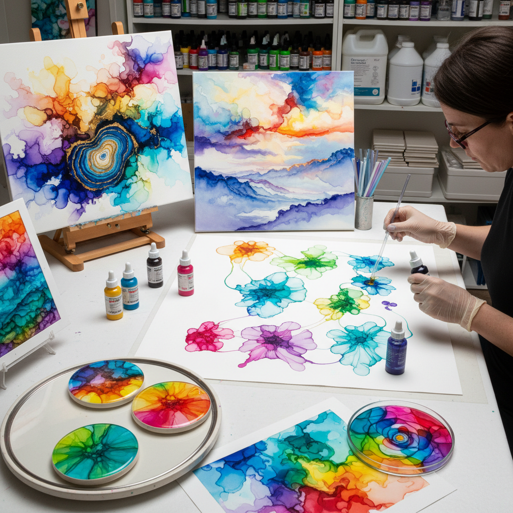

# Alcohol Ink 酒精墨水

> "Alcohol ink is controlled chaos on a non-porous surface — the pigment flows, blooms, and reacts with each drop of isopropyl, creating organic patterns that look like satellite images of alien landscapes or microscopic views of living cells." — Unknown

## 概述

酒精墨水（Alcohol Ink）是一种以酒精（异丙醇）为溶剂的高度饱和染料墨水——在非吸收性表面（如Yupo纸、瓷砖、玻璃、金属）上使用时，墨水会自由流动、扩散和混合，产生独特的有机图案。酒精墨水的特点是：色彩极其鲜艳饱和、干燥极快（酒精蒸发）、可以用酒精重新激活已干燥的墨水、在非吸收性表面上产生独特的流动效果。

酒精墨水在2010年代经历了爆发式的流行——社交媒体上大量的酒精墨水艺术视频吸引了全球的关注。酒精墨水的魅力在于其不可预测性——墨水的流动受到重力、气流、表面张力和酒精蒸发速度的影响，产生的图案每次都不同。艺术家可以通过吹气、倾斜、滴加酒精等方式来引导墨水的流动。

## 核心特征

| 特征 | 描述 |
|------|------|
| 酒精 | 酒精为溶剂 |
| 流动 | 自由流动的特性 |
| 鲜艳 | 极其鲜艳的色彩 |
| 快干 | 干燥极快 |
| 不可预测 | 结果不完全可控 |
| 非吸收 | 在非吸收性表面使用 |

## 视觉特征

- **流动**：有机的流动图案
- **鲜艳**：极其鲜艳的色彩
- **透明**：透明的色彩层
- **有机**：有机的自然形态
- **细胞**：类似细胞的图案
- **宝石**：宝石般的色彩深度

## 代表作品

| 作品 | 艺术家 | 年代 | 意义 |
|------|--------|------|------|
| *Alcohol ink abstracts* | Various | 当代 | 抽象酒精墨水艺术 |
| *Alcohol ink landscapes* | Various | 当代 | 酒精墨水风景 |
| *Alcohol ink on tile* | Various | 当代 | 瓷砖上的酒精墨水 |
| *Petri dish art* | Various | 当代 | 培养皿酒精墨水艺术 |
| *Alcohol ink jewelry* | Various | 当代 | 酒精墨水首饰 |

## 历史时间线

| 时期 | 事件 |
|------|------|
| 1960s | 早期酒精基墨水的工业应用 |
| 1990s | Ranger/Tim Holtz推出艺术用酒精墨水 |
| 2000s | 酒精墨水在手工艺中的应用 |
| 2010s | 社交媒体推动的爆发式流行 |
| 2015+ | 高品质艺术家级酒精墨水的出现 |
| 当代 | 酒精墨水作为严肃艺术媒介的认可 |

## 中国语境

酒精墨水在中国有极其广泛的流行——特别是在社交媒体时代。中国的短视频平台上有大量酒精墨水艺术创作视频。中国的手工艺爱好者群体中，酒精墨水因其"易上手、效果惊艳"的特点而极受欢迎。中国市场上有多种酒精墨水品牌——包括进口的Ranger、Copic和国产品牌。中国的一些艺术家将酒精墨水与树脂（resin）结合创作装饰艺术品。中国的酒精墨水工作坊和课程非常活跃。

## AI生成概念图

## 与其他风格的关系

- **Fluid Art** → 流体艺术
- **Resin Art** → 树脂艺术
- **Watercolor** → 水彩画
- **Abstract Art** → 抽象艺术
- **Marbling** → 大理石纹
- **Pour Painting** → 倾倒画

---

*浮光艺志 | Chronicle of Artistry*
