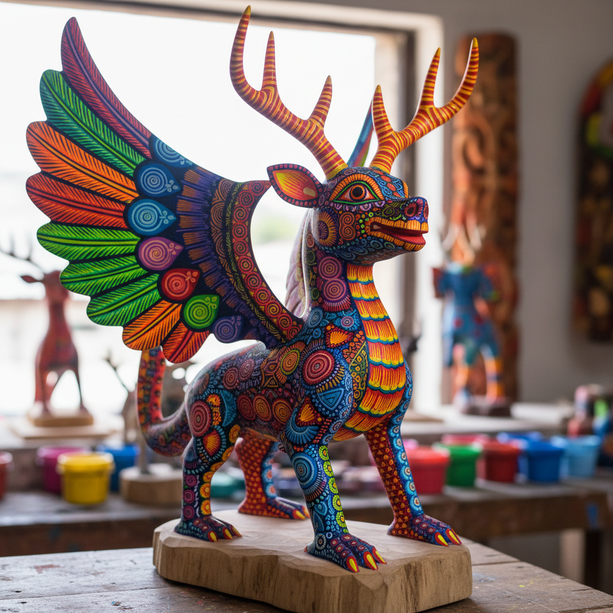

# Alebrije 墨西哥幻想动物 | Alebrije

> **"梦境的动物园——墨西哥工匠用纸浆和木头雕刻出只存在于想象中的彩色生物。"**

## 概述

Alebrije是墨西哥的幻想动物雕塑艺术，以其色彩斑斓、造型奇异的想象生物著称。这种艺术有两个独立的传统：1）纸浆Alebrije——由Pedro Linares López于1936年在墨西哥城创立，他在发烧昏迷中梦见了这些奇异生物；2）木雕Alebrije——瓦哈卡州（Oaxaca）的Copal木雕传统，由Manuel Jiménez等工匠发展。Alebrije通常是多种动物的混合体——龙的翅膀、蛇的身体、鹿的角、鱼的鳞片——涂上极度鲜艳的色彩和精细的图案。

## 两大传统

| 传统 | 地区 | 材料 |
|------|------|------|
| 纸浆Alebrije | 墨西哥城 | 纸浆（cartonería） |
| 木雕Alebrije | 瓦哈卡 | Copal木 |

## 核心特征

- **幻想生物**：多种动物的混合体
- **极度鲜艳**：饱和的多色涂装
- **精细图案**：身体上的装饰性图案
- **手工制作**：每一件都是独一无二的
- **梦境来源**：源自梦境和想象
- **文化符号**：墨西哥身份的视觉标志

## 常见造型

| 造型 | 特征 |
|------|------|
| 龙 | 翅膀+蛇身+角 |
| 狮鹫 | 狮身+鹰翅 |
| 美洲豹 | 翅膀+鳞片 |
| 蜥蜴 | 角+翅膀+花纹 |
| 猫头鹰 | 多色羽毛 |
| 骷髅 | 亡灵节主题 |

## 视觉特征

- 极度鲜艳的多色涂装
- 精细的点和线图案
- 奇异的混合动物造型
- 立体雕塑的存在感
- 梦幻和超现实的氛围
- 墨西哥的热烈生命力

## 与其他风格的关系

| 风格 | 关系 |
|------|------|
| Día de Muertos | 共享墨西哥民间传统 |
| Papel Picado | 共享墨西哥装饰艺术 |
| 超现实主义 | 共享梦境和想象 |
| 当代玩具设计 | Alebrije的全球影响 |
| Pixar Coco | Alebrije的流行文化传播 |

## 概念图

---

*浮光艺志 | Chronicle of Artistry*
