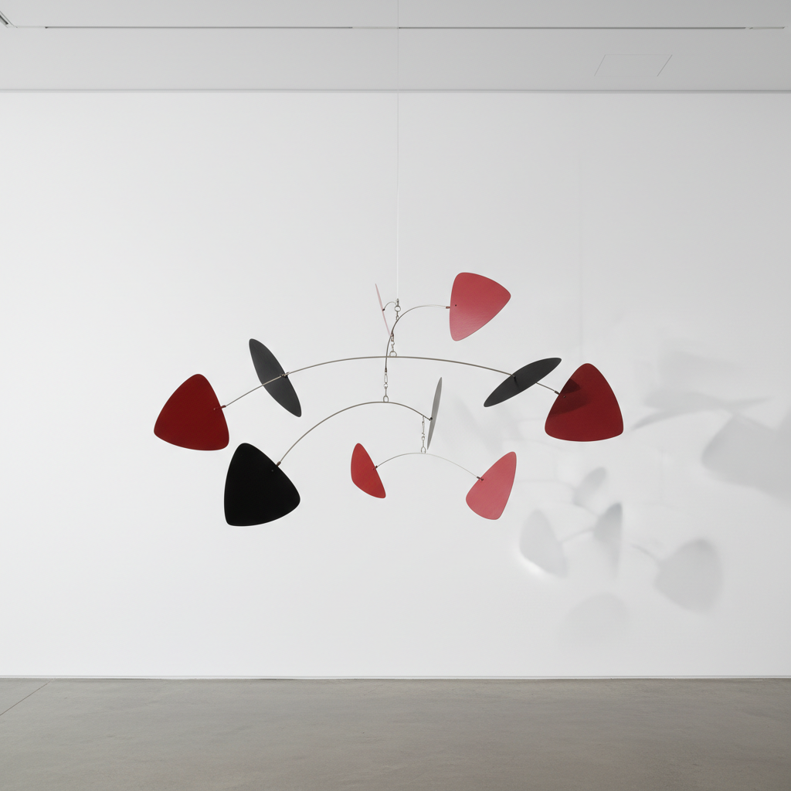

# Alexander Calder 亚历山大·考尔德

> **流派**: 动态雕塑 · 抽象艺术  
> **时期**: 1898–1976 美国  
> **关键词**: 动态雕塑(Mobile)、稳定雕塑(Stabile)、铁丝马戏团、原色

## 概述

亚历山大·考尔德发明了"动态雕塑"(Mobile)——悬挂在空中、随气流缓慢旋转的抽象金属片组合。他让雕塑第一次真正动了起来，将时间和偶然性引入三维艺术。从铁丝马戏团到巨型公共雕塑，他始终保持着游戏般的创造力。

## 视觉特征

- **悬挂平衡**: 金属片通过精密的平衡点悬挂旋转
- **原色调**: 红、黄、蓝、黑、白的鲜明色彩
- **有机形状**: 叶片般的不规则金属片
- **铁丝线条**: 用铁丝在空间中"画"出轮廓
- **巨型尺度**: 晚期公共雕塑高达数十米

## 代表作品

- 《龙虾陷阱与鱼尾》(1939) 纽约MoMA
- 《火烈鸟》(1974) 芝加哥联邦广场
- 考尔德马戏团 (1926–31)
- 《红色Mobile》系列

## 历史影响

考尔德发明了一种全新的艺术形式——运动中的雕塑。他证明了严肃的抽象艺术可以充满幽默和游戏精神，影响了后来的动力艺术和互动装置。

## 相关风格

- [Jean Arp 让·阿尔普](jean-arp.md)
- [Joan Miró 胡安·米罗](joan-miro.md)
- [Kinetic Art 动力艺术](kinetic-art.md)
