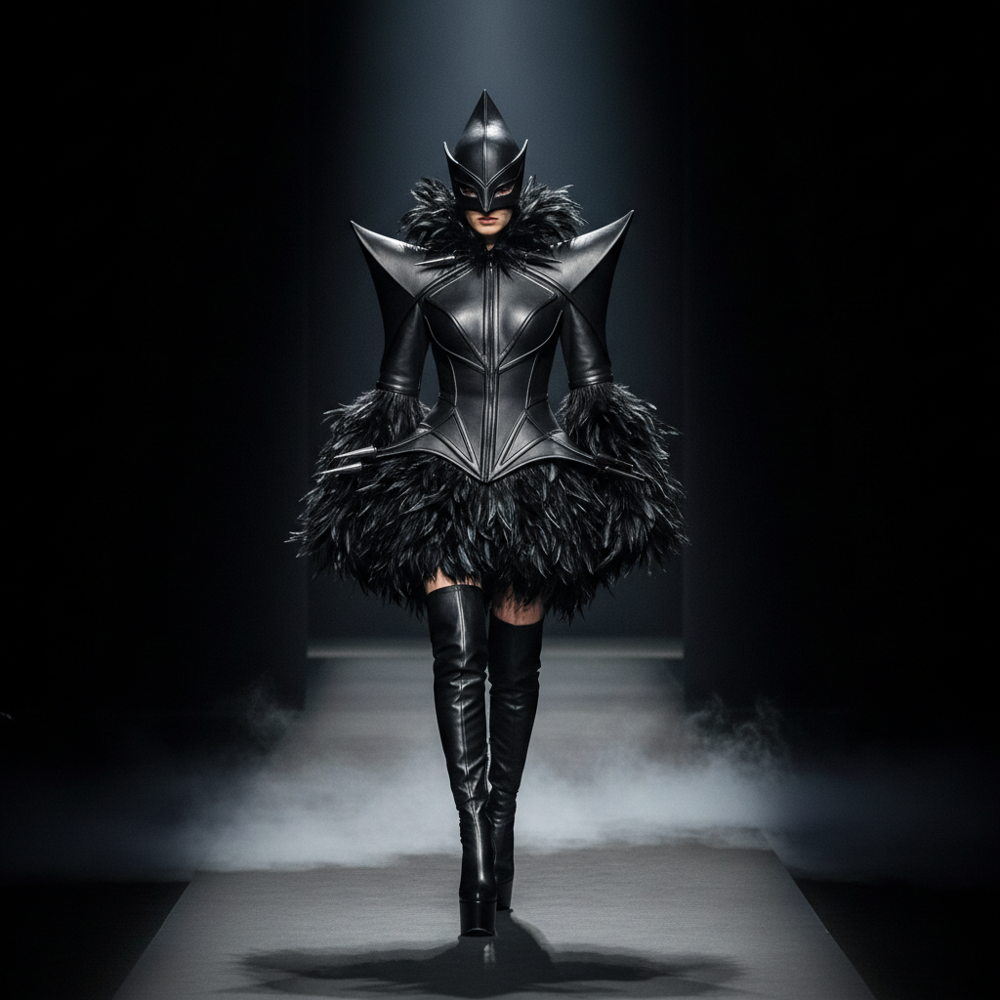

# Alexander McQueen 亚历山大·麦昆

> **时期：** 1969–2010  
> **关键词：** 暗黑浪漫、戏剧性时装秀、工艺极致、自然与科技

## 概述

Alexander McQueen 是英国时装设计师，以将时装秀变成戏剧性的艺术事件而闻名。他的设计融合了精湛的裁剪工艺与暗黑的浪漫主义想象——骷髅、飞蛾、盔甲、机械臂喷漆——将时尚从商业推向了艺术的边界。

## 风格特征

- **暗黑浪漫**：哥特式的美与恐怖并存
- **戏剧性秀场**：时装秀如同剧场表演或行为艺术
- **极致裁剪**：萨维尔街传统的精湛工艺
- **自然引用**：飞蛾翅膀、鸟类羽毛、花朵的解构
- **科技融合**：3D打印、全息投影等技术应用

## 代表作品

- *No.13*秀（1999，机械臂喷漆）
- *Plato's Atlantis*（2010）
- *骷髅丝巾*系列
- *Armadillo 鞋*（2010）

## 概念图

