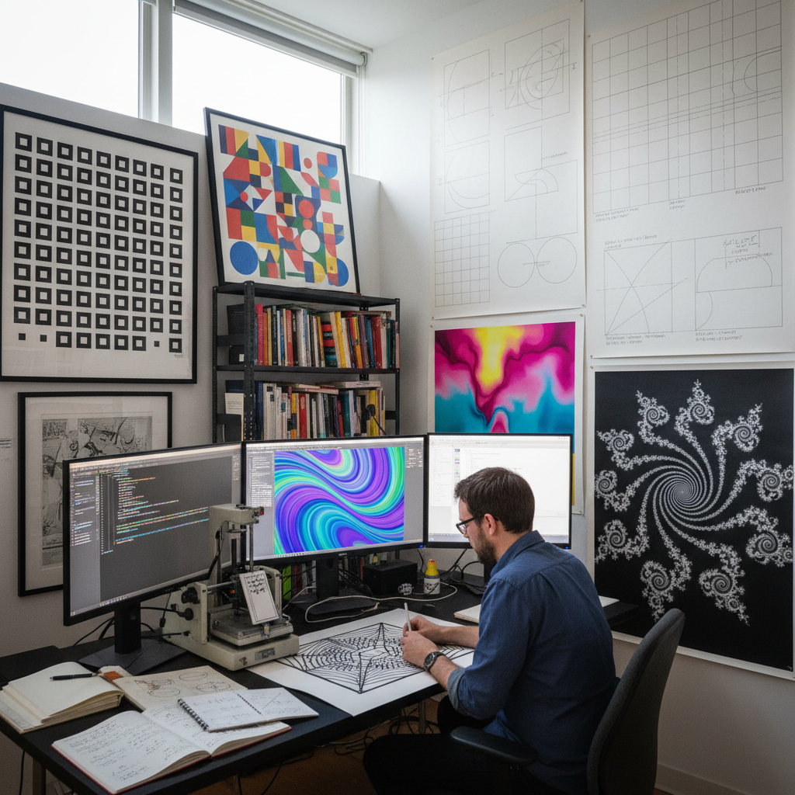

# Algorithmic Art 算法艺术

> "Algorithmic art is beauty born from logic — the artist writes rules rather than strokes, defining processes rather than products, setting mathematical systems in motion and discovering that equations can bloom into flowers, that recursive functions can build cathedrals, and that the simplest rules iterated endlessly can generate complexity rivaling nature itself, each work a collaboration between human intention and computational surprise." — Unknown

## 概述

算法艺术（Algorithmic Art）是一种使用算法（一组明确定义的规则和步骤）作为创作核心方法的艺术形式。艺术家设计算法——可以是数学公式、逻辑规则、条件语句、递归过程等——然后由计算机（或手工）执行这些算法来生成视觉作品。算法艺术的核心在于"过程"而非"产品"——艺术家创作的是生成系统，而非最终图像。

算法艺术的先驱包括1960年代的计算机艺术家如弗里德·纳克（Frieder Nake）、格奥尔格·尼斯（Georg Nees）和A. Michael Noll。他们使用早期计算机和绘图仪创作了第一批算法生成的视觉作品。索尔·勒维特（Sol LeWitt）的墙画指令也可以被视为一种"人工执行的算法艺术"——他写下精确的文字指令，由他人执行来生成作品。当代的算法艺术已经发展出极其丰富的分支，包括生成艺术、进化艺术、人工智能艺术等。

## 核心特征

| 特征 | 描述 |
|------|------|
| 规则 | 基于明确的规则 |
| 过程 | 过程优先于产品 |
| 计算 | 计算机执行 |
| 数学 | 数学基础 |
| 系统 | 系统性的生成 |
| 惊喜 | 意料之外的结果 |

## 视觉特征

- **几何**：几何图案和结构
- **重复**：规则的重复变化
- **复杂**：简单规则的复杂结果
- **精确**：计算的精确性
- **变化**：参数变化的多样性
- **自然**：模拟自然的复杂性

## 代表作品

| 作品 | 艺术家 | 年代 | 意义 |
|------|--------|------|------|
| *Schotter (Gravel)* | Georg Nees | 1968 | 早期算法艺术经典 |
| *Walk-Through Raster* | Frieder Nake | 1966 | 纳克的栅格漫步 |
| *Wall Drawings* | Sol LeWitt | 1968起 | 勒维特的指令墙画 |
| *Substrate* | Jared Tarbell | 2003 | 塔贝尔的基底 |
| *Fidenza* | Tyler Hobbs | 2021 | 霍布斯的生成艺术NFT |

## 历史时间线

| 时期 | 事件 |
|------|------|
| 1960年代 | 第一批计算机生成艺术 |
| 1965 | 首次计算机艺术展览 |
| 1970-80年代 | 算法艺术的学术化 |
| 2000年代 | Processing等创意编程工具 |
| 2020年代 | 生成艺术NFT的爆发 |

## 中国语境

算法艺术在中国有快速发展的实践。中国的数字艺术家和创意编程社区积极探索算法艺术创作。中国的美术院校和科技院校都开设了相关课程。有趣的是，中国传统艺术中也有"算法性"的元素——如中国传统图案中的几何规则（回纹、万字纹等的重复规则）、书法中的笔画规则系统、以及中国传统建筑中的模数化设计（如《营造法式》中的材分制度）。当代中国的一些新媒体艺术家（如曹斐、陆扬等）在创作中融合算法和中国文化元素。中国的AI艺术和生成艺术社区也在快速成长。

## AI生成概念图

## 与其他风格的关系

- **Generative Art** → 生成艺术
- **Fractal Art** → 分形艺术
- **Computer Art** → 计算机艺术
- **Conceptual Art** → 概念艺术
- **Op Art** → 欧普艺术
- **AI Art** → 人工智能艺术

---

*浮光艺志 | Chronicle of Artistry*
