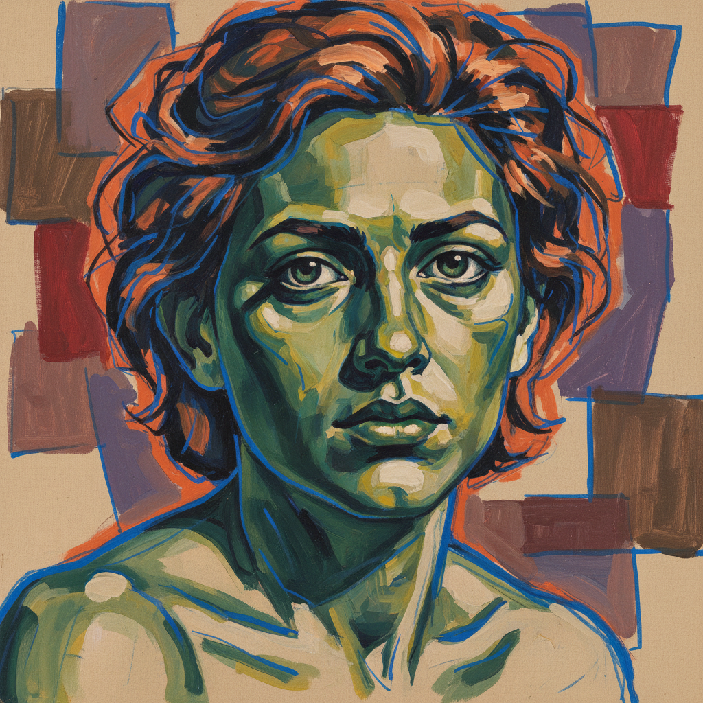

# Alice Neel 爱丽丝·尼尔

> **时期：** 1900–1984  
> **关键词：** 心理肖像、社会纪录、表现主义线条、纽约众生

## 概述

Alice Neel 是美国肖像画家，以对纽约各阶层人物的深刻心理描绘闻名。她终生坚持具象绘画——在抽象表现主义主导的时代被边缘化数十年——描绘邻居、朋友、艺术家、孕妇和街头人物，用锐利的线条和大胆的色彩揭示每个人的内在状态。

## 风格特征

- **心理穿透**：人物的姿态、表情和手势传达深层的心理状态和社会处境
- **锐利线条**：以蓝色或黑色轮廓线勾勒人物，线条具有速写般的即时感
- **大胆色彩**：皮肤常呈现非自然的绿色、蓝色或黄色，反映情绪而非外表
- **未完成感**：画面常保留未完成的区域——空白的手、粗略的背景
- **正面凝视**：人物常直视观者，建立直接的心理连接

## 代表作品

- *Pregnant Woman*（1971）
- *Andy Warhol*（1970）
- *The Family (John Gruen, Jane Wilson and Julia)*（1970）
- *Jackie Curtis and Ritta Redd*（1970）

## 历史意义

Neel 在80岁时才获得广泛认可，她的坚持证明了具象绘画在任何时代都具有不可替代的价值。她对当代肖像画家——从 Jordan Casteel 到 Kehinde Wiley——的影响是深远的。

## 概念图

