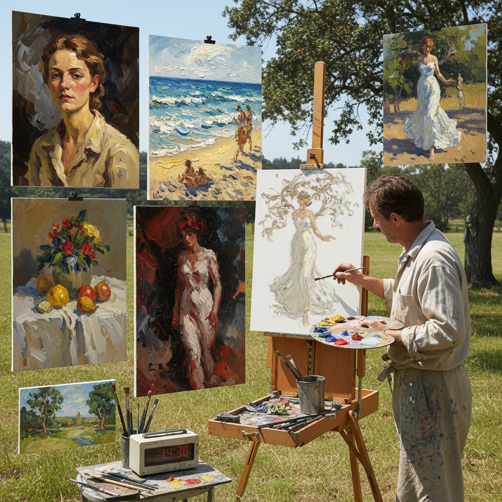

# Alla Prima Painting 一次完成画法

> "Alla prima is painting without a safety net — completing the entire work in a single session while the paint is still wet, every stroke final and irreversible, demanding that the artist see the whole picture at once and commit to each decision with the confidence of a surgeon, creating works that vibrate with the energy of their making because the paint never had time to grow cold between intention and execution." — Unknown

## 概述

一次完成画法（Alla Prima），意大利语意为"at first attempt"（第一次尝试），也称为"wet-on-wet"（湿上湿）或"direct painting"（直接画法），是一种在一次作画过程中完成整幅画作的技法——不等待底层颜料干燥就在其上继续作画，所有的颜料层在湿润状态下相互混合和叠加。

与传统的多层画法（先画底色、等干、再罩染、再等干……）不同，alla prima要求画家在一次坐下来的时间内（通常几小时）完成整幅作品。这要求画家具有极强的预判能力、果断的决策力和熟练的技术。印象派画家是alla prima的主要推动者——他们需要在户外快速捕捉变化的光线，没有时间等待颜料干燥。约翰·辛格·萨金特（John Singer Sargent）是alla prima肖像画的大师。

## 核心特征

| 特征 | 描述 |
|------|------|
| 一次完成 | 一次作画完成 |
| 湿上湿 | 湿颜料上继续作画 |
| 直接 | 直接的绑画方式 |
| 快速 | 快速的创作过程 |
| 果断 | 果断的笔触决策 |
| 新鲜 | 新鲜活泼的效果 |

## 视觉特征

- **新鲜**：新鲜活泼的色彩
- **果断**：果断有力的笔触
- **流畅**：流畅的颜料混合
- **即兴**：即兴的表现力
- **活力**：充满活力的表面
- **统一**：色调的统一和谐

## 代表作品

| 作品 | 艺术家 | 年代 | 意义 |
|------|--------|------|------|
| *Madame X* | John Singer Sargent | 1884 | 萨金特的alla prima肖像 |
| *Impression, Sunrise* | Claude Monet | 1872 | 莫奈的户外alla prima |
| *Plein air landscapes* | Joaquín Sorolla | 1900年代 | 索罗拉的光感alla prima |
| *Portrait studies* | Anders Zorn | 19世纪末 | 佐恩的alla prima肖像 |
| *Contemporary alla prima* | Various | 当代 | 当代一次完成画法 |

## 历史时间线

| 时期 | 事件 |
|------|------|
| 17世纪 | 哈尔斯等画家的直接画法 |
| 19世纪 | 印象派推动alla prima |
| 19世纪末 | 萨金特等大师的alla prima |
| 20世纪 | Alla prima的普及 |
| 当代 | Alla prima的全球流行 |

## 中国语境

一次完成画法在中国的油画创作中非常流行。中国的许多油画家使用alla prima技法——特别是在写生和肖像创作中。中国的美术院校在油画写生课程中教授alla prima。中国的户外写生活动（plein air）中，alla prima是最常用的技法。有趣的是，中国传统绘画本身就是一种"一次完成"的艺术——中国画的水墨在宣纸上一旦落笔就无法修改，这与alla prima的"不可逆"精神完全一致。中国画的"一气呵成"理念与alla prima高度相通。

## AI生成概念图

## 与其他风格的关系

- **Impressionism** → 印象派
- **Plein Air** → 户外写生
- **Wet-on-Wet** → 湿上湿
- **Direct Painting** → 直接画法
- **Sargent** → 萨金特风格
- **Expressionism** → 表现主义

---

*浮光艺志 | Chronicle of Artistry*
