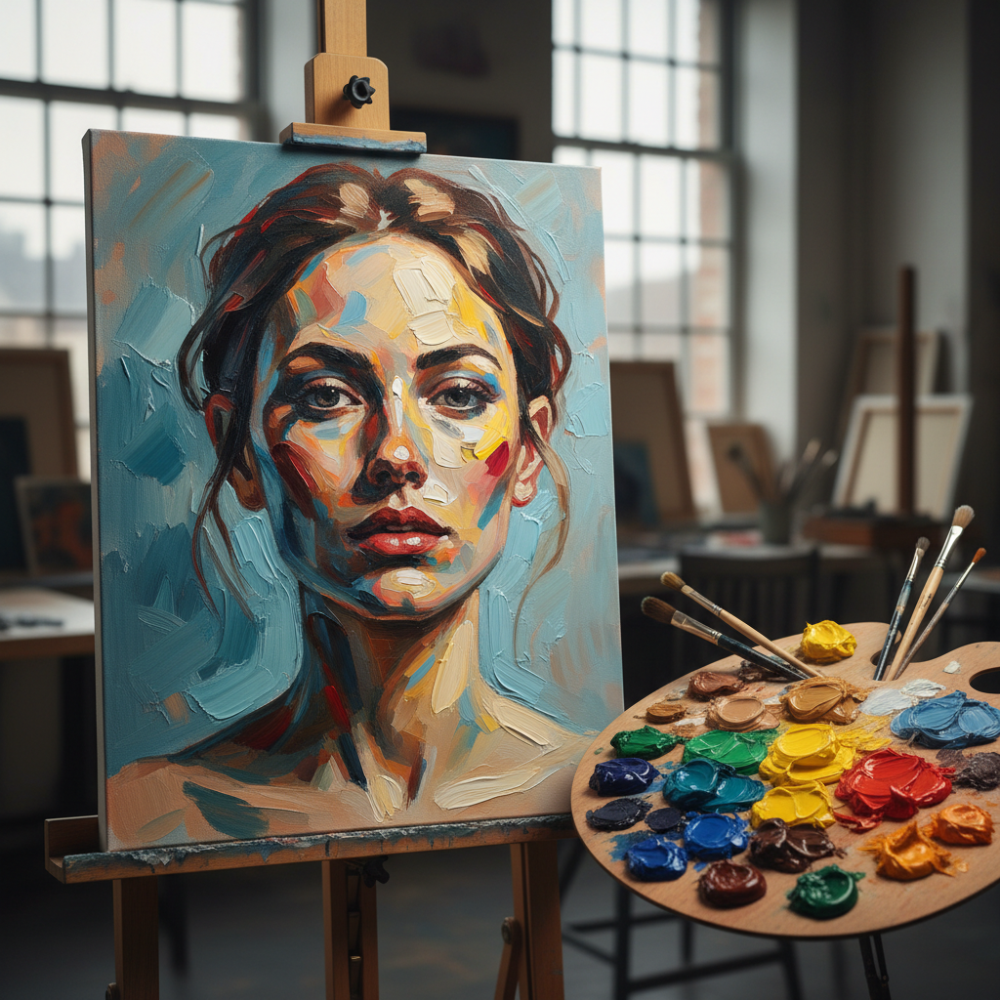

# Alla Prima 一次完成画法

> "Alla prima is painting with courage — every stroke must be right the first time." — John Singer Sargent

## 概述

一次完成画法（Alla Prima，意大利语"一次性"）是在颜料未干时一次性完成绘画的技法——不等待底层干燥再叠加，而是在湿润的颜料上直接工作，让色彩在画布上直接混合。从哈尔斯的飞速肖像到萨金特的优雅笔触，从索罗拉的阳光海滩到当代的写生画家，一次完成画法以其即时性、生动性和技术难度成为最考验画家功力的创作方式。

一次完成画法的精神在于：果断——每一笔都必须准确，因为没有修改的机会。

## 核心特征

| 特征 | 描述 |
|------|------|
| 一次性 | 在一次会话中完成 |
| 湿对湿 | 在湿颜料上继续工作 |
| 即时 | 即时的色彩混合 |
| 果断 | 每一笔都必须果断 |
| 生动 | 保持画面的生动感 |
| 技巧 | 需要极高的技术功力 |

## 视觉特征

- **笔触**：清晰可见的果断笔触
- **生动**：画面的即时生动感
- **色彩**：颜料的直接混合效果
- **厚度**：适度的颜料厚度
- **统一**：色调的统一和谐
- **速度**：速度感和即兴感

## 代表作品

| 作品 | 艺术家 | 年代 | 意义 |
|------|--------|------|------|
| *Laughing Cavalier* | Frans Hals | 1624 | 早期一次完成的大师 |
| *Madame X* | John Singer Sargent | 1884 | 优雅的一次完成 |
| *Beach scenes* | Joaquín Sorolla | 1900s-10s | 阳光下的一次完成 |
| *Portraits* | Anders Zorn | 1880s-1920 | 瑞典一次完成大师 |
| *Contemporary alla prima* | Various | 2000s+ | 当代一次完成运动 |

## 历史时间线

| 时期 | 事件 |
|------|------|
| 17世纪 | Hals、Velázquez——早期大师 |
| 19世纪 | 印象派的户外一次完成 |
| 1880s-1920s | Sargent、Sorolla、Zorn |
| 20世纪 | 一次完成作为写生标准 |
| 当代 | 一次完成画法的全球复兴 |

## 中国语境

一次完成画法在中国油画教育中是重要的训练内容——"一次性写生"是中国美术学院的基础课程。中国传统绘画中的"写意"精神与一次完成画法有深刻的相通——都强调果断、即兴和一气呵成。当代中国的写实油画家中，许多人擅长一次完成画法，特别是在户外写生中。

## AI生成概念图

## 与其他风格的关系

- **Plein Air** → 户外写生常使用一次完成
- **Impressionism** → 印象派大量使用一次完成
- **Impasto** → 厚涂常与一次完成结合
- **Portraiture** → 肖像画中的一次完成传统
- **Realism** → 写实的一次完成技法
- **Wet-on-Wet** → 湿对湿是一次完成的核心

---

*浮光艺志 | Chronicle of Artistry*
