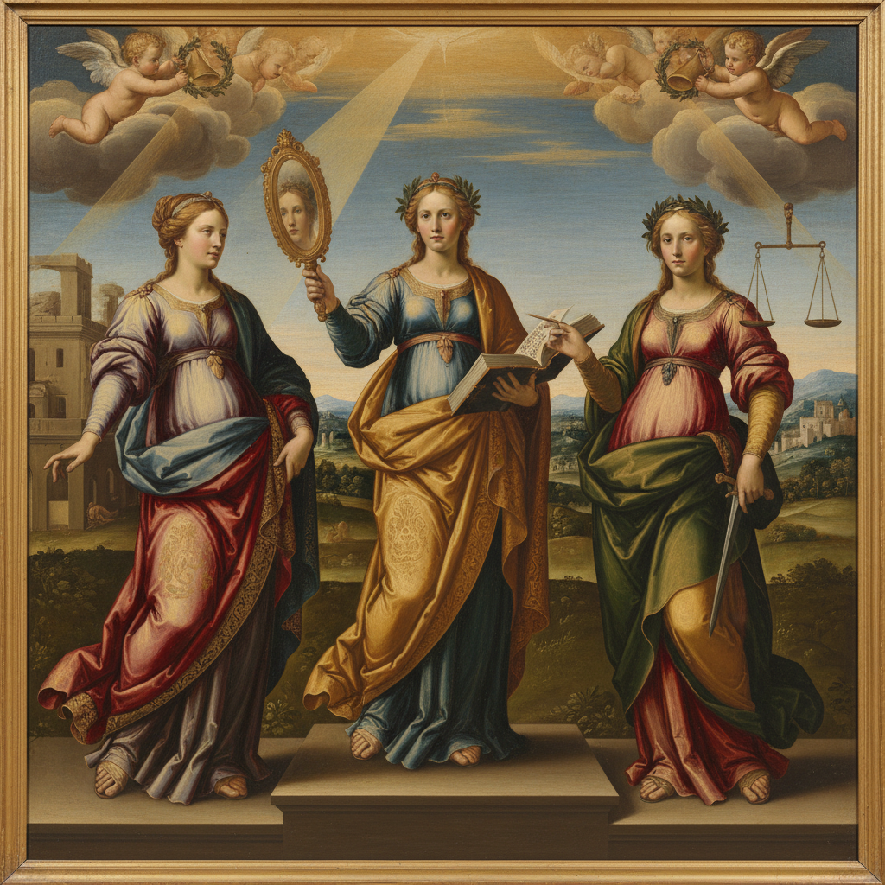

# Allegory Painting 寓意画

> **时期：** 中世纪–19世纪  
> **关键词：** 象征人物、抽象概念可视化、道德教训、拟人化、多层含义

## 概述

Allegory Painting（寓意画）通过拟人化的人物和象征物来表达抽象概念——正义手持天平、时间老人挥舞镰刀、真理从井中升起。它是视觉语言最复杂的形式之一，要求观者具备解读符号的文化素养。从波提切利的《春》到德拉克洛瓦的《自由引导人民》，寓意画将不可见的思想变为可见的图像。

## 风格特征

- **拟人化**：抽象概念化为人物形象
- **属性符号**：每个人物携带辨识物品
- **多层阅读**：表面叙事与深层含义并存
- **古典服饰**：人物常穿古希腊罗马式长袍
- **构图秩序**：人物关系反映概念逻辑

## 代表人物与作品

- 波提切利《春》《维纳斯的诞生》
- 鲁本斯《战争与和平的寓言》
- 维米尔《绘画的寓言》
- 古斯塔夫·克里姆特 维也纳大学天顶画

## 概念图

