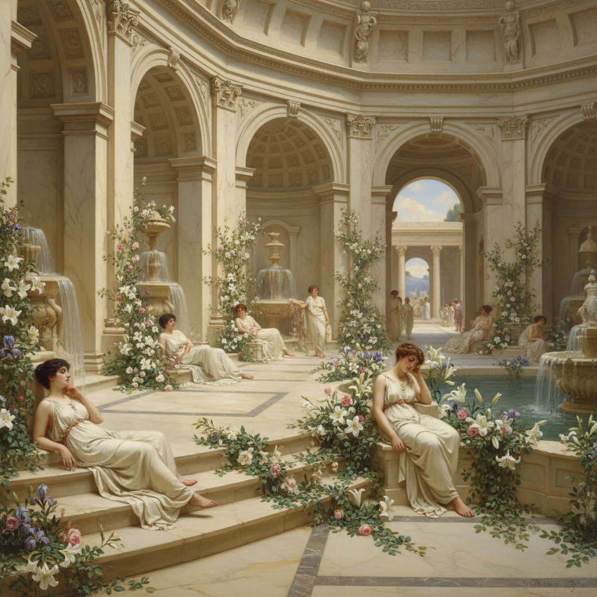

# Lawrence Alma-Tadema 阿尔玛-塔德玛

> "Every accessory is carefully studied from the actual object." — Lawrence Alma-Tadema

## 概述

劳伦斯·阿尔玛-塔德玛（Lawrence Alma-Tadema，1836–1912）是荷兰裔英国画家，维多利亚时代最受欢迎的学院派画家之一。他以描绘古罗马和古希腊的奢华日常生活闻名——大理石浴场、花瓣铺满的阶梯、阳光下的地中海露台，用考古学般的精确和感官的愉悦重建了一个理想化的古典世界。

## 核心特征

| 特征 | 描述 |
|------|------|
| 大理石质感 | 极其逼真的石材表面 |
| 古典场景 | 罗马浴场、希腊庭院 |
| 花瓣与阳光 | 感官愉悦的地中海氛围 |
| 考古精确 | 每件道具都有历史依据 |
| 女性之美 | 优雅的古典女性形象 |
| 透明水面 | 水池和海面的光学效果 |

## 代表作品

| 作品 | 年代 | 意义 |
|------|------|------|
| *The Roses of Heliogabalus* | 1888 | 花瓣雨的感官极致 |
| *A Favourite Custom* | 1909 | 罗马浴场的优雅 |
| *Spring* | 1894 | 古罗马节庆的壮观 |
| *A Coign of Vantage* | 1895 | 地中海阳光的诗意 |

## AI生成概念图

## 与其他风格的关系

- **Academic Art** → 维多利亚学院派的巅峰
- **Pre-Raphaelite** → 共享精细写实的追求
- **Neoclassicism** → 古典题材的感官化
- **Hollywood** → 影响了早期史诗电影的布景
