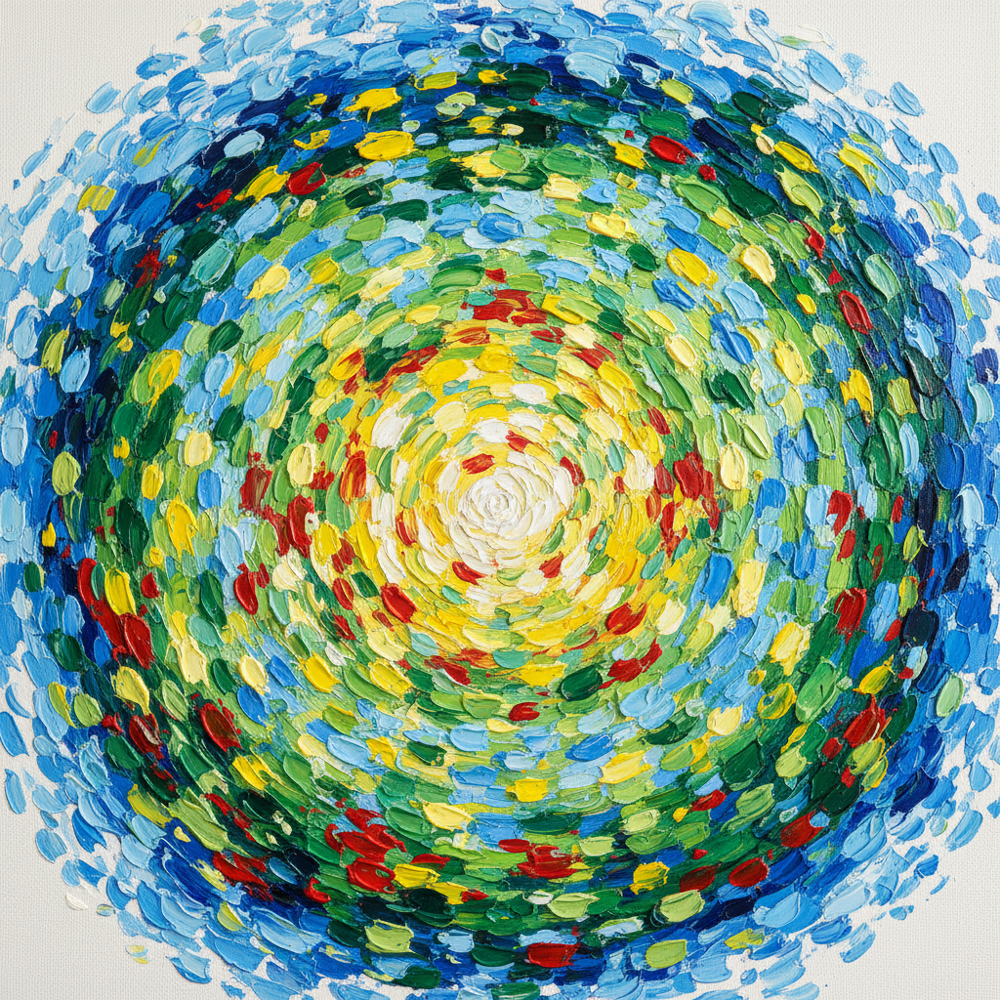

# Alma Thomas 阿尔玛·托马斯

> **时期：** 1891–1978  
> **关键词：** 色彩马赛克、自然抽象、华盛顿色彩画派、晚年绽放

## 概述

Alma Thomas 是美国画家，华盛顿色彩画派的重要成员。她在退休后才全身心投入绘画，70多岁时创造了标志性的"色彩马赛克"风格——用密集的短笔触排列成同心圆或条纹图案，将窗外的树木、花园和太空探索转化为振动的色彩场域。

## 风格特征

- **色彩马赛克**：密集的短笔触如同马赛克瓷砖，排列成有机图案
- **同心圆构图**：色彩从中心向外辐射，如同花朵绽放或宇宙膨胀
- **自然灵感**：树叶、花瓣、水面的光影被转化为纯粹的色彩节奏
- **明亮色调**：以蓝、绿、黄、红的纯色为主，画面充满光感和活力
- **留白呼吸**：笔触之间留有白色画布的间隙，创造出闪烁的光效

## 代表作品

- *Alma's Garden*（1968）
- *Resurrection*（1966）
- *Wind and Crepe Myrtle Concerto*（1973）
- *Starry Night and the Astronauts*（1972）

## 历史意义

Thomas 是第一位在惠特尼美术馆举办个展的非裔美国女性艺术家（1972年）。她证明了艺术创造力没有年龄限制，也证明了抽象绘画可以同时是愉悦的、严肃的和政治的。

## 概念图

