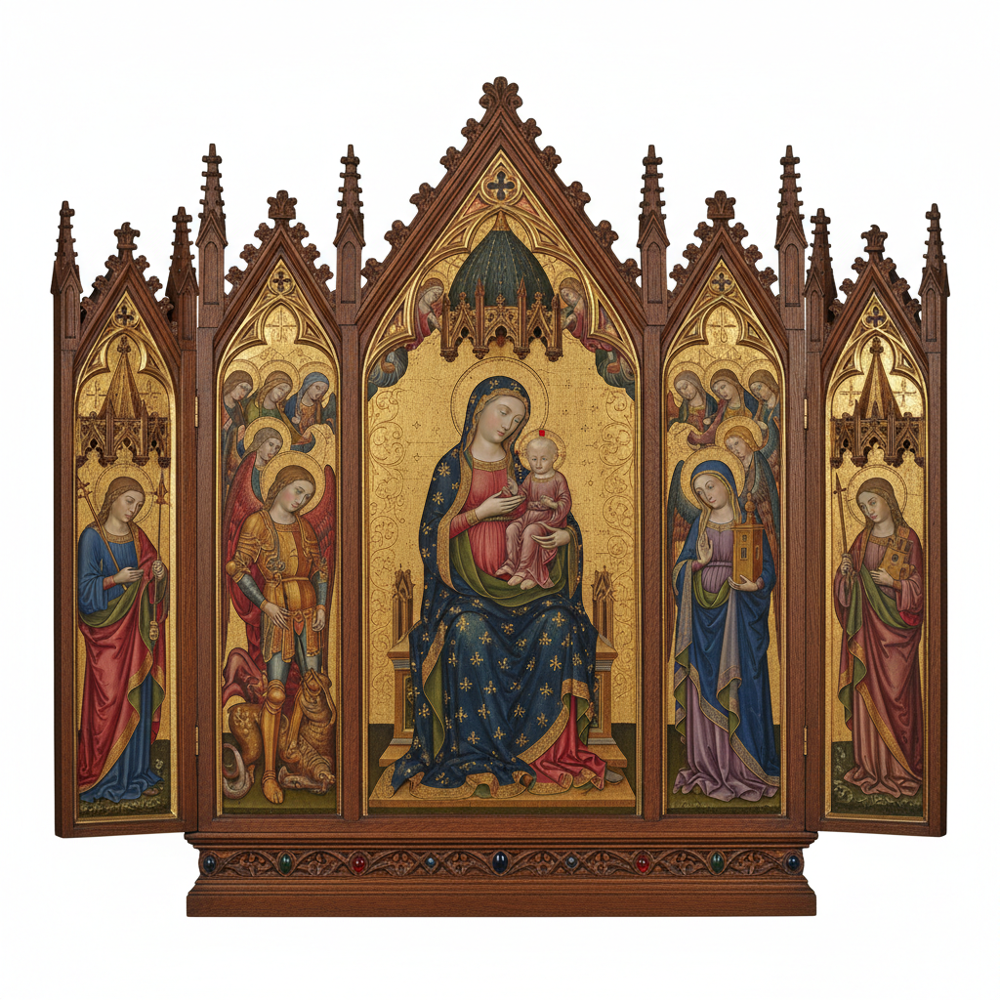

# Altarpiece Art 祭坛画

> **时期：** 11世纪–至今  
> **关键词：** 教堂装饰、宗教叙事、金箔、木板绘画、礼拜空间

## 概述

Altarpiece（祭坛画）是放置在教堂祭坛后方的宗教绘画或雕塑作品，是中世纪和文艺复兴时期最重要的艺术委托形式。从拜占庭的金色圣像到文艺复兴的透视杰作，祭坛画不仅是装饰，更是信仰的视觉焦点——信徒的目光穿过烛光和香烟，最终落在这些神圣的图像上。

## 风格特征

- **宗教主题**：基督生平、圣母、圣徒故事
- **金箔装饰**：象征天国光辉的金色背景
- **层级构图**：神圣人物居中且尺寸最大
- **精细工艺**：木雕框架与绘画的结合
- **礼拜功能**：为特定宗教仪式服务

## 代表人物与作品

- 乔托 斯克罗维尼礼拜堂
- 杜乔《圣母升天》祭坛画
- 皮耶罗·德拉·弗朗切斯卡 祭坛画
- 提香《圣母升天》

## 概念图

